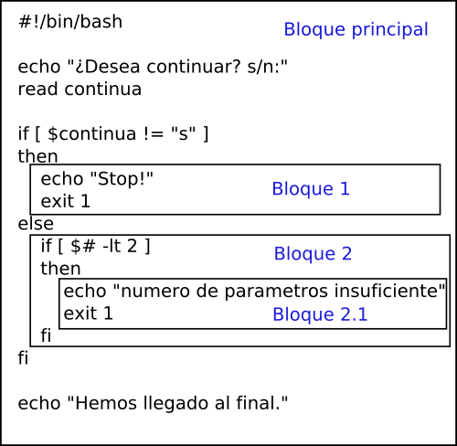

<h1>Bash Script</h1>

<h3>Tabla de contenidos</h3>


- [1. ¿Qué es un script?](#1-qué-es-un-script)
- [2. Comentarios](#2-comentarios)
- [3. Variables](#3-variables)
  - [3.1. Variables de usuario](#31-variables-de-usuario)
  - [3.2. Variables de entorno](#32-variables-de-entorno)
  - [3.3. Variables especiales de bash](#33-variables-especiales-de-bash)
- [4. `echo`, `read` y `printf`](#4-echo-read-y-printf)
  - [4.1. `echo`](#41-echo)
  - [4.2. `printf`](#42-printf)
  - [4.3. `read`](#43-read)
- [5. Parámetros](#5-parámetros)
- [6. Comillas](#6-comillas)
- [7. Condiciones](#7-condiciones)
- [8. Valores devueltos por programas](#8-valores-devueltos-por-programas)
- [9. Condiciones en shell script](#9-condiciones-en-shell-script)
  - [9.1. Condiciones al ejecutar comandos](#91-condiciones-al-ejecutar-comandos)
  - [9.2. Evaluación de expresiones. La orden `test`.](#92-evaluación-de-expresiones-la-orden-test)
- [10. Control de flujo de programa. Estructura `if`.](#10-control-de-flujo-de-programa-estructura-if)
- [11. Bloques dentro de un programa](#11-bloques-dentro-de-un-programa)
- [12. Recordando el Redireccionamiento](#12-recordando-el-redireccionamiento)
- [13. Expresiones matemáticas](#13-expresiones-matemáticas)
- [14. Metacaracteres y algunos caracteres especiales](#14-metacaracteres-y-algunos-caracteres-especiales)
- [15. Estructura `case`](#15-estructura-case)
- [16. Bucles](#16-bucles)
  - [16.1. Estructura `While` (mientras)](#161-estructura-while-mientras)
  - [16.2. Estructura `for`](#162-estructura-for)
  - [16.3. Ruptura de bucles: `break` y `continue`](#163-ruptura-de-bucles-break-y-continue)
- [17. Saltos de línea en los scripts: '`;`' y '`\`'](#17-saltos-de-línea-en-los-scripts--y-)
- [18. Vectores (Arrays)](#18-vectores-arrays)
- [19. Funciones](#19-funciones)
- [20. ANEXOS](#20-anexos)
  - [20.1. Definir color y posición del texto en la consola](#201-definir-color-y-posición-del-texto-en-la-consola)
  - [20.2. Definir la posición](#202-definir-la-posición)
  - [20.3. El doble paréntesis `(( .. ))`](#203-el-doble-paréntesis---)
  - [20.4. Número aleatorios](#204-número-aleatorios)
  - [20.5. Reflexión final](#205-reflexión-final)


# 1. ¿Qué es un script?

Un script no es más que fichero de texto que contiene una serie de instrucciones y órdenes que se ejecutarán en la línea de comandos de forma seguida. Estas órdenes funcionarían de la misma manera si las fuésemos introduciendo en la línea de comandos nosotros.

El procedimiento para **crear un programa o comando** necesita de los siguientes pasos:

1. Escribir el código de nuestra herramienta. Si ya sabes qué necesitas o qué quieres, escribe el código fuente de tu herramienta sea la que sea y sea cual sea el lenguaje que hayas elegido. Por ejemplo, puedes hacerlo en *C*, *Python*, *Perl*, o como un script para *Bash*.
2. Compilar nuestro código fuente para generar el ejecutable. Por ejemplo, si es en C* o *C++,* etc., puedes hacerlo con ayuda del compilador gcc de una forma fácil. Si se trata de un lenguaje interpretado, como *Python*, *Perl*, *Ruby*, etc., tendremos que tener instalado el intérprete de éste y hacer ejecutable el fichero con el código fuente. Ese también es el caso de un script para Bash, en este caso el intérprete es el propio *Bash* y para hacerlo ejecutable podemos usar: `chmod +x nombre_script.sh`
3. Una vez compilado o tenemos el fichero ejecutable, lo copiamos o movemos a una ruta incluida en la variable de entorno `$PATH`, como por ejemplo `/usr/bin`. Puedes ver las rutas con `echo $PATH`. Con esto podemos ejecutarlo simplemente introduciendo su nombre y no tendremos que poner la ruta absoluta.

Para ejecutar un script tenemos 2 alternativas. La primera es llamar al intérprete pasándole el fichero de texto que contiene el script como primer parámetro, para esto sólo requiere que el archivo tenga permiso de lectura. 

```bash
sh script.sh    # se ejecuta utilizando la shell `sh`
bash script.sh  # se ejecuta utilizando la shell `bash`
```

La segunda es indicando en el archivo la ruta del intérprete de comandos en la primera línea de la siguiente forma: `#!/bin/bash` (en este caso `/bin/bash` es la ruta al intérprete bash, que será el que utilicemos, pero aquí se puede poner la ruta a nuestro intérprete favorito). En este último caso basta con darle permiso de ejecución y llamar directamente al script

```
./script.sh
```

Un script simple puede tener una serie de comandos seguidos y ya está:

```bash 
#!/bin/bash
mkdir dir1
cd dir1
touch arch1
cd ..
ln -s dir1/arch1 enl1
```

# 2. Comentarios

Un comentario en un script es una línea que será ignorada por el intérprete de comandos. En estas líneas podemos poner cualquier nota o  apunte que nos resulte útil, por ejemplo, para recordar en el futuro que es lo que realizaba una parte del script que hicimos hace tiempo.

Un comentario siempre empieza por '`#`', lo que haya detrás será completamente ignorado hasta que pasemos a la siguiente línea:

```
#!/bin/bash
#Este es un comentario cualquiera

#Creamos el directorio “dir1” y dentro creamos el archivo “arch1”
mkdir dir1
cd dir1
touch arch1
cd ..

#Creamos un enlace a dir1/arch1
ln -s dir1/arch1 enl1
```


# 3. Variables

Una variable se puede decir que es un nombre que se le da a un dato cualquiera para luego poder acceder a él sin problemas. Por ejemplo, si queremos preguntarle a alguien por su nombre en un script, habrá que almacenar ese nombre en una variable, ya que no podemos saber el nombre que introducirá. De esa forma podremos acceder a su nombre sin conocerlo, simplemente conociendo el nombre de la variable es suficiente:

```
#!/bin/bash
echo “Escribe tu nombre”

#Almacenamos el nombre que escriba el usuario en una variable llamada nombre
read nombre

#Ahora no sabemos su nombre, pero cuando lo escriba lo tendremos guardado en nombre 
#correcto
echo “Hola $nombre”
#incorrecto
echo “Hola nombre”

#También podemos dar el valor a una variable de esta forma
var=”Hola”
echo “$var $nombre”
```

Para acceder al valor de una variable hay que ponerle el símbolo **`$`** delante y para darle un nuevo valor no hace falta. Si queremos acceder a una variable, pero tiene texto pegado, podemos encerrar el nombre entre llaves '`{}`' detrás del símbolo `$`.

```bash
#!/bin/bash
var=”arch”
#Queremos crear un archivo llamado archnombre
touch ${var}nombre
#Así no busca una variable que se llame 'varnombre', sino 'var'
```

Si queremos que un carácter especial como `$` se interprete como una carácter normal y no como un identificador de variables, hay que “*escaparlo*”, es decir, poner el símbolo '`\`' delante:

```bash
#!/bin/bash
var=20
echo “Esto me ha costado $var \$.”
#Esto mostraría la frase: Esto me ha costado 20 $.
```

Debemos tener en cuenta que hay varios tipos de variables en tu script de `Bash`:

- Variables de usuario
- Variables de entorno
- Variables especiales


## 3.1. Variables de usuario

Además, puedes establecer y utilizar variables personalizadas en tu script.

Puedes llamar a las variables de usuario de la misma manera como se muestra a continuación:

## 3.2. Variables de entorno

Estas variables que vienen definidas por defecto en Bash, y que se refieren al entorno en el que trabajas. Para conocer estas variables puedes utilizar el comando `env` (de environtment)

Si lo ejecutas puedes encontrar algunas variables tan interesantes como:
- `$SHELL`: que indica el shell que estás ejecutando
- `$EDITOR`: donde está indicado el editor por defecto. En mi caso vim.
- `$HOME`: la ruta del usuario. En mi caso `/home/sergio`
- `$USERNAME`: el nombre del usuario. En mi caso `sergio`
- `$PATH`: la ruta por defecto donde encontrar binarios, etc.


## 3.3. Variables especiales de bash

En Bash, hay algunas variables especiales y que están definidas por defecto, y que se refieren al script, al que ha ejecutado el script, o a la máquina en la que se ha ejecutado el script. Así, algunas de ellas son las siguientes:

- `$0`, `$1`...: parámetros que veremos más adelante
- `$?`: la salida del último proceso que se ha ejecutado
- `$$`: el ID del proceso del script
- `$USER`: el nombre del usuario que ha ejecutado el script
- `$HOSTNAME`: se refiere al hostname ejecutando el script
- `$SECONDS`: se refiere al tiempo transcurrido desde que se inició el script, contabilizado en segundos.
- `$RANDOM`: devuelve un número aleatorio cada vez que se lee esta variable.
- `$LINENO`: indica el número de líneas que tiene nuestro script.

# 4. `echo`, `read` y `printf`

En este apartado comentaremos detalladamente los comandos echo, printf y read, los cuales
nos permiten realizar las operaciones de entrada/salida que requiere un script.

## 4.1. `echo`

Ya hemos visto que la orden `echo` es para mostrar mensajes por pantalla. 

El comando `echo` simplemente escribe en la salida estándar los argumentos que recibe. La siguiente tabla muestra las opciones que podemos pasar a echo.

| Opción | Descripción |
| :---: | --- |
| `-e` | Activa la interpretación de caracteres precedidos por el carácter de escape. |
| `-E` | Desactiva la interpretación de caracteres precedidos por el carácter de escape. Es la opción por defecto. |
| `-n` | Omite el carácter `\n` al final de la línea (es equivalente a la secuencia de escape `\c`).

Por ejemplo, la opción `-e` activa la interpretación de las secuencias de escape, que por defecto echo las ignora, es decir:

```bash
$ echo "Hola\nAdios"
# Obtenemos una línea: Hola\nAdios

$ echo -e "Hola\nAdios"
# Obtenemos el texto en dos líneas: 
# Hola
# Adios
```

La siguiente tabla nos muestra las secuencias de escape que acepta `echo` (cuando se usa la opción `-e`). Para que estas tengan éxito deben encerrarse entre comillas simples o dobles, ya que sino el carácter de escape `\` es interpretado por el shell y no por `echo`.

| Escape | Descripción |
| :---: | --- |
| `\a` | Produce un sonido "poom" (alert) |
| `\b` | Borrar hacía atrás (backspace) |
| `\c` | Omite el `\n` al final (es equivalente a la opción `-n`). Debe colocarse al final de la línea |
| `\n` | Cambio de línea |
| `\r` | Retorno de carro |
| `\t` | Tabulador horizontal |
| `\v` | Tabulador vertical |


## 4.2. `printf`

El comando `printf` en Linux, se usa para mostrar cadenas formateadas, ya sea por número o por cualquier otro especificador de formato en la ventana de nuestra terminal. Funciona de la misma manera, que printf en el lenguaje de programación `C`, que es su base. El comando `printf` no estaba disponible en las primeras shell, por lo que si estas en un sistema muy antiguo tal vez no tengas acceso. Deberíamos usar este comando antes que `echo` para generar las salidas formateadas.

La sintaxis de `printf` no es difícil, tan solo debes acostumbrarte a ella.

```bash
printf formato_de_cadena argumento1 argumento2 ...  argumenton
```

***Formato de cadena*** representa la cadena que se mostrará por pantalla. Puede contener formatos queserán substituidos por el valor de las expresiones citadas a su continuación. Tiene que haber tantos formatos como argumentos.


Existen varios especificadores de formato, algunos de los más utilizados son:

- `%s` : Especificador de cadena para la salida.
- `%b` : Nos permite interpretar secuencias de escape con un argumento.
- `%d` : Permite mostrar valores integrales.
- `%x` : Imprime valores hexadecimales en minúsculas con relleno de salida.
- `%f` : Permite mostrar valores con coma flotante.

También se permiten *secuencias de escape* e incluso, caracteres ordinarios. Una de las más conocidas y casi imprescindible es «`\n`», que indica salto de línea.

Ejemplos: 

```bash
# Una cadena con un salto de línea al final 
printf "%s\n" "Hola, Linux!"
# Obtenemos: Hola, Linux!

# Una cadena sin mas, sin salto de línea. El prompt aparecera
printf "%s" "Hola, Linux!"
# Hola, Linux!

# Dos cadena separadas por un salto de línea
printf "%b\n" "Hola, Linux! \n" "Gracias por vuestra labor\n"
# Hola, Linux!
# Gracias por vuestra labor

# Valonres numéricos, separados por un salto de línea
printf "%d\n %d\n" "2020" "2021"
# 2020
# 2021

# VAlores hexadecimales
printf "%08x\n" "2021"
# 000007e5

# Valores en coma flotante, con decimales 
printf "%f\n" "1,82" "2,16"
# 1,820000
# 2,160000
```

Debes tener presente, que los valores decimales deben estar separados por una coma. Si usas como separador un punto, recibirás un error.

Ejemplos de formatos comúnmente utilizados:

- `%20s` : Visualización de una cadena (string) de 20 posiciones (alineada a la derecha por defecto).
- `%-20s` : Visualización de una cadena (string) de 20 posiciones con alineación a la izquierda.
- `%3d` : Visualización de un entero decimal de 3 posiciones (alineación a la derecha
- `%03d` : Visualización de un entero (decimal) de 3 posiciones (alineación a la derecha) completado con 0 a la izquierda.
- `%-3d` : Visualización de un entero (decimal) de 3 posiciones (alineación a la izq.)
- `%+3d` : Visualización de un entero (decimal) de 3 posiciones (alineación a la derecha) con escritura sistemática del signo (un número negativo siempre mostrará su signo).
- `%10.2f` : Visualización de un número en coma flotante de 10 posiciones, 2 de las cuales decimales.
- `%+010.2f` : Visualización de un número en coma flotante de 10 posiciones, 2 de las cuales decimales, alineación a la derecha, con escritura sistemática del signo, completado con ceros a la izquierda.

## 4.3. `read`

La orden `read` se puede usar para darle valor a una variable como ya se ha mostrado en los ejemplos. También se puede dar valores a más de una variable de una vez:

```bash
$ read var
hola que tal
# var contendrá el texto “hola que tal”

$ read var1 var2 var3
hola que tal bien
# var1 contendrá “hola”, var2 contendrá “que” y var3 contendrá “tal bien”
```

A cada variable se le asigna una palabra, y a a la última, el resto del texto.

Principales opciones del comando `read`, que se resumen en la tabla:

| Opción | Descripción |
| :---: | --- |
| `-a` | Permite leer las palabras como elementos de un ***array*** | 
| `-n` max | Permite leer como máximo max caracteres. |  
| `-p` | Permite indicar un texto de prompt | 
| `-s` | Ocultar los caracteres introducidos (para contraseñas). | 
| `-t` | Permite indicar un timeout para la operación de lectura | 


# 5. Parámetros

Los parámetros son opciones o valores que se le pasan al programa cuando se ejecuta por línea de comandos, la estructura es la siguiente:

    `nombre_progama param1 param2 param3 param4 ...`

Por ejemplo, al crear un directorio con `mkdir` podemos ver las equivalencias de la siguiente manera:

```bash
mkdir         -p     dir1/dir1-1 dir2   dir3
# nombre_prog param1 param2      param3 param4
```

Para acceder a los valores de los parámetros dentro del programa, se accede con las variables especiales `$1`, `$2`, `$3,` `$4,` ... Estarán numeradas según el orden del parámetro. Para acceder a los parámetros a partir del 9, deberán encerrarse los números entre llaves '`{}`' (`${10}`, `${11}`, ...).

Ejemplo, con el siguiente script 

```bash
#!/bin/bash
echo “Me llamo $1 y tengo $2 años”
```
Al ejecutarlo con con los siguientes parámetros
    `./script.sh Sergio 25`

Obtendremos la siguiente salida:

> `Me llamo Sergio y tengo 25 años`


También tenemos las variables especiales:
- `$0` : Nombre del programa
- `$#` : Número de parámetros enviados
- `$*` : Lista con todos los parámetros enviados
  

# 6. Comillas

> Advertencia: Al copiar y pegar trozos de código de este documento que contengan comillas, puede que estas no se copien de forma correcta (caso de las comillas dobles casi siempre) y el programa no funcione bien. Por ello se recomienda, una vez pegado el trozo de código, volver a reescribir todas las comillas que aparezcan.

En la programación en el shell `Bash` existen 3 tipos de comillas:

- `Comillas simples (') ` : Las comillas simples encierran una cadena de texto que se representa después tal como se ha escrito, es decir, no se sustituyen ni variables ni caracteres especiales que estén dentro de este tipo de comillas.
- `Comillas dobles (“)`: Las comillas dobles tienen una función similar a las comillas simples. La diferencia es que primero sustituyen las variables y los caracteres especiales por su valor y a continuación el resultado de esa sustitución es como si estuviera encerrado en comillas simples.
- `Comillas invertidas o acento grave (``) ` ( A la derecha de la tecla p) : Las comillas invertidas se utilizan para encerrar un comando y después son sustituidas por la salida que produce la ejecución de ese comando

```bash
#!/bin/bash
var=”Mensaje”

echo 'os mando un $var'
# Esto escribirá: os mando un $var

echo “os mando un $var”
# Esto escribirá: os mando un Mensaje

echo 'A veces queremos "entrecomillar algo" y usamos los dos tipos de comillas'
# Esto escribirá: A veces queremos "entrecomillar algo" y usamos los dos tipos de comillas

echo `ls -l`
#Mostrará la salida de ejecutar ls -l

#También se pueden poner cadenas de texto seguidas encerradas en diferentes tipos #de comillas
echo 'La variable $var tiene el valor:' “$var” `date`
#Esto mostraŕa: La variable $var tiene el valor: Mensaje lun feb 26 12:23:36 CET 2023
```

Cuando pongamos una cadena de texto sin encerrarla en comillas de ningún tipo se comportará principalmente como si la hubiéramos encerrado entre comillas dobles, pero cualquier cantidad de espacios seguidos, tabuladores o saltos de línea los interpretará como un sólo espacio.

```bash
#!/bin/bash
echo “Aquí van  5 espacios”
#Mostrará: Aquí van 5 espacios

echo Aquí van   5 espacios
# Mostrará: Aquí van 5 espacios
```

# 7. Condiciones

Como veremos más adelante, lo que hemos aprendido hasta ahora, nos deja muy limitados.

¿Cómo podríamos hacer un script que preguntase un número y dependiendo del número introducido hiciese una cosa u otra?, ¿Cómo se podría hacer una operación 100 veces seguidas sin tener que escribir nosotros el comando 100 veces dentro del script?. 

Este tipo de cosas tan simples no se pueden hacer simplemente con lo que hemos aprendido hasta ahora.

Antes de aprender a hacer cosas como las mencionadas anteriormente, vamos a aprender que es una **condición**, y como representarlas en el intérprete de comandos `bash`.

Una condición es algo que cuando se comprueba sólo puede dar 2 valores como resultado, el valor `verdadero` (**se representa como 0** en `bash` script) que indica que la condición es válida, y el valor `falso` (**se representa como 1**) que indica lo contrario. 

Una condición puede ser por ejemplo “x es mayor que y”, siendo 'x'  e 'y' números.

| condición | resultado | 
| ---       | :---:     |
| verdadero | **1**     |
| falso     | **0**     |

Cuando queremos unir 2 o más condiciones para evaluar si son ciertas o no, es decir, podemos crear un programa que te pregunte la altura y el peso, y en función de eso mostrar mensajes diferentes. En este caso podemos evaluar 2 condiciones (altura y peso) de la siguiente forma:

- Si altura es igual que x y peso mayor que y
- Si altura es igual que x y peso menor que z
- Si altura es mayor que f o peso menor que g
- etcétera.


En este caso tendremos 2 operadores especiales, llamados operadores lógicos, estos son el operador `y` y el operador `o`.

-**Operador `y`**: El operador “y” se evalúa como verdadero si todas las condiciones unidas con este operador son verdaderas, y falso en el caso contrario.

Imaginemos la evaluación de: “condición1 **y** condición2 **y** condición3”

| condición1 | condicion2 | condicion3 | ***resultado*** |
| --- | --- | --- | --- |
| Verdadero | Verdadero | Verdadero | ***Verdadero*** | 
| Verdadero | Falso | Verdadero | ***Falso*** | 
| Falso | Verdadero | Falso | ***Falso*** | 
| Falso | Falso | Falso | ***Falso*** | 

En definitiva si cualquier valor evaluado con “y” es falso, el resultado será falso.

- **Operador `o`**: El operador “o” se evalúa como falso si todas las condiciones unidas con este operador son falsas, y verdadero en el caso contrario. Es decir, es suficiente con que se cumpla una de las condiciones.
- 
Imaginemos la evaluación de: “condición1 **o** condición2 **o** condición3”

| condición1 | condicion2 | condicion3 | ***resultado*** |
| --- | --- | --- | --- |
| Verdadero | Verdadero | Verdadero | ***Verdadero*** | 
| Verdadero | Falso | Verdadero | ***Verdadero*** | 
| Falso | Verdadero | Falso | ***Verdadero*** | 
| Falso | Falso | Falso | ***Falso*** | 

También existe otro operador lógico que es la negación, en este caso lo vamos a representar como “`!`”, cualquier condición que tenga delante esta negación da como resultado el valor contrario al de la condición, es decir, se niega el resultado de la condición dando como resultado lo contrario.

| **condición** | **!condicion** | 
| ---       | :---:     |
| verdadero | falso |
| falso     | verdadero |

Las condiciones se pueden agrupar entre paréntesis igual que si de expresiones matemáticas se tratara, simplemente hay que evaluar primero las condiciones de los paréntesis y sustituir el paréntesis por el resultado:

Siendo: 
- condición1=verdadero
- condición2=verdadero
- condición3=falso
- condición4=verdadero

1. condición1 y condición2 y (condición3 o condición4)
2. verdadero y verdadero y (falso o verdadero) -> falso o verdadero = verdadero
3. verdadero y verdadero y verdadero
4. verdadero


Otro ejemplo:

1. !(verdadero y (falso o falso o (verdadero y falso)))
2. !(verdadero y (falso o falso o falso))
3. !(verdadero y falso)
4. !(falso)
5. verdadero


# 8. Valores devueltos por programas

En shell script de Linux, los programas cuando terminan de ejecutarse, devolverán un valor que indicará si se han ejecutado de forma correcta, o por el contrario, ha ocurrido algún tipo de error durante su ejecución. Cuando todo ha ido correctamente, devolverán el valor 0, mientras que si algo ha ido mal, devolverán un valor diferente de `0`, normalmente `1` o `-1`.

Para terminar un programa devolviendo uno de estos valores hay que ejecutar la orden `exit` dentro del programa pasándole como primer y único parámetro el valor de salida. Si no se le pasa ningún parámetro se interpreta como valor 0, es decir, el programa ha ido  correctamente.

```bash
#!/bin/bash
# Escribimos el programa y comprobamos si ha ido todo bien
# Si todo ha ido bien
exit 0
# Si algo ha fallado
exit 1
```

> ***Con esto se puede deducir que el valor verdadero (todo correcto), se representa con el número 0, y otro valor diferente, por ejemplo el 1, se interpretará como falso***. 

Esto puede liar un poco porque funciona justo al revés que en muchos lenguajes de programación ya que normalmente se
suele asociar al 0 como valor falso.


# 9. Condiciones en shell script

Podemos representar un condición de 2 maneras cuando realizamos un script. La primera es ejecutando un comando y evaluando su salida (0 -> correcto, y, otro valor -> falso) y la segunda es mediante la orden test que sirve para evaluar expresiones.

## 9.1. Condiciones al ejecutar comandos

Cada vez que ejecutemos un comando o programa y este termine nos devuelve un valor que indica si todo ha ido correcto o no, lo equivalente a `verdadero` y `falso` en este caso. Por ejemplo el comando:

`cd dir1`

Nos devolverá `verdadero` (**0**) si el directorio 'dir1' existe y ha podido entrar en el, y falso en caso contrario (algo ha ido mal, es decir, no ha podido entrar en el directorio, bien sea porque no existe, o porque no tiene permiso el usuario).

En este tipo de condiciones podemos utilizar los operadores '`y`' y '`o`' que vimos anteriormente.

En este caso, el operador `y` se representa '`&&`' y el operador '`o`' se representa '`||`'. Podemos usar paréntesis para agrupar comandos también (pero no se comportarán igual, ya que comandos como `cd dir` se evaluarán pero no tendrán ningún efecto), y hay que tener en cuenta que estos **se evalúan de izquierda a derecha**, es decir, si tenemos algo del tipo: 'comando1 y comando2', el comando 2 sólo se ejecutará si el comando1 es verdadero (ha ido bien), ya que si unimos 2 condiciones con '`y`', y alguna es falsa, el resultado siempre será falso, no nos hará falta evaluar la otra condición. 

Si las unimos con '`o`', en cuanto encuentre un comando que vaya correctamente se parará y no ejecutará el resto.


Imaginemos que queremos crear un archivo dentro de un directorio, pero no sabemos si el directorio existe:

```bash
cd dir1 && touch arch1
```

De esta forma, el comando '`touch arch1`' sólo se ejecutará si el comando '`cd dir1`' se ha ejecutado correctamente.


Otro ejemplo:

```bash
cd dir1 || echo “No he podido entrar en dir1”
```

De esta forma, `echo “No he podido entrar en dir1”` sólo se ejecutará si '`cd dir1`' ha fallado, es decir, si no podemos entrar en `dir1` por alguna razón, mostrará un mensaje de error.

```bash
cd dir1 || cd dir2 && touch arch1
```

Primero evalúa '`cd dir1`', si todo es correcto, no evaluará '`cd dir2`'. Si '`cd dir1`' o '`cd dir2`' funcionan bien, creará un archivo '`arch1`' dentro de ellos.

Digamos que va evaluando primero los 2 primeros comandos y el resultado lo evalúa junto con el siguiente de la derecha y así sucesivamente.

Si ponemos un símbolo de admiración '`!`' antes de un comando (separado por un espacio), estaremos haciendo una negación, es decir, si el resultado del comando es V, pasará a ser F y viceversa.

```bash
! cd dir || echo “enhorabuena, estamos dentro de dir”
cd dir && echo “enhorabuena, estamos dentro de dir”
```

## 9.2. Evaluación de expresiones. La orden `test`.

En shell script, tenemos una orden o comando llamado `test`, que evalúa una serie de condiciones y devuelve el valor final, es decir, verdadero, o falso. Hay dos formas de llamar a este comando.

- test condición
- [ condición ]

Cuando evaluamos una expresión con los corchetes `[]`, hay que tener muy en cuenta que se debe dejar un espacio entre el primer corchete y la condición y también al poner el último corchete.


1. **Operadores para ficheros**: Trabajan con ficheros y algunos de los que existen son:

| operador | resultado |
| --- | --- |
| `-e` fichero | Comprueba si el fichero existe |
| `-f` fichero | Comprueba si el fichero existe y además es un fichero normal y corriente |
| `-d` fichero | Comprueba si el fichero existe y además es un directorio | 
| `-r` fichero | Comprueba si el proceso (script) tiene permiso de lectura sobre el fichero |
| `-w` fichero | Comprueba si el proceso (script) tiene permiso de escritura sobre el fichero |
| `-x` fichero | Comprueba si el proceso (script) tiene permiso de ejecución sobre el fichero |
| `-s` fichero | Comprueba si el fichero no es vacío (tiene más de 0 bytes) |
| fich1 `-nt` fich2 | Comprueba si fich1 se ha modificado más recientemente que fich2 |
| fich1 `-ot` fich2 | Comprueba si fich1 se ha modificado antes (es más viejo) que fich2 |


2. **Operadores para cadenas de texto**: Trabajan con texto y algunos de los que existen son:

| operador | resultado |
| --- | --- |
| texto1 `=` texto2 | Comprueba si las dos cadenas de texto son idénticas (no pueden ser cadenas de texto vacías) |
| texto1 `==` texto2 | Comprueba si las dos cadenas de texto son idénticas (no pueden ser cadenas de texto vacías) |
| texto1 `!=` texto2 | Comprueba si las dos cadenas de texto son diferentes (no vacías) |
| `-z` texto | Comprueba si la cadena de texto está vacía (longitud 0) |
| `-n` texto | Comprueba que la cadena de texto no esté vacía (longitud > 0) |
 
3. **Operadores para manejar números**: Trabajan comparando valores numéricos:

| operador | resultado |
| --- | --- |
| num1 `-eq` num2 | Comprueba si los números son iguales |
| num1 `-ne` num2 | Comprueba si los números son distintos |
| num1 `-gt` num2 | Comprueba si num1 es mayor que num2 |
| num1 `-ge` num2 | Comprueba si num1 es mayor o igual que num2 |
| num1 `-lt` num2 | Comprueba si num1 es menor que num2 |
| num1 `-le` num2 | Comprueba si num1 es menor o igual que num2 |

4. **Operadores `y`, `o`, `no` y `paréntesis`**: Se pueden unir condiciones o negarlas y agruparlas de la siguiente manera:

- El operador 'y' se representa con '`-a`'.
- El operador 'o' se representa con '`-o`'.
- El operador 'no' se representa con '`!`'.
- Para utilizar los paréntesis hay que escaparlos, es decir, poner el símbolo '`\`' antes de cada paréntesis, ya que estos son símbolos especiales para el intérprete y queremos evitar que los interprete como tales.

| operador | resultado |
| --- | --- |  
| num1 -`eq` num2 `-a` num1 `-gt` num3 | Comprueba si num1 es igual a num2 y además mayor que num3. |
| `-r` arch1 `-o` `-x` arch1 | Comprueba si arch1 tiene permisos de lectura o de ejecución. |
| `!` `-s` arch1 | Comprueba que el fichero arch1 si es vacío |
| $var `-ne` 0 `-a` `\(` `-f` arch1 `-o` `-d` arch1 `\)` | Comprueba si el valor de la variable $var es distinto de 0 y además, comprueba si arch1 es un fichero normal o un directorio. |


# 10. Control de flujo de programa. Estructura `if`.

La estructura `if` permite tomar decisiones de una forma sencilla en el programa, normalmente para decidir si en función de una u otra situación ejecutaremos un código u otro. La estructura es la siguiente:

```bash
if [ condición ]
then
  # instrucciones a ejecutar si se cumple la condición
fi
```

De esta forma podemos incluir en el programa un conjunto de instrucciones que sólo se ejecutarán si la condición impuesta se cumple. Si no se cumple, no ejecutará ninguna instrucción que haya inmediatamente después de la palabra `then`.

<div align="center">
    
</div>

Hay una manera de que ejecute una serie de instrucciones cuando no se cumpla la condición. De esta forma podemos ejecutar instrucciones cuando se cumple la condición, y cuando no se cumple ejecutar otras.

```bash
if [ condición ]
then
  # instrucciones a ejecutar si se cumple la condición
else
  # instrucciones a ejecutar si no se cumple la condición
fi
```

La condición `else`no es obligatoria si no se necesita. Después de la palabra `else` no se debe poner `then`.

<div align="center">
    
</div>

Por último, si queremos que cuando una condición se cumpla ejecutar unas instrucciones, cuando se cumpla otra, ejecutar otras, y así podemos hacer lo siguiente:

```bash
if [ condición1 ]
then
  # instrucciones a ejecutar si se cumple la condición1
elif [ condición2 ]
then
  # instrucciones a ejecutar si se cumple la condición2
else
  # instrucciones a ejecutar si no se cumple ninguna condición
fi
```

Puede haber tantas instrucciones `elif` como creamos necesario, pero sólo una instrucción `else` como máximo (puede no haber ninguna), ya que es lo que se ejecutará cuando no se haya cumplido ninguna de las anteriores condiciones.

<div align="center">
    
</div>

Después de cada condición `elif` también se pone la palabra `then` en la siguiente línea.

Existe una instrucción nula que se representa con dos puntos `:`. La podemos usar cuando no queremos que se ejecute nada en un punto de la estructura `if` por ejemplo.

```bash
if [ condición ]
then
  # Si no queremos ejecutar nada si es verdadera, podemos poner la instrucción nula
  :
else
  #instrucciones a ejecutar si no se cumple la condición (falsa)
fi
```

**Ejemplos**:

- Script que comprueba si recibe como mínimo 2 parámetros. Si recibe menos, muestra un mensaje de error y sale.

```bash 
#!/bin/bash
if [ $# -lt 2 ]
then
  echo ”El programa necesita 2 parámetros al menos”
  exit 1
fi
```
- Script igual que el anterior, pero además comprueba que el primer parámetro sea igual a “s”, o a “n”, porque sino también dará error.

```bash
#!/bin/bash
if [ $# -lt 2 ]
then
    echo “El programa necesita 2 parámetros al menos”
    exit 1
else
    if [ $1 != “s” -a $1 != “n” ]
    then
        echo “El primer parámetro debe ser \”s \”o \”n\”.”
        exit 1
    fi
fi
```

- Script que pregunte por el nombre de 2 ficheros. Después comprueba si existe el primer fichero, y si existe, escribe el contenido del directorio dentro. Si no existe el primero, comprueba si existe el segundo como alternativa para hacer lo mismo. En caso de que no exista
ninguno de los 2 mostrará un mensaje de error y terminará el programa.

```bash
#!/bin/bash
echo “Teclea nombre para el primer fichero a escribir: ”
read fich1
echo “Teclea nombre de un fichero alternativo, por si no existe el primero: ”
read fich2
if [ -e $fich1 ]
then
    ls -l >> $fich1
    echo “He escrito la información en $fich1”
elif [-e $fich2 ]
then
    ls -l >> $fich2
    echo “He escrito la información en $fich2”
else
    echo “Ninguno de los 2 ficheros recibidos existe”
    exit 1
fi
```

En el caso de que queramos tener más de una condición utilizamos los operadores lógicos `&&` y `-a` (y), `||` y `-o` (o) y `!` (negado) tal y como hemos visto antes.

Por ejemplo: 

```bash
#/bin/bash
valor1=55
valor2=22
valor3=36

if [ $valor1 -ge $valor2 ] || [ $valor2 -ge $valor3 ]
then
    echo "el valor mayor de todos es $valor1"
fi
# comprueba si valor1 es el mayor de todos los valores

if [[ $(($valor1 % 2)) == 0 ]]
then
    echo Par
else
    echo Impar
fi
# Comprueba si valor1 es par o impar realizando una operación en la propia condición.

```

o por ejemplo un comando más complejo. El siguiente script nos dice si un usuario dado se encuentra en el sistema: 

```bash
#/bin/bash

if $(grep -q ^$1: /etc/passwd); then
    echo “El usuario $1 existe”
else
    echo “El usuario $1 NO existe”
fi
```

> **RETO**. A partir del script anterior genera un script que le pases dos nombres con una letra "y" u "o" en medio y nos devuelva si existen los dos usuarios (si se ha pasado una "y") o no, o hay uno de los dos (si se ha pasado una "o"). Un ejemplo de ejecución sería `./hayUsuarios.sh sergio y gustavo`

> **RETO2**. Verifica que hay una "y" o una "o" antes de hacer nada más.

# 11. Bloques dentro de un programa

Antes de continuar, y para aclarar del todo el funcionamiento de una estructura como `if`, y otras que veremos más adelante. Vamos a ver lo que es un bloque de instrucciones dentro de un programa y lo que puede significar.

Un **bloque de instrucciones** se puede decir que es un conjunto de instrucciones que se ejecutan una detrás de otra, y además, ese bloque está siempre delimitado por una instrucción o palabra clave que marca su inicio y por otra que marca su fin, excepto en el caso del bloque principal de programa. En el caso del bloque principal del programa, el inicio y el final de dicho bloque están
marcados por el inicio y el final del fichero.

<div align="center">
    
</div>

Como se puede observar en la figura anterior, se pueden meter bloques de instrucciones, unos dentro de otros. A esto se le llama anidar bloques. De esta forma cuando un bloque contiene otro dentro, se puede decir que el que contiene es el bloque padre, y el contenido es el bloque hijo.

Excepto el bloque principal, el resto de bloques, hemos visto que comienzan con una palabra clave y no terminan hasta que aparece otra para finalizarlo. En el caso de la estructura `if`, cuando aparece la palabra `then`, se abre un bloque nuevo dentro de este (que se ejecutará sólo cuando se cumpla la condición). Este bloque finalizará cuando aparezca una nueva condición con `elif`, la palabra `else`, o la palabra de fin de estructura `fi`.

> ***Consejo***: Cada vez que se abra un nuevo bloque, es aconsejable que las instrucciones comiencen un mínimo de 2 o 3 espacios después que las instrucciones del bloque padre. De esta forma diferenciaremos sin problema que instrucciones pertenecen a cada bloque.


# 12. Recordando el Redireccionamiento

Ya hemos visto que podemos construir expresiones del tipo:

```bash 
echo “una frase” > archivo
ls -l >> archivo
```

Este tipo de expresiones, lo que hacen es redirigir la salida del programa, es decir, el texto que normalmente mostraría por pantalla, a un archivo que nosotros le especifiquemos.

Ya hemos visto que hay 2 formas de redirigir la salida de un comando o programa. La primera es mediante `>`, que sustituye todo lo que hubiera anteriormente en el archivo por el texto de salida del programa (también crea el archivo si no existía antes). La segunda es mediante `>>`, que hace exactamente lo mismo, sólo que no borra los contenidos anteriores del archivo de texto, sino que
añade el nuevo texto al final del mismo.

Tambien sabemos distinguir entre la salida estándar y la salida de error. La salida estándar son los mensajes que el programa envía
cuando todo funciona de la forma esperada, es decir, correctamente. La salida de error son los mensajes que el programa envía cuando algo ha fallado. Un script puede generar ambas salidas si algunos comandos funcionan correctamente mientras que otros fallan (si no las redireccionamos, ambas aparecerán siempre por pantalla, juntas).

- `>`, `>>` Redireccionan la salida estandar a algún archivo que indiquemos
- `2>`, `2>>` Redireccionan la salida de error a algún archivo que indiquemos
- `&>`, `&>>` Redireccionan las 2 salidas a algún archivo que indiquemos

Ejemplo:

```bash
# El directorio dir ya existe
mkdir dir
# Producirá la salida: mkdir: no se puede crear el directorio «dir»: El fichero ya existe
# Esta salida es de error porque el comando ha fallado.
mkdir dir > salida.txt
# Como estamos redireccionando sólo la salida estandar y el mensaje era de error, nos seguirá apareciendo lo mismo de antes.
mkdir dir 2> salida.txt
mkdir dir &> salida.txt
# En estos casos si que se guardará el mensaje de error porque redireccionamos la salida correcta
```

Con esto también podemos llevar la salida normal de un programa a un archivo y la salida de error a otro archivo diferente y así analizar los mensajes por separado por ejemplo:

```bash
sh script.sh > salida.txt 2> error.txt
```

La salida estándar se numera como 1 (esto quiere decir que aunque podemos utilizar el símbolo `>` para redireccionar la salida estándar, lo más correcto sería usar `1>`), y la de error como salida `2>`.

Dentro de un script, podemos hacer por ejemplo, que la salida de un comando echo, salga por la salida de error, esto se hace de la siguiente forma.

```bash
#!/bin/bash
echo “elige un número del 1 al 3”
read opcion
if [ $opcion = “1” ]
then
    echo “Has elegido el número 1”
elif [ $opcion = “2” ]
then
    echo “Has elegido el número 2”
elif [ $opcion = “3” ]
then
    echo “Has elegido el número 3”
else
    echo “numero incorrecto” 1>&2
fi
```

De esta forma, el mensaje “numero incorrecto” saldrá por la salida de error, que además es lo que queremos, ya que es un mensaje de error. La expresión `1>&2` se podría interpretar como redireccionar el mensaje que normalmente aparecería por la salida estándar (1), a la salida de error (2).

A lo mejor nos interesa que alguna de las salidas (o ambas) no aparezca ni por pantalla, ni se guarde en ningún archivo. Esto se puede conseguir redireccionando la salida de un programa al fichero especial `/dev/null`. Este fichero, es como un agujero negro, que se tragará todos los mensajes que le enviemos y desaparecerán. De esta forma:

```bash
mkdir dir 2> /dev/null
```

Estamos redirigiendo la salida de error a `/dev/null`, lo que quiere decir que el comando no mostrará mensajes de error. En este caso, esto significa, que si ya existe el directorio 'dir' no se mostrará un mensaje de error.

Otra forma de saber, por ejemplo, si existe un fichero, además de `[ -e fichero ]`, es ejecutar el comando ls sobre ese fichero. Si existe el fichero el comando funcionará bien, y si no existe dará un error. Como hemos visto, eso es equivalente a devolver verdadero o falso.

```bash
if [ -e fichero]
then
    echo “fichero ya existe”
else
    echo “fichero no existe”
fi

if ls fichero &> /dev/null
then
    echo “fichero ya existe”
else
    echo “fichero no existe”
fi
```

Como se observa, al ejecutar el comando `ls fichero`, no nos interesa ni mensaje con el listado con el fichero, ni el mensaje de error que pueda dar, solamente si funciona o no. Por eso redirigimos ambas salidas a `/dev/null` , para que no nos muestre ningún mensaje por pantalla


# 13. Expresiones matemáticas

Existen 2 comandos que evalúan expresiones matemáticas y lógicas. 

El primero de ellos es el comando `expr` que evalúa una expresión matemática, lógica, e incluso con cadenas de texto, y
devuelve el resultado de la evaluación por la salida estándar.

```bash 
expr 3 + 4
# obtenemos como resultado un 7
```

Este comando acepta los operadores matemáticos `+`, `-`, `*`, `/` y `%` (resto de una división). 

También acepta los operadores lógicos `>`, `<` , `>=`, `<=`, `=` y `!=` (distinto de). También acepta operadores de cadenas de texto como `length “cadena de texto”` que te muestra la longitud que tiene una cadena de texto, o `substr “cadena de texto” inicio longitud`, que saca un trozo del texto con una longitud indicada empezando desde la posición indicada también.

```bash
expr length “esto es un texto”
# Retorna : 16

# Desde el carácter número 6 -> 'q', devuelve 3 caracteres.
expr substr “hola que tal” 6 3
# Retorna : que

# Desde el carácter número 4 -> 'a', devuelve 7 caracteres.
expr substr “hola que tal” 4 7
# Retorna : a que t
```

Además tenemos que tener en cuenta algunos aspectos esenciales a la hora de utilizar la funcion `expr`:

- Los caracteres especiales, como por ejemplo `*`, `>`, `<`, `(`, `)`, han de '***escaparse***', es decir ponerles la barra invertida '`\`' delante para que se interpreten como caracteres normales.
- Todos los operadores y operandos deben de estar separados por un espacio entre si.
- Se pueden agrupar expresiones entre paréntesis
- Los operadores lógicos devuelven 1 si es verdadero y 0 si es falso.


Más ejemplos:

```Bash
expr 2 \* 3
# Retorna : 6

expr 3 \< 2
# Retorna : 0

expr \( 2 + 2 \) \> 3
# Retorna : 1
```

El otro comando que evalúa expresiones matemáticas y lógicas es `let`. Está limitado a este tipo de expresiones, pero es bastante más flexible que el anterior. Con este comando asignamos la evaluación de una expresión a una variable (es aconsejable casi siempre encerrar la expresión entre comillas ya que nos ahorrará problemas con caracteres especiales. El comando expr no soporta las comillas, pero let si).

Ejemplos:

```bash
let "var = 4 + 3"
echo $var
# Retorna : 7

let "var = 4 > ( 6 – 4 )"
echo $var
# Retorna : 0

let "var = 4"
let "var = $var * 3"
echo $var
# Retorna : 12
```

No hace falta con este comando separar los operadores y los operandos por espacios, además, al estar encerrada la expresión entre comillas no hace falta '***escapar***' los caracteres especiales.

Ahora un par de equivalencias útiles:

- `let "var = $var + 1"` → `let var++`
- `let "var = $var - 1"` → `let var--`

O sea que `++` y `--` se pueden utilizar con `let` como en otros lenguajes de programación, para incrementar o decrementear un valor entero.

Por último, vamos a ver la diferencia entre asignar un valor a una variable utilizando el comando `expr` y el comando `let`.

```bash
# Forma clásica con expr, asígnar a una variable la salida de un comando
var=`expr 3 + 4`

# Con let puede parecer que es más intuitivo, aunque es menos utilizada
let "var = 3 + 4”
```

> **Importante**: cuando se utiliza `let`, a diferencia de `expr`, utilizar '`=`' no significa comparar si dos números son iguales, sino asignar un valor a una variable. Para comparar si dos números son iguales se utiliza el doble igual '`==`' (dos símbolos de igual pegados).

Por último, tenemos el comando `bc`, que nos permite hacer operaciones con decimales. Como en realidad este comando es muy potente (se puede programar con él) suele leer los datos desde un archivo, pero en nuestro caso podemos pasarselos con una tubería de la siguiente forma:

```bash
variable=`echo “5.5 * 2.5” | bc`
echo $variable
# Retona : 13.7

y=10
y=$(echo $y/3 | bc)
echo $y
Retorna : 2
```
> **Nota**: se debe incluir toda la operacion entre `` acentos abiertos o $()

En todo caso, `bc` es una herramienta potente para la realización de calculos matemáticos que tal vez escape al proposito de nuestro curso. Mas informacion en [freeshell: Cálculo numérico con bc](http://marcmmw.freeshell.org/esp/programacion/bc.html)


# 14. Metacaracteres y algunos caracteres especiales

Los metacaracteres son caracteres especiales que tienen un significado determinado cuando los utilizamos:

| caracter | significado| 
| --- | --- |
| `*` | Significa 'cualquier cosa', es decir 0 o más caracteres, da igual cuales. |
| `?` | Significa 'cualquier carácter'. 1 carácter cualquiera. | 
| `[]` | Cualquiera de los caracteres encerrados entre los corchetes. | 

Ejemplos de uso:

- `dir*` → palabra dir, seguida de cualquier cosa (dir, direct, dir1, directorio, ...)
- `dir?` → palabra dir, seguida de 1 carácter cualquiera (dir1, dira, dirz, dir7, ...)
- `dir[1234]` → palabra dir, seguida de uno de los caracteres entre corchetes (dir1, dir2, dir3 o dir4). Por ejemplo 'dir9' no sería válida.
- `dir[a-j]` → palabra dir seguida de una letra entre la 'a' y la 'j'. El guión significa un rango entre el primer carater y el segundo (dira, dirf, dird). Por ejemplo 'dirt' no sería válido.

Se pueden unir en una palabra tantos metacaracteres como queramos:

- `ls a*t?[1-9]` → Lista archivos que se llamen por ejemplo: ate1, aperiti2, algo8, alt91.
- 
Con el símbolo '`!`' O '`^`' negamos el carácter o el rango que tengamos detrás.

- `ls [!a]*` → Archivos que no empiecen por la letra a
- `ls [!0-9]*` → Archivos que no empiecen por un número
- `mv ?m[a-z].txt` → Archivos cuyo primer carácter sea cualquiera, la segunda letra sea una m, la tercera, una letra entre 'a' y 'z', y después la extensión '.txt'.
- 
Existen caracteres especiales representar para cadenas de texto, que no simbolizan letras ni números, sino que simbolizan espacios, tabulaciones, saltos de línea, etc... Estos caracteres se pueden consultar por ejemplo en el manual del comando echo (man echo). Algunos son:

- `\n` → Salto de línea
- `\t` → Tabulación

Para activar estos caracteres utilizando `echo`, hay que utilizar la opción `-e`. Ejemplos:

```bash
echo -e “Esto es una línea.\nEsta es otra”
```
Tiene como resultado el texto en dos líneas separadas:
Esto es una línea
Esto es otra

Esto se suele utilizar mucho a la hora de realizar ***menus***:

```bash
echo -n -e “1)Opción 1 \n2)Opción 2\n\tElige una opción: ”
1)Opción 1
2)Opción 2
Elige una opción:
```


# 15. Estructura `case`

Esta estructura es muy fácil de entender una vez entendido como funciona la estructura `if`. Ya que el funcionamiento es similar, pero más limitado. La estructura es la siguiente:

```bash
# Se pueden poner tantas opciones como se quieran
case valor in
valor1)
    # ordenes a ejecutar si el valor coincide con valor1;;
valor2)
    # ordenes a ejecutar si el valor coincide con valor2;;
valor3)
    # ordenes a ejecutar si el valor coincide con valor3;;
esac
```
> **Importante**: Las instrucciones a ejecutar se pueden poner inmediatamente a continuación del valor o en la línea siguiente, eso no importa, lo que sí hay que tener en cuenta es que después de la última instrucción dentro de un valor debe haber siempre dos punto y coma '`;;`' seguidos, justo después de la instrucción o en la línea de abajo, como se prefiera.

En este caso lo que evaluaremos siempre es el valor que tiene una variable, y dependiendo del valor, se ejecutaran unas acciones u otras, algo similar a cuando realizábamos un menú con la estructura if, pero más claro. Aquí podemos ver la equivalencia.

Versión `case`

```bash
echo “1) opcion1”
echo “2) opcion2”
echo -e -n “\tElige una opción: ”
read opcion

case $opcion in
1)
    echo “Opción 1 elegida”;;
2)
    echo “Opción 2 elegida”;;
*)
    echo “Opción no válida” 1>&2;;
esac
```

Versión `if`
```bash
echo “1) opcion1”
echo “2) opcion2”
echo -e -n “\tElige una opción: ”
read opcion

if [ $opcion = “1” ]
then
    echo “Opción 1 elegida”
elif [ $opcion = “2”]
    echo “Opción 2 elegida”
else
    echo “Opción no válida” 1>&2
fi
```

En este caso, las estructuras son idénticas, aunque la opción `case` es la más limpia. Esta se evalúa de la misma forma que los `if` y `elif`, es decir va comprobando de arriba a abajo las condiciones, y cuando encuentra una válida, ejecuta las ordenes que hay a continuación.

Como ya hemos visto los metacaracteres `*`, `?`, y `[]`, podemos intuir que si ponemos `*` como valor significará cualquier cosa, y entrará ahí siempre que no haya entrado antes en ninguno de los otros valores (como en el caso de `if`, sólo entrará en uno de los valores cuando se ejecuta, nunca en más). Por este motivo, se puede decir que el valor `*`, se comporta exactamente igual que `else`, es decir, si no ha encontrado antes una condición válida, entrará ahí siempre.

Aquí podemos ver un ejemplo, simple utilizando metacaracteres. En este caso vamos a preguntar al usuario por la confirmación de algo, y vamos a comprobar si el usuario ha contestado afirmativa o negativamente. A nosotros nos da igual si el usuario contesta “s”, “si”, “S”, “Si”, “si quiero”, “n”, “NO”, etc... Lo que nos interesa para evaluar la opción es saber si la primera letra es una 's' o una 'n' (mayúscula o minúscula), y el resto del texto nos da igual. Lo podemos hacer así:

```bash
echo “¿Desea continuar?:”
read resp
case $resp in
[sS]*) #Si la respuesta es una s o una S seguido de 'lo que sea'
echo “Ha elegido continuar”;;
[nN]*) #Si la respuesta es una n o una N seguido de 'lo que sea'
echo “Ha elegido no continuar”
exit;;
*)
echo “Respuesta no válida” 1>&2;;
esac
```

# 16. Bucles

Hasta ahora, las condiciones que hemos visto nos permiten ejecutar una serie de acciones diferentes según se cumpla una condición determinada, como por ejemplo que el valor de una variable sea 1, 2, 3, o 4, etc...

Lo que no sabemos hacer todavía es volver hacia atrás en un script. Siempre hemos ido hacia delante hasta que llegabamos al final del script, y este finalizaba. Pero podemos encontrarnos con la situación de que si el usuario no introduce una opción válida, podamos seguir preguntándole hasta que introduzca una opción que sí sea correcta, y de esa manera no tener que volver a ejecutar todo
el script otra vez.

Se puede decir que un bucle, es un conjunto de instrucciones que se repiten, es decir, cuando llega al final de esas instrucciones, vuelve a empezar desde el principio del conjunto. Normalmente, no queremos que esas instrucciones se repitan todo el tiempo, y nunca terminen, ya que en ese caso estaríamos hablando de un bucle infinito (siempre se repite y nunca terminará). Por ello, estableceremos una condición o conjunto de condiciones que se deberán cumplir si queremos que las instrucciones dentro del bucle se vuelvan a repetir, o no.

Ejemplo de un bucle infinito. Podemos observar como después de ejecutar todas las instrucciones vuelve a empezar desde el principio:

<div align="center">
    
</div>

## 16.1. Estructura `While` (mientras)

Esta estructura establece un bucle dentro de si misma. Este bucle de instrucciones se repetirá siempre que la condición que pongamos sea cierta. Se puede decir que es como una estructura `if`, con la diferencia de que cuando termina, vuelve al principio a comprobar otra vez la condición una y otra vez hasta que esta no se cumpla.

La estructura while es así:

```bash
while [ condición ]
do
    # Instrucciones dentro del bucle
done
```
<div align="center">
    
</div>

Como podemos observar, siempre que la condición sea cierta, se ejecutarán las instrucciones dentro del bucle una y otra vez, hasta que la condición sea falsa.

Esta condición nos puede servir para cuando detectamos un error, o que el usuario introduce una condición que no es válida y le queremos seguir insistiendo hasta que nos de una opción correcta.

Ejemplo:

```bash
#!/bin/bash
echo -n "¿Desea continuar (s/n)?: "
read resp

# Mientras que la respuesta sea diferente de “s” y de “n”, sigue preguntando
while [ $resp != "s" -a $resp != "n" ]
do
    echo "Respuesta no valida. ¿Desea continuar (s/n)?"
    read resp
done

if [ $resp = “n” ]
then
    exit
fi

# y en caso de pulsar s, seguiria la ejecución por aqui...
```

Otro uso que le podemos dar a esta estructura es el de repetir algo un número determinado de veces:

```bash
#!/bin/bash
repeticiones=3
i=0

# Mientras el contador sea menor que el total, repite
while [ $i -lt $repeticiones ]
do
    # Como la variable va de 0 a 2, le sumamos 1 al mostrarla
    # para que aparezcan números del 1 al 3
    echo "Repetición numero: " `expr $i + 1`
    #incrementamos en una unidad la variable i
    let i++
done
```

otro ejemplo: 

```bash
#!/bin/bash
echo "¿Cuantos directorios deseas crear?"
read total
num=1

# Si el número es mayor que el total, paramos de crear, mientras tanto, sí creamos.
while [ $num -le $total ]
do
    # Por si acaso existe el directorio, quitamos los mensajes de error
    mkdir dir${num} 2> /dev/null
    # incrementamos la variable num una unidad más para el siguiente directorio
    let num++
done

echo "Hemos creado $total directorios."
```

## 16.2. Estructura `for`

La estructura `for` funciona de manera similar a la estructura `while`, aunque está pensada para ser usada en casos más concretos (algo similar a lo que pasa con la estructura case con respecto a `if`). La estructura `if` se puede usar de dos maneras. La primera es la siguiente:

```bash
for variable in lista
do
    # Instrucciones dentro del bucle
done
```

Este bucle se repetirá siempre tantas veces como elementos haya en la lista. En cada repetición la variable utiliza para iniciar el bucle tomará como valor el siguiente elemento de la lista, así en la primera repetición tomará el valor del primer elemento de la lista y así sucesivamente.

Esta lista puede ser una lista de palabras o números. Si queremos agrupar texto para que por ejemplo, si ponemos un nombre y apellido vayan juntos y no sean elementos diferentes debemos agruparlos entre comillas:

```bash
for nombre in Francisco Martínez Juan López     # Se repetirá 4 veces (4 elementos)
for nombre in “Francisco Martínez” “Juan López” # Así es correcto, se repetirá 2 veces.
```

Podemos ver su uso en el siguiente ejemplo
```bash
#!/bin/bash

# Este bucle se repetirá 9 veces
for num in 1 2 3 4 5 6 7 8 9
do
    echo "Repetición número $num"
done

# Creamos los siguientes directorios
for dir in dir1 dir2 dir3 dir4 dir5
do
    if [ ! -e $dir ]
    then
        mkdir $dir
    fi
done

# Mostramos los parámetros recibidos
echo "Número de parámetros $#"
num=1
for param in $*
do
    echo "Parámetro $num: $param"
    let num++
done
```

Tambien podemos añadir grupos de valores o **rangos**, si vamos a iterar por valores enteros:

Ejemplo: 

```bash
#!/bin/bash
for NUM in {1..10}
# Equivalente for NUM in `seq 1 10`
do
    echo Linea $NUM
done
```

--- 

Un **rango** se puede expresar con un número de inicio y un número de fin. Sin embargo, `Bash`, es lo suficientemente inteligente, como para interpretar que si el número de inicio, es mayor que el número de fin, lo que tiene que hacer es una cuenta regresiva. Así,

- `{1..1000}` contará de 1 a 1000 
- `{1000..1}` contará de 1000 a 1

Pero, no solo puedes decir que cuente de uno en uno, también le puedes definir paso. Así

- `{1..1000..2}` contará de 1 a 1000, pero, de dos en dos.
- `{1000..1..-2}`, lo mismo que en el caso anterior, pero de forma regresiva.

Por supuesto que además de ponerlo en un bucle `for`, también lo puedes utilizar directamente en un echo, por ejemplo,

```bash
echo {1..100..5}
```

---

Existe, sin embargo, otra forma de utilizar el bucle `for`. Esta otra forma es muy útil sobretodo cuando queremos hacer un contador, y queda más limpio que utilizando la estructura `while`:

```bash
for (( instr1; condición; instr2 ))
do
    # Instrucciones que se repiten hasta que condición sea falsa
done
```

<div align="center">
    
</div>

En esta estructura tenemos un bucle `for`, y encerrados entre un doble paréntesis una instrucción que se ejecutará justo antes de comenzar el bucle por primera vez (instr1), una condición que indicará si se ejecutan las instrucciones dentro del bucle o se terminará y una instrucción final que se ejecutará como última instrucción dentro del bucle (instr2). Se podría expresar así en *pseudocódigo*:

```
instr1
mientras condición=verdadera
    instrucciones dentro del bucle
    instr2
fmientras
```

> ***Importante***: las instrucciones y condiciones dentro del doble paréntesis se escriben de forma casi idéntica a las instrucciones cuando se utiliza el comando `let`. De esta manera, una condición de si un número es mayor que otro se escribirá `n1 > n2`, si se quiere comparar si dos números son iguales se escribirá `n1 == n2`, etc... (de forma idéntica a cuando se utiliza `let`)

**Comparativa contador con `for` y `while`**

Veamos un mismo ejemplo resulto con `for` y con `while`:

Versión `for`
```bash
#!/bin/bash
# Este bucle se repetirá 9 veces
for (( i = 1; i <= 9; i++ ))
do
    echo "Repetición número $i"
done
```

Version `ẁhile``
```bash
#!/bin/bash
# Este bucle se repetirá 9 veces
let "i = 1"
while [ $i -le 9 ]
do
    echo "Repetición número $i"
    let i++
done
```

En el ejemplo con `for`, realiza los pasos de forma idéntica a como los realiza en el ejemplo con `while`, pero sin embargo nos estamos ahorrando 2 líneas en el código del programa.

## 16.3. Ruptura de bucles: `break` y `continue`

Hasta ahora hemos visto que para salir de un bucle la condición de entrada en dicho bucle debe ser falsa, y además, sabemos que la instrucciones dentro del bucle se ejecutarán hasta el final antes de volver a repetirse.

Sin embargo, hay algunas ocasiones en las que podría interesarnos salir del bucle debido por ejemplo a un error o a una situación especial, sin esperar a que la condición de dicho bucle se evalúe a falso. En otras ocasiones podría interesarnos saltarnos alguna de las *iteraciones* (vueltas) del bucle y pasar a la siguiente. Para ello tenemos 2 instrucciones útiles:

- `break`: Esta instrucción al ejecutarse, nos hace salir del bucle donde nos encontramos. El resto de instrucciones dentro del bucle no se llegan a ejecutar y además ya no se comprueba la condición de continuidad de bucle, simplemente salimos de él.

    Aunque puede resultar bastante útil en ciertas ocasiones, siempre que se pueda es mejor utilizar la condición del bucle para salir de él. 

La instrucción `break` puede servirnos sobretodo para salir de un bucle al encontrar un error o algo inesperado y no pudiésemos seguir ejecutando el bucle con normalidad.

```bash
#!/bin/bash
encontrado=0

# Vamos a buscar el archivo 'arch' en una lista de directorios
for dir in dir1 dir2 dir3 dir4 dir5
do
    if [ -e ${dir}/arch ]
    then
        encontrado=1
        # Ya no tiene sentido seguir buscando
        break
    fi
done

if [ $encontrado -eq 0 ]
then
    echo "Archivo no encontrado"
else
    echo "Archivo encontrado en $dir"
fi
```

- `continue`: Esta instrucción, a diferencia de `break`, no termina el bucle, sino que se salta las instrucciones que haya desde la palabra continue hasta el final del bucle y pasa a la siguiente *iteración* (vuelta) del bucle. Esto nos puede resultar muy útil cuando queremos hacer algo con una lista de cosas pero tenemos algún tipo de excepción.

```bash
#!/bin/bash
echo -n "Introduce número máximo al que llegaremos: "
read nummax

echo -n "Introduce un número para que los números divisibles entre él no aparezcan: "
read divisor

for (( i = 1; i <= $nummax; i++ ))
do
    let "resto = $i % $divisor"
    if [ $resto -eq 0 ]
    then
        # Si es divisible nos saltamos el resto y pasamos al siguiente
        continue
    fi
    echo "$i "
done
```

Como se ha podido observar, la instrucción continue, en el caso de un bucle del tipo `for (( instr1; condición; instr2 ))`, no afecta a `instr2`, que se sigue ejecutando siempre al final del bucle.

> ***Importante***: aunque estas dos instrucciones nos pueden resultar muy útiles en varias ocasiones, no conviene abusar de ellas (sólo utilizarlas cuando de verdad se necesite), ya que podrían hacer el código del programa más difícil de entender al alterar el comportamiento normal de un bucle e introducir comportamientos no esperados.


# 17. Saltos de línea en los scripts: '`;`' y '`\`'

En ocasiones, tal vez por elegancia, o por pura claridad (aunque suele ser subjetivo), nos podría interesar tener más de 1 instrucción que irían en líneas separadas, en una misma línea o viceversa.

Tener una instrucción de 1 sola línea dividida en varias debido a su longitud.

El símbolo punto y coma '`;`', se utiliza para poder poner a continuación, lo que pondríamos el la línea siguiente. Se podría decir que es como introducir un salto de línea de forma artificial, aunque hay excepciones: detrás de las palabras especiales then y do, por ejemplo, aunque normalmente hagamos un salto de línea este no es obligatorio, y por lo tanto, no se puede poner punto y coma
entre la palbara y la primera instrucción.

```bash
#!/bin/bash
echo -n "dime tu edad: "; read edad
if [ $edad -lt 18 ]; then echo "menor de edad"; else echo "mayor de edad"; fi
```

Por el contrario, la barra invertida '`\`' puede servir para lo contrario. Ya hemos explicado que la barra invertida sirva para que un carácter especial sea interpretado como si fuera texto normal. Pues bien, esto también es válido para el salto de línea, considerado un carácter especial. Cuando justo delante de un salto de línea se pone una barra invertida este pasa a ser como un espacio normal y
corriente o como un tabulador, es decir, lo que haya en la línea de abajo es como si siguiera estando en la línea superior.

```bash
#!/bin/bash
echo "Este es un mensaje muy largo, y por eso voy a dividirlo \
en dos partes. Y así me cabe sin problemas, o tal vez debiera \
dividirlo en más. Lo que no hay que olvidar es que a continuación \
de la barra invertida es donde tiene que estar el salto de línea."
for dir in dir1 dir2 dir3 dir4 dir5 dir6 dir7 dir8 dir9 \
dir10 dir11 dir12 dir13 dir14 dir15 dir16
do
    mkdir $dir
done
```
# 18. Vectores (Arrays)

Un vector o array, básicamente se puede decir que es una variable que en lugar de contener un sólo valor, puede contener varios. Para acceder a cada valor, se utiliza un índice, que es el número que indica la posición que ocupan dentro del vector.

La forma más común de asignar valores inicialmente a un vector es similar a la que se utilizaría para asignar un valor a una variable normal, simplemente hay que encerrar todos los valores entre paréntesis.

```bash
vector=( valor1 valor2 valor3 valor4 )
```

Los valores, al igual que en una lista de valores deben de estar separados por un espacio entre si. Para acceder a cada valor, simplemente hay que poner el índice entre corchetes después del nombre de la variable. El índice del primer valor siempre es 0. El índice del último es el número de valores – 1. Es decir, en un vector con 4 elementos, los índices irían del 0 al 3.

```bash
#!/bin/bash
vector=( 10 5 2 6 )
echo "Primer elemento: ${vector[0]}"
echo "Segundo elemento: ${vector[1]}"
echo "Tercer elemento: ${vector[2]}"
echo "Ultimo elemento: ${vector[3]}"
echo "Elemento no existente: ${vector[5]}"
```

Como se ve, si intentamos acceder a un elemento que no existe, el que tiene índice 5 en este ejemplo, es como acceder a una variable a la que no hemos dado valor todavía, estaría vacía.

Digamos que la estructura de la variable vector en este caso se podría representar así.

<div align="center">
    
</div>

Podemos añadir un elemento adicional al vector, o modificar uno existente, de la misma forma que accedemos a él.

```bash
vector[2]=15
vector[4]=3
```

<div align="center">
    
</div>

Podemos asignar un valor a un índice, por ejemplo el 7, dejando índices vacíos en medio, aunque esta no es un práctica muy aconsejable en la mayoría de las ocasiones.

```bash
vector[7]=20
```

<div align="center">
    
</div>

Hay un propiedad muy útil en la vectores, y es el hecho de que si utilizamos '`*`' como índice, nos muestra el vector como si fuera una lista.

```bash
#!/bin/bash
vector=( uno dos tres cuatro cinco seis )

# Vamos a mostrar los valores del vector por pantalla
echo "${vector[*]}"
```

Gracias a esto podemos recorrer un vector de la siguiente forma:

```bash
#!/bin/bash
vector=( uno dos tres cuatro cinco seis )
for valor in ${vector[*]}
do
    echo -n "$valor "
done
```

Otra propiedad es como obtener el número de elementos que contiene un vector:

```bash
#!/bin/bash
vector=( uno dos tres cuatro cinco seis )

# Vamos a mostrar el número de elementos del vector por pantalla
echo "Numero de elementos: ${#vector[*]} "
```

Y por ello sería equivalente recorrer los valores del vector de la siguiente forma:

```bash
#!/bin/bash
vector=( uno dos tres cuatro cinco seis )

# De esta manera debemos saber que hay 6 elementos en el vector
for (( i = 0; i < 6; i++ ))
do
    echo "Elemento ${i}: ${vector[$i]} "
done

# Aquí no hace falta saber cuantos elementos tenemos
for (( i = 0; i < ${#vector[*]}; i++ ))
do
    echo "Elemento ${i}: ${vector[$i]} "
done
```

> **Nota**: Se puede borrar el valor de una posición del vector con el comando `unset`. Asimismo también se puede borrar el valor asignado a una variable (es como si ya no existiese).
> ```bash
> vector=( 4 5 3 6 7 )
> unset ${vector[4]}
> ```
> Ahora vector tendrá 4 elementos en lugar de 5, ya que hemos eliminado el último (índice 4).

También podemos inicialmente dar los valores uno a uno, en lugar de asignarle varios valores a la vez. En este caso, el orden no importa, pero no es aconsejable dejar indices sin valor.

```bash
vector[0]=”uno”
vector[2]=”tres”
vector[1]=”dos”

# lo anteior es lo mismo que la siguiente línea
vector=( “uno” “dos” “tres” )
```


# 19. Funciones

Aunque no vamos a profundizar demasiado en este tema, vamos a aprender lo que es una **función** y su utilidad de forma muy básica.

Una **función** se puede describir como un trozo del código o conjunto de instrucciones que se agrupan para realizar alguna función específica dentro del programa. Esta función específica puede ser una operación matemática, una búsqueda, ordenación, etc...

<div align="center">
    
</div>

Una función se define con un nombre seguido de '`()`' y '`{`'. A continuación se escriben las instrucciones que formarán parte de la función y se terminará cerrando la llave '`}`'.

Para llamar a esa función simplemente hay que poner el nombre de la función en algún lugar del código y cuando se ejecute, nos trasladará al código dentro de la función. Cuando la función acabe volveremos al programa principal después de la llamada a la función.

```bash
#!/bin/bash
# Aquí sólo estamos definiendo la función,
# no se ejecutará hasta que se la llame
funcion () {
    echo "Soy una función"
}

echo "Vamos a llamar a la función..."
funcion
```

Una función, al igual que el programa principal cuando se ejecuta, puede recibir **parámetro**, y trabaja con ellos de forma idéntica. Es decir el primer **parámetro** se accederá con `$1`, el segundo con $`2`, el número de parámetros con `$#,` la lista con `$*,` etc...

Hay que tener en cuenta, que debido a ello, ***una función no tiene acceso directamente a los parámetros que recibe el programa***, sino solamente a los parámetros con los cuales se llama a la función.

```bash
#!/bin/bash
# Aquí sólo estamos definiendo la función,
# no se ejecutará hasta que se la llame
funcion () {
    echo "He recibido $# parámetros"
    echo "Parametro 1: $1"
    echo "Parametro 2: $2"
}

# y la llamada a la función con sus dos parámetros
funcion "par1" "par2"
```

La palabra `return` dentro de una función tiene una función similar a `exit` en el programa, sale de la función **devolviendo** un número que puede ser un **valor entre 0 y 255**. El valor de retorno de la última función llamada queda guardada en la variable `$?`.

```bash
#!/bin/bash
FALSO=0
VERDADERO=1

# Esta función comprueba si un archivo existe.
# Si existe devuelve 1->Verdadero, y si no 0->Falso
existe () {
    if [ -e $1 ]
    then
        return $VERDADERO
    else
        return $FALSO
    fi
}

# ahora llamamos a la función creada
existe "archivo1.txt"

# Comprobamos el valor devuelto por la función
if [ $? -eq $VERDADERO ]
then
    echo "El archivo existe."
else
    echo "El archivo NO existe."
fi
```

Por último, y bastante importante ya que no tiene nada que ver con la gran mayoría de los lenguajes de programación y muestra una vez más las limitaciones que tiene `bash` script con las funciones, hablamos de las variables dentro de una función.

**Las variables que se crean dentro de una función son globales**, es decir, pueden ser accedidas posteriormente desde el programa principal y mantendrán el valor dado dentro de la función. Si queremos que una variable sólo exista dentro de una función, es decir sea local a la función, simplemente hay que poner la palabra `local` delante cuando le demos valor. De esta forma, la variable local dejará de existir cuando salgamos de la función (sería como ejecutar unset variable al salir de la función).

```bash
#!/bin/bash
suma () {
    local num1=$1
    local num2=$2
    let "resultado = $num1 + $num2"
}

# llamamos a la función
suma 4 6

# num1 y num2 no existen fuera de la función al ser locales
# así que no los mostrará por pantalla. Resultado sin embargo
# no ha sido definida como local, así que estará accesible desde fuera.
echo "$num1 + $num2 = $resultado"

```

Es importante saber que la funciones en un script de `bash` están más limitadas y se saltan algunas reglas que deben cumplir en otros lenguajes de programación, y que cuando sea posible se deberían intentar respetar:

- **La funciones deberían tener un nombre único**, es decir, no debería haber ninguna variable que se llamase igual. En bash script, sin embargo, te permite hacer esto ( para acceder a la variable pones '$' delante, y si no, accedes a la función.
- **Las variables utilizadas en las funciones deberían ser locales**, es decir, existir sólo para esa función, y sin embargo en bash script a menos que nosotros le digamos que son locales, todas las variables serán globales ( accesibles y modificables en cualquier parte del programa).
- Las funciones deberían poder **devolver un valor** de cualquier tipo básico que soporte el lenguaje (numérico, cadena de texto, etc...). Sin embargo aquí estamos **limitados a un número entero entre 0 y 255** solamente.
- Normalmente se define la cantidad de parámetros que puede (y debe) recibir una función (y muchas veces el tipo de parámetro también). Este no es el caso de `bash` script, en el cual **podemos enviar a una función cualquiera una cantidad indeterminada de parámetros**.

# 20. ANEXOS

## 20.1. Definir color y posición del texto en la consola

Para hacer que el texto aparezca de un determinado color o en una determinada posición de la consola (definida por número de columna y de fila), se utilizan una serie de códigos especiales, que luego serán interpretados por el comando echo con la opción -n (igual que cuando queremos que funcionen los saltos de línea o tabuladores `\n\t)`.

Estos son los códigos para colores y estilos de letra (*subrayado*, *negrita*), lo más útil es guardarlos en variables por ejemplo, al principio de nuestro script o en otro al cual llamaremos desde el nuestro (lo ejecutamos).

```bash
# Resetear el formato de texto (volver al original)
Color_Off='\e[0m'
# Text Reset

# Colores normales
Black='\e[0;30m'    # Black
Red='\e[0;31m'      # Red
Green='\e[0;32m'    # Green
Yellow='\e[0;33m'   # Yellow
Blue='\e[0;34m'     # Blue
Purple='\e[0;35m'   # Purple
Cyan='\e[0;36m'     # Cyan
White='\e[0;37m'    # White

# Colores + negrita
BBlack='\e[1;30m'   # Black
BRed='\e[1;31m'     # Red
BGreen='\e[1;32m'   # Green
BYellow='\e[1;33m'  # Yellow
BBlue='\e[1;34m'    # Blue
BPurple='\e[1;35m'  # Purple
BCyan='\e[1;36m'    # Cyan
BWhite='\e[1;37m'   # White

# Colores + subrayado
UBlack='\e[4;30m'   # Black
URed='\e[4;31m'     # Red
UGreen='\e[4;32m'   # Green
UYellow='\e[4;33m'  # Yellow
UBlue='\e[4;34m'    # Blue
UPurple='\e[4;35m'  # Purple
UCyan='\e[4;36m'    # Cyan
UWhite='\e[4;37m'   # White

# Color de fondo (anteriores era para el texto)
On_Black='\e[40m'   # Black
On_Red='\e[41m'     # Red
On_Green='\e[42m'   # Green
On_Yellow='\e[43m'  # Yellow
On_Blue='\e[44m'    # Blue
On_Purple='\e[45m'  # Purple
On_Cyan='\e[46m'    # Cyan
On_White='\e[47m'   # White

# Colores de alta intensidad
IBlack='\e[0;90m'   # Black
IRed='\e[0;91m'     # Red
IGreen='\e[0;92m'   # Green
IYellow='\e[0;93m'  # Yellow
IBlue='\e[0;94m'    # Blue
IPurple='\e[0;95m'  # Purple
ICyan='\e[0;96m'    # Cyan
IWhite='\e[0;97m'   # White

# Colores de alta intensidad + negrita
BIBlack='\e[1;90m'  # Black
BIRed='\e[1;91m'    # Red
BIGreen='\e[1;92m'  # Green
BIYellow='\e[1;93m' # Yellow
BIBlue='\e[1;94m'   # Blue
BIPurple='\e[1;95m' # Purple
BICyan='\e[1;96m'   # Cyan
BIWhite='\e[1;97m'  # White

# Colores de fondo de alta intensidad
On_IBlack='\e[0;100m'   # Black
On_IRed='\e[0;101m'     # Red
On_IGreen='\e[0;102m'   # Green
On_IYellow='\e[0;103m'  # Yellow
On_IBlue='\e[0;104m'    # Blue
On_IPurple='\e[10;95m'  # Purple
On_ICyan='\e[0;106m'    # Cyan
On_IWhite='\e[0;107m'   # White
```

Para probar estos colores, simplemente debemos meter la variable entre el texto (los cambios serán permanentes hasta que los volvamos a resetear o cambiar de nuevo):

```bash
echo -e "${Blue}Texto azul ${UGreen}Texto verde subrayado${Color_Off} Reset"
```

## 20.2. Definir la posición

Se hace de una forma parecida a usar colores, es decir, mediante un código. Los 3 tipos de códigos que nos interesan son:

- `\033[s` → Guarda la posición actual del cursor, útil para luego volver a ella
- `\033[<fila>;<columna>f` → Sitúa el cursos, para empezar a escribir, en la posición fila (línea), columna de la consola que indiquemos (empiezan en 1 ambas).
- `\033[u` → Restaura la posición guardada anterior para seguir escribiendo.
- `\033[<N>A` → Mueve el cursor arriba N líneas
- `\033[<N>B` → Mueve el curso abajo N líneas
- `\033[<N>C` → Mueve el cursor hacia delante N columnas
- `\033[<N>D` → Mueve el cursor hacia atrás N columnas
- `\033[2J` → Limpia la pantalla
- `\033[K` → Limpia hasta el final de línea

Ejemplo de uso

```bash
echo -e '\033[2J\033[1;1fBienvenido a: \033[4;7f La consola\033[4C...Del futuro'
```
 
## 20.3. El doble paréntesis `(( .. ))`

El doble paréntesis, cuyo uso en un caso muy particular ya hemos visto con el bucle for, forma un estructura con funcionamiento muy similar al comando let. De hecho podemos hacer lo mismo que hacíamos con let (El dólar para leer las variables sigue siendo opcional en este caso solamente, sólo para leer, al darles valor siempre van sin dolar):

```bash
#!/bin/bash
(( n = 3 + 5 ))
echo $n
# La variable n valdrá 8
```

Si en lugar de usarlo como el `let` (asignar un valor a una variable), queremos que funcione más bien como usar `expr operación` basta con ponerle el dólar '`$`' delante y se sustituirá por el resultado de la operación.

```bash
#!/bin/bash
n=5
echo “El doble de $n es $((n * 2))” # El doble de 5 es 10
```

Lo mejor de usar el doble paréntesis, es que cuando ponemos una condición lógica dentro devuelve un valor verdadero o falso, con lo cual se hace posible utilizarlo como condición, para un if o para un bucle while por ejemplo:

```bash
#!/bin/bash
i=0

# Contador desde i=0 a i=4
while (( i < 5 ))
do
    if (( (i % 2) == 0 )) #Numero par
    then
        echo "Numero par: $i"
        else #Numero impar
        echo "Numero impar: $i"
    fi
    (( i++ ))
done
```

Otra posibilidad del doble paréntesis es la de poder hacer operaciones con vaariables, para mostrarlas por pantalla, por ejemplo, si tenemos una posición de un array, y queremos mostrar una posición más (para empezar desde la 1 y no desde la 0), en ese caso se pone el símbolo `$`, seguido del doble paréntesis y la operación dentro. Ejemplo:

```bash
for (( i = 0; i < ${#vector[*]}; i++ ))
do
    echo "Elemento $((i+1)): ${vector[$i]} "
done
```

## 20.4. Número aleatorios

A veces, estamos programando algún script en `Bash` y necesitamos (por algún motivo) generar algún **número aleatorio**. `RANDOM` es una variable de shell que se utiliza para generar enteros aleatorios en Linux. Es un comando bash interno que devuelve un entero de 16 bits en el rango 0 - 32767.Devuelve un entero diferente en cada invocación.

- Generando un entero aleatorio cuando se da el límite superior.

Si se desea generar un número entero aleatorio dentro de Y (donde Y no está incluido). El formato para lograr esto es:

```bash
NUM=$(( $RANDOM % Y))
```

Para incluir el valor del limite superior (Y) la operación será Y+1. El formato es:

```bash
R=$(($RANDOM % Y+1))
```

- Generando un número entero aleatorio cuando se da tanto el límite superior como el inferior

Si se desea generar un número entero aleatorio entre X e Y donde X es el límite inferior (X ≠ 0) e Y es el límite superior. El formato para lograr esto es:

```bash
RANGO = $ ((Y-X + 1))
NUM = $ (($ (($ RANDOM% $ RANGO)) + X))
```

Otra forma de conseguir un valor aleatorio es mediante el comando `shuf` (*shuffle* = barajar). Como argumentos más representativos tenemos: 
- `-i`: indica el intervalo del que debe extraer el número aletorio
- `-n`: indica la cantidad de números aleatorios a obtener, si no ponemos nada realiza un orden aleatorio de todos el intervalo indicado
- `-r`: se pueden repetir los números obtenidos. Si no se pone, no se repiten, se van descartando.
- `-z`: el delimitador de línes es NUL. Obtiene todos los números en una misma línea.

Por ejemplo 
```bash
shuf -i1-10 -n3
# Obtiene 3 números aleatorios desde el 1 al 10 ambos incluidos

shuf -i 0-9 -n 5 -r -z
# obtiene 5 dígitos aleatorios entre 0 y 9, que se pueden repetir y se obtienen en una misma línea

echo "El número primeado ha sido el `shuf -i0-9 -n5 -rz`"
# ídem anterior, pero lo muestra en una frase.

```

## 20.5. Reflexión final

Finalmente cabe resaltar que todavía no hemos aprendido todas las posibilidades de programar con `bash script`. Aunque lo aprendido nos servirá para salir airosos de la mayoría de las situaciones, hay ocasiones en las que se requieren conocimientos más avanzados, y por ello, quien esté interesado puede buscar y consultar en los cientos de tutoriales y ejemplos que existen en internet.

Allí podrá encontrar nuevas posibilidades para programar con bash script. ¡Simplemente usa tu buscador favorito para ello!.0