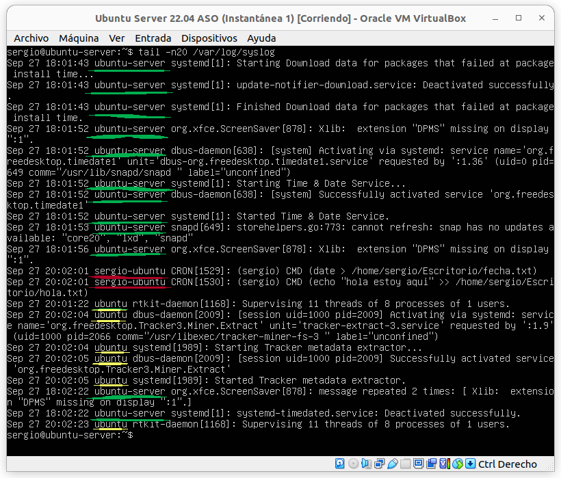

### Gestión de eventos del sistema.

Una de las cosas que hace de GNU/Linux un gran sistema operativo es que prácticamente cualquier cosa que suceda en y hacia el sistema puede estar registrado de alguna manera. Esta información es imprescindible para controlar cualquier sistema y es ​​uno de los primeros recursos que se utilizan para solucionar problemas del sistema y de las aplicaciones. Los registros pueden recoger casi cualquier cosa que necesite un *administrador*, siempre y cuando tenga una idea de dónde buscar primero.

Por ejemplo, ***Ubuntu*** proporciona información vital mediante varios archivos de registro del sistema. Estos archivos de registro suelen ser texto ASCII plano en un formato de archivo de registro estándar, y la mayoría de ellos se encuentran en el subdirectorio de registro del sistema tradicional `/var/log` . Muchos se generan por el demonio de registro del sistema, **`syslogd`** en nombre del sistema y ciertas aplicaciones, mientras que algunas aplicaciones generan sus propios registros escribiendo directamente en archivos en `/var/log` .

Vamos a ver cómo leer y usar varios de estos archivos de registro del sistema, cómo usar y configurar el demonio, **rsyslog**.

### Registros del sistema

Los registros del sistema tratan principalmente del funcionamiento del sistema Ubuntu, no necesariamente de aplicaciones adicionales agregadas por usuarios. Por ejemplo, se incluyen los mecanismos de autorización, demonios del sistema, mensajes del sistema y el registro del sistema o cualquier otro aspecto del sistema.

#### Registro de autorización

El Registro de autorización rastrea el uso de los sistemas de autorización, los mecanismos para autorizar a los usuarios que solicitan al usuario contraseñas, como el sistema del Módulo de autenticación conectable (PAM), el comando `sudo`, inicios de sesión remotos en `sshd`, etc. Se puede acceder al archivo de registro de autorización en `/var/log/auth.log`. Este registro es útil para conocer los inicios de sesión de los usuarios y uso del comando '`sudo`'.

Es muy común el uso del comando `grep` para hacer filtrados y búsquedas de información en este registro. Por ejemplo, para ver solo información en el Registro de autorización correspondiente a inicios de sesión `sshd`, se hace con:

```bash
grep sshd /var/log/auth.log | less
```

#### Daemon Logs

Un *demonio* es un programa que se ejecuta en segundo plano, generalmente sin intervención humana, y realiza alguna operación importante para el correcto funcionamiento de su sistema. El registro del demonio en `/var/log/daemon.log` y contiene información sobre el sistema en ejecución.y demonios de aplicaciones como el demonio *Gnome Display Manager* (**gdm**) , el demonio *Bluetooth HCI hcid* o *MySQL daemon* de base de datos *mysqld*. Esta información puede ayudar a solucionar problemas con un demonio en particular.

De nuevo, el uso de `grep` para buscar información específica es fundamental, mediante el nombre del demonio que le interesa.

#### Debug log

El ***registro de depuración*** (debug log) en `/var/log/debug` y proporciona mensajes de depuración detallados del sistema Ubuntu y las aplicaciones que se registran en **syslog** en el nivel *DEBUG*.

#### Kernel log

El *registro del kernel* (kernel log) en `/var/log/kern.log` proporciona un registro detallado de los mensajes del kernel de *Ubuntu* o cualquier sistema *GNU/Linux*. Estos mensajes pueden resultar útiles para solucionar problemas de un kernel nuevo o personalizado, por ejemplo.

#### Kernel Ring Buffer

El **Kernel Ring Buffer** no es realmente un archivo de registro en si, sino más bien un área en el kernel en ejecución que puede consultar para el inicio del kernel.mensajes a través de la utilidad `dmesg`. Para ver los mensajes, se hace mediante:

```bash
dmesg | less
```

O para buscar líneas que mencionen el sistema de *Plug & Play*, por ejemplo, se haría así:

```bash
dmesg | greppnp | less
```

De forma predeterminada, el script de inicialización del sistema `/etc/init.d/bootmisc.sh` envía todos los mensajes de inicio al archivo `/var/log/dmesg` también. Se puede ver y realizar búsquedas en este archivo mediante el comando `grep`, tal y como se hace en el resto de registros.

#### System Log o Registro del sistema

El **registro del sistema** normalmente contiene la mayor cantidad de información de forma predeterminada sobre un sistema *Ubuntu* o *GNU/Linux*. Se almacena en `/var/log/syslog` y puede contener información que otros registros no contienen. Se suele consultar para temas genéricos o cuando no se localiza la información en los registros anteriores, por no ser específicos. También contiene todo lo que solía estar en `/var/log/messages` en versiones anteriores de *Ubuntu* .

### Registros de aplicaciones

Muchas aplicaciones también crean registros en *`/var/log`* . Si recuperamos el contenido de esta carpeta podremos ver nombres familiares, como `/var/log/apache2` que representan los registros del servidor web *Apache 2*, o `/var/log/samba` ,que contiene los registros del servidor *Samba*. 

El sistema de visualización será el mismo que en los registros del sistema, por lo que no nos extenderemos más. Sin embargo, un buen administrador de un sistema Apache o Samba debería tener en cuenta estos fichero y llevar un control de los registros que en ellos aparecen.

### Demonio de registro del sistema (rsyslog)

El demonio de registro del sistema `syslogd` o `syslog` o **`rsyslog`** o `sysklogd`, espera mensajes de registro de numerosas fuentes y rutas.los mensajes al archivo o destino de red apropiado. Los mensajes registrados en `rsyslog` generalmente contienen elementos como ***nombres de host*** del sistema y ***marcas de tiempo*** además de la ***información de registro específica***.

#### Configuración de `rsyslog`

El archivo de configuración del demonio `rsyslog` es `/etc/syslog.conf`. Cada entrada en este archivo consta de dos campos, el selector y la acción. El campo selector especifica una función que se registrará, como por ejemplo la función de autenticación, que trata sobre la autorización y un nivel de prioridad para registrar dicha información, como info o advertencia . El campo de acción consta de un destino para la información de registro, como un archivo de registro estándar (es decir, `/var/log/syslog`), o el nombre de host de una computadora remota a la que enviar la información de registro.

#### `logger`: Enviado mensajes a syslog

Existe una utilidad interesante en la herramienta de registro, que permite colocar mensajes en el registro del sistema.(es decir, `/var/log/syslog`) arbitrariamente. Por ejemplo, supongamos que su nombre de usuario es *Sergio* y que desea registrar un mensaje en el **syslog** sobre lo interesante que son las clases en el I.E.S. Lluis Simarro, entonces lo haría de la siguiente forma:

<div align="center">
    
</div>

y aparecerá una nueva línea en el archivo `/var/log/syslog` con el mensaje enviado:

<div align="center">
    
</div>

Incluso puede especificar una etiqueta de la que provienen los mensajes y redirigir también el error estándar de salida mediante la opción `-s`.

```bash
logger -s "Este mensaje se registra en /var/log/syslog y en pantalla"
```

#### Rotación o backup de registros

Al ver los ficheros del directorio /var/log o cualquiera de sus subdirectorios, puede encontrar archivos de registro con nombres como `daemon.log.0`, `daemon.log.1.gz`, etc. ¿Cuáles son estos archivos de registro? Son archivos de registro "*rotados*". Es decir, han sido renombrados automáticamente después de un período de tiempo predefinido y se ha iniciado un nuevo registro original. Después de más tiempo el los archivos se comprimen con la utilidad `gzip` como en el caso del ejemplo `daemon.log.1.gz`. 

El propósito la rotación es archivar y comprimir registros antiguos para que consuman menos espacio en disco, pero aún estén disponibles para su inspección comonecesario. 

Esto se gestiona de forma automática el comando `logrotate` al cual se le llama desde un script **cron** de todo el sistema /etc/cron.daily/logrotate, y esta definido con más detalle por el archivo de configuración /etc/logrotate.conf. 

Se pueden añadir archivos de configuración individuales a `/etc/logrotate.d` (donde apache2 y mysql se almacenan las configuraciones por ejemplo).

> También puede rotar los archivos de registro del sistema mediante el script *cron.daily* `/etc/cron.daily/sysklogd `en lugar de utilizar `logrotate`. En realidad, el savelog de la utilidad puede producir resultados inesperados.en la rotación de registros en la que la configuración de logrotate parece no tener ningún efecto. 

### Centralizando el registro de eventos.

Hasta ahora hemos visto cómo un sistema registra sus propios eventos o mensaje, pero el sistema `syslog` también permite centralizar el registro de eventos de varios sistemas en un único equipo o servidor.

De hecho, para los administradores de sistemas puede ser muy útil unificar todos los *logs* de los diferentes equipos o servidores en un único equipo, para controlar de una forma más sencilla el sistema.

Existen varias herramientas complejas y costosas que permite hacer esto, pero configurando el redireccionamiento de los mensajes de una máquina a otra, podemos obtener excelentes resultado usando únicamente el protocolo `syslog`.

Por ejemplo, una vez configurados 3 equipos correctamente:
- Ubuntu (equipo host, donde virtualizamos - logs en amarillo)
- Ubuntu-Server (equipo virtualizado servidor - logs en verde)
- sergio-ubuntu (equipo virtualizado Desktop - logs en rojo)

podemos centralizar todos los mensajes y podemos obtener un registro de eventos como el siguiente:

<div align="center">
    
</div>

A continuación se detalla un par de fuentes donde se explica cómo configurar el sistema para poder centralizar mensajes en un equipo.

Para ello debemos actuar tanto en el equipo servidor como en el resto de equipos:
- En el equipo que hará de servidor
  - Se prepara la recepción de mensajes para poder admitir los mensajes que lleguen de otros equipos. Incluso se pueden almacenar en carpetas o ficheros separados.
  - Se debe abrir el firewall para permitir la entrada de estos mensajes. Normalmente se utiliza el puerto 514
- En el resto de equipos
  - Simplemente se redirigen los mensajes al equipo que hará de servidor.

En ambos casos, tras modificar la configuración debemos reiniciar el servicio `rsyslog`

Fuentes:

- [LinuxHint: How To Send Linux Logs to a Remote Server](https://linuxhint.com/send_linux_logs_remote_server/)
- [PaperBlog: Cómo enviar logs de Linux a un servidor remoto](https://es.paperblog.com/como-enviar-logs-de-linux-a-un-servidor-remoto-6809836/)