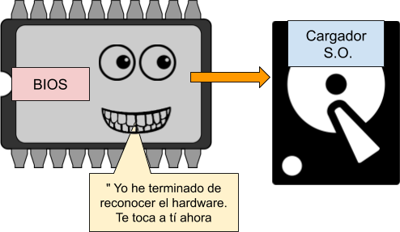

<h1>Gestión de procesos: SystemD</h1>

<h3>Tabla de contenidos</h3>

# Introducción

Si ejecutamos el siguiente comando: 

```bash
ps -eo pid,ppid,euser,stat,comm
```

Obtenemos un listado de los procesos del sistema con los siguientes datos:

- PID del proceso,
- PID del padre del proceso,
- usuario
- Estado del proceso
- línea de comandos que originó el proceso

En este listado, podemos ver que todo proceso tiene un padre (PPID), y que todo padre tiene a su vez otro, hasta llegar a los procesos 1 y 2. El mas importantes es el 1, el systemd.


# Servicios o procesos demonio

Veamos qué es un proceso o servicio y cómo funciona

## Funcionamiento interno de un proceso servidor.

Se hace la demo de como funciona un servidor


# El arranque del sistema linux

Una forma excelente de representar el arranque del sistema es mediante las siguientes figuras:

En primer lugar, es la BIOS la que inicia el sistema hardware y busca un disco duro que pueda inicializar el Sistema Operativo

<div align="center">
    
</div>

Seguimos todos los graficos de arranque y llegamos hasta el comando 

```bash
ls -l /sbin/init
```

y el **EJERCICIO**
> Ejercicio: Intenta razonar qué de pasos y acciones que deberá dar el proceso init u otros procesos
en el arranque para dejar el computador listo para ser usado por un usuario.

# SystemD

## Objetivos del systemd

## `Units`. Tipos

Los 7 tipos más importantes:

- **service**: Demonios que pueden ser iniciados, detenidos, reiniciados o recargados.
- **socket**: Esta unidad encapsula un socket en el sistema de archivos o en Internet. Cada unidad socket tiene una unidad de servicio correspondiente.
- **device**: Esta unidad encapsula un dispositivo en el árbol de dispositivos de Linux.
- **mount**: Esta unidad encapsula un punto de montaje en la jerarquía del sistema de archivos.
- **automount**: Encapsula un punto de montaje automático. Cada unidad automount tiene una unidad mount correspondiente, que se inicia al acceder al directorio de automontaje.
- **target**: Utilizada para la agrupación lógica de unidades. Referencia a otras unidades, que pueden ser controladas conjuntamente, un ejemplo sería multi-user.target, que básicamente desempeña el papel de nivel de ejecución 3 en el sistema clásico SysV.
- **snapshot**: Similar a las unidades target.


## Units de servicio: 

Para hacer funcionar los servicios.

### ficheros .service

```
[Unit]
Description=Foo
[Service]

ExecStart=/usr/sbin/foo-daemon

[Install]
WantedBy=multi-user.target
```

Donde 
- **Unit**: características generales
- **Service**: Indica como iniciar y parar el servicio
- **Target**: BAjo que condiciones o ***target*** se ejecuta el servicio.


### Tarjets

Significan estado a alcanzar por una situación concreta del sistema, por ejemplo `multi-user.target` es el principal de inicio.

Ver los ficheros en `/usr/lib/systemd/system/multi-user.target` y la carpeta `/usr/lib/systemd/system/multi-user.target.wants` y analizar 

### Carpetas importantes

- `/lib/systemd/system` : Repositorio principal de ***units***, gestionado por el gestor de paquetes.
- `/usr/lib/sytemd/system` : Copia del principal de ***units*** al que se le añaden las ***units*** los administradorescd 
- `/etc/systemd/system` : Configuración del sistema **real** aplicada, o sea, las que se ejecutan. Observer que todas enlaces a la carpeta anterior


# El comando `systemctl`

Tenemos muchos tutoriales buenos por internet, por ejemplo 

(DigitalOcean: Cómo usar Systemctl para gestionar servicios y unidades de Systemd)[https://www.digitalocean.com/community/tutorials/how-to-use-systemctl-to-manage-systemd-services-and-units-es]

Sintetizando: 

- Iniciar y apagar un servicio:

```bash
sudo systemctl start application.service
sudo systemctl stop application.service
```

- Reiniciar o volver a cargar:

```bash
sudo systemctl restart application.service
sudo systemctl reload application.service  # solo recarga configuración
```

- Habilitar y deshabilitar servicios

```bash
sudo systemctl enable application.service
sudo systemctl disable application.service
```

- Comprobar estado del servicio:

```bash
systemctl status application.service
```

- Enmascarar y desenmascarar unidades

```bash
sudo systemctl mask nginx.service
sudo systemctl unmask nginx.service
```

- Enumerar units del sistema:

```bash
systemctl                                       # lista las units cargadas
systemctl list-units                            # ídem anterior 
systemctl list-units --all                      # lista incluso las no activas
systemctl list-units --all --state=inactive     # filtrando por las inactivas
systemctl list-units --type=service             # filtrando por servicios solamente.
```

Demo de cómo se `status` y `mask`


# Ejercicio de iniciar servicio:

Puntos a tener en cuenta

- Si metemos nuevos ficheros de 
- Los archivos deben ser del root
- El archivo servHoraMult.service se puede copiar a `/usr/lib/systemd/system` o a `/lib/systemd/system`, es indiferente, se replica.
- Una vez hecho el paso anterior es aconsejable recargar el demonio de systemctl

```bash
sudo systemctl daemon-reload
```

- Se debe copiar el ejecutable en donde pone en el archivo de configuración: `/usr/bin/servHoraMult`
- Cuidado, porque el servicio lo mete en `/etc/systemd/system/multi-user.target.wants/`

Para ejecutar la prueba: 
```bash
sernetcat localhost 5000
```