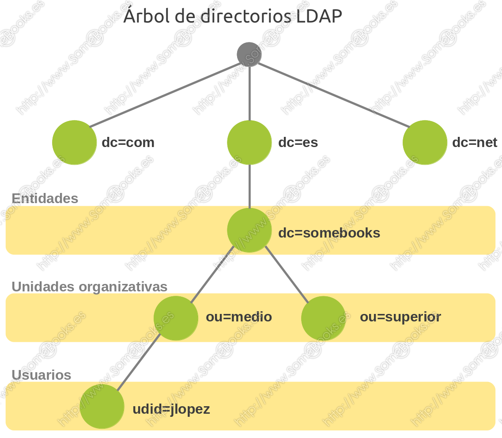
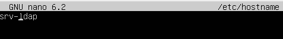

<h1>LDAP</h1>

<h3>Tabla de contenidos</h3>

- [1. Introducción](#1-introducción)
  - [1.1. ¿Qué es **NSS**?](#11-qué-es-nss)
  - [1.2. ¿Qué es **PAM**?](#12-qué-es-pam)
  - [1.3. ¿Qué es **LDAP**?](#13-qué-es-ldap)
  - [1.4. ¿Qué es **OpenLDAP**?](#14-qué-es-openldap)
- [2. Funcionamiento de **LDAP** y **OpenLDAP**](#2-funcionamiento-de-ldap-y-openldap)
- [3. Instalar **OpenLDAP** en Ubuntu](#3-instalar-openldap-en-ubuntu)
  - [3.1. Configuración inicial](#31-configuración-inicial)
  - [3.2. Instalación de software necesario](#32-instalación-de-software-necesario)
  - [3.3. Realizar la configuración básica](#33-realizar-la-configuración-básica)
  - [3.4. Comprobación de la instalación. `slapcat`](#34-comprobación-de-la-instalación-slapcat)
- [4. Configuración de **OpenLDAP**](#4-configuración-de-openldap)
  - [4.1. Iniciar estructura de directorio. `ldapadd`](#41-iniciar-estructura-de-directorio-ldapadd)
  - [4.2. Añadir un grupo de forma manual. `ldapadd`](#42-añadir-un-grupo-de-forma-manual-ldapadd)
  - [4.3. Añadir un usuario de forma manual. `ldapadd` y `slappasswd`](#43-añadir-un-usuario-de-forma-manual-ldapadd-y-slappasswd)
  - [4.4. Recuperar información del usuario. `ldapsearch`](#44-recuperar-información-del-usuario-ldapsearch)
  - [4.5. Modificar entradas del directorio. `ldapmodify`](#45-modificar-entradas-del-directorio-ldapmodify)
  - [4.6. Borrar entradas del directorio. `ldapdelete`](#46-borrar-entradas-del-directorio-ldapdelete)
  - [4.7. El paquete `ldapscripts`](#47-el-paquete-ldapscripts)
- [5. La interfaz web ***LDAP Account Manager***](#5-la-interfaz-web-ldap-account-manager)
  - [5.1. Instalacion de ***LDAP Account Manager***](#51-instalacion-de-ldap-account-manager)
  - [5.2. Configuración de ***LDAP Account Manager***](#52-configuración-de-ldap-account-manager)
- [6. Configurar un equipo cliente con Ubuntu para autenticarse en el servidor OpenLDAP](#6-configurar-un-equipo-cliente-con-ubuntu-para-autenticarse-en-el-servidor-openldap)
  - [6.1. Preparación del equipo](#61-preparación-del-equipo)
  - [6.2. Instalar el software necesario](#62-instalar-el-software-necesario)
  - [6.3. Ajustes en los fichero de configuración.](#63-ajustes-en-los-fichero-de-configuración)
    - [6.3.1. Fichero `/etc/nsswitch.conf`](#631-fichero-etcnsswitchconf)
    - [6.3.2. Fichero `/etc/pam.d/common-password`](#632-fichero-etcpamdcommon-password)
    - [6.3.3. Fichero `/etc/pam.d/common-session`](#633-fichero-etcpamdcommon-session)
  - [6.4. Comprobar funcionamiento](#64-comprobar-funcionamiento)
  - [6.5. Iniciar sesión gráfica en el equipo cliente con un usuario LDAP](#65-iniciar-sesión-gráfica-en-el-equipo-cliente-con-un-usuario-ldap)
    - [6.5.1. Instalar nslcd](#651-instalar-nslcd)
    - [6.5.2. Iniciar sesión gráfica con un usuario LDAP](#652-iniciar-sesión-gráfica-con-un-usuario-ldap)


# 1. Introducción

Sabemos que Linux mantiene a los usuarios registrados en el archivo `/etc/passwd` por lo que , si deseas acceder al dispositivo, debes tener un usuario definido en ese archivo.

Esto es bueno cuando estás trabajando en una o varias máquinas, pero ¿qué sucede si tienes cientos de máquinas o tal vez miles, cómo vas a mantener las tareas de administración de usuarios como la modificación de contraseña o cualquier otra tarea administrativa como que alguien dejó el trabajo y necesitas cerrar su cuenta,

Existen diferentes formas de autenticar clientes en una red GNU/Linux, pero una de las más usadas es la combinación de tres herramientas diferentes: `PAM`, `NSS` y `LDAP`.

La idea consiste en disponer de un servidor que facilite la autenticación de los clientes, de modo que éstos recurran al servidor cada vez que un usuario necesite identificarse.De esta forma, la cuenta de usuario no es específica de un equipo cliente, sino que será válida en cualquier equipo de la red que haya sido debidamente configurado.

<div align="center">
    
</div>

De hecho, éste es el método que suele utilizarse en GNU/Linux para obtener una gestión de usuarios globales similar a la que ofrecen los Servidores Windows a través de una estructura de dominios.

Fuente : [Somebooks: Instalar y configurar OpenLDAP en Ubuntu](http://somebooks.es/sistemas-operativos-red-2a-edicion/#conte)

## 1.1. ¿Qué es **NSS**?

**NSS** (*Name Service Switch*) es un servicio que permite la resolución de nombres de usuario y contraseñas (o grupos) mediante el acceso a diferentes orígenes de información. En condiciones normales, esta información se encuentra en los archivos locales del sistema operativo, en concreto en `/etc/passwd`, `/etc/shadow` y `/etc/group`, pero puede proceder de otras fuentes, como **DNS** (Domain Name System), **NIS** (Network Information Service), **LDAP** (Lightweight Directory Access Protocol) o **WINS** (Windows Internet Name Service).

Los primeros sistemas operativos de tipo *Unix* accedían directamente a los archivos de configuración o código que dependía de la forma en que se producía la autenticación. Esto hacía que cualquier cambio en el modo de autenticación obligara a cambiar el sistema operativo.

El objetivo de **NSS** es que los programas o los comandos del sistema operativo puedan manejar información administrativa relacionada con los usuarios, las contraseñas y los grupos (incluidos aspectos como la caducidad de una contraseña o su nivel de complejidad) sin tener que conocer el lugar donde se encuentran almacenados. 

<div align="center">
    
</div>

## 1.2. ¿Qué es **PAM**?

**PAM** (*Pluggable Authentication Modules*) establece una interfaz entre los programas de usuario y distintos métodos de autenticación. De esta forma, el método de autenticación se hace transparente para los programas.

La idea se basa en la creación de módulos de autenticación reemplazables, de forma que sea transparente para el sistema el uso de distintos métodos de autenticación. Esto hace que, sin realizar modificaciones en el sistema, podamos utilizar métodos que vayan desde el uso típico de un nombre de usuario y una contraseña, hasta dispositivos que faciliten la identificación biométrica de los usuarios (lectores de huellas, de voz, de imagen, etc.). Incluso incorpora opciones para aceptar contraseñas de un solo uso, restringir el acceso a determinados horarios o establecer políticas de autenticación específicas para cada usuario o grupos de usuarios.

Básicamente, **PAM** complementa en algunos aspectos el funcionamiento de **NSS** ya que mientras éste se centra en la búsqueda y mapeo de los usuarios, PAM controla la autenticación, el inicio de sesión y su configuración.

En la actualidad, **PAM** es el método que utilizan la mayoría de las aplicaciones y herramientas de *GNU/Linux* que necesitan relacionarse, de algún modo, con la autenticación de los usuarios.

<div align="center">
    
</div>

## 1.3. ¿Qué es **LDAP**?

**LDAP** es un protocolo que ofrece el acceso a un servicio de directorio implementado sobre un entorno de red, con el objeto de acceder a una determinada información. Puede ejecutarse sobre *TCP/IP* o sobre cualquier otro servicio de trasferencia orientado a la conexión.

**LDAP** son las siglas en inglés de ***Lightweight Directory Access Protocol*** (Protocolo Ligero de Acceso a Directorios) y podemos considerarlo como un sistema de almacenamiento de red (normalmente construido como una base de datos) al que se pueden realizar consultas.

## 1.4. ¿Qué es **OpenLDAP**?

La respuesta es muy sencilla: **OpenLDAP** es un desarrollo del protocolo **LDAP**, implementado con la filosofía del software libre y código abierto.

Como ocurría en el caso de **LDAP**, **OpenLDAP** está muy optimizado para ofrecer los mejores resultados en situaciones que requieran operaciones de lectura intensivas. De esta forma, un directorio **OpenLDAP** arrojará unos resultados muy superiores a los que ofrece una base de datos relacional optimizada, cuando realicemos operaciones de consulta intensivas sobre ambas.

Por el contrario, si utilizáramos un directorio **OpenLDAP** para guardar datos que sean actualizados de manera frecuente, los resultados obtenidos serían muy inferiores a los ofrecidos por una base de datos relacional.

No sólo podemos encontrar **OpenLDAP** en la mayoría de de las distribuciones GNU/Linux, sino que también lo encontramos para *Microsoft Windows*, *Apple OSX*, *Solaris*, *HP-UX*, *BSD*, etc. 

# 2. Funcionamiento de **LDAP** y **OpenLDAP**

El modelo de información de **LDAP** se basa en entradas, entendiendo por entrada un conjunto de atributos identificados por un nombre global único (***Distinguished Name*** – `DN`), que se utiliza para identificarla de forma específica. Las entradas se organizan de forma lógica y jerárquica mediante un esquema de directorio, que contiene la definición de los objetos que pueden formar parte del directorio.

Cada entrada del directorio representa un objeto, que puede ser abstracto o real: una persona, un mueble o una función en la estructura de una empresa, etc

Cada atributo de una entrada tendrá un tipo y un valor con el formato atributo/valor que permite caracterizar un aspecto del objeto que define la entrada. Estos atributos tienen nombres que hacen referencia a su contenido y pueden ser de dos tipos:

- **Atributos normales**: Son los atributos que identifican al objeto (nombre, apellidos, etc.).
- **Atributos operativos**: Son los atributos que utiliza el servidor para administrar el directorio (fecha de creación, tamaño, etc.).

Las entradas se indexan mediante el nombre completo (`dn`), que facilita la identificación singular a cada elemento del árbol. El nombre completo se formará con una serie de pares atributo/valor, separados por comas, que reflejan la ruta inversa desde la posición lógica del objeto hasta la raíz del árbol.

Para referirse al nombre completo suelen utilizarse las siglas **RDN**, que provienen del inglés R****elative Distinguished Name****.

Entre los atributos que suelen emplearse habitualmente, encontramos los siguientes, aunque puede haber muchos más:

- `uid` (user id): Identificación única de la entrada en el árbol.
- `objectClass`: Indica el tipo de objeto al que pertenece la entrada.
- `cn` (common name): Nombre de la persona representada en el objeto.
- `givenname`: Nombre de pila.
- `sn` (surname): Apellido de la persona.
- `o` (organization): Entidad a la que pertenece la persona.
- `u` (organizational unit): El departamento en el que trabaja la persona.
- `mail`: dirección de correo electrónico de la persona.

Obviamente, los atributos anteriores hacen referencia a un tipo de objeto que representa a los miembros de una empresa. Para representar otros tipos de objetos, necesitaríamos atributos diferentes.

De esta forma, una entrada almacenada en el directorio LDAP podría tener el siguiente aspecto:

```
dn: uid=jlopez, ou=medio, dc=somebooks, dc=es
objectClass: person
cn: Juan Lopez
givenname: Juan
sn: Lopez
o: somebooks
u: medio
mail: juanlopez@somebooks.es
```

Como hemos dicho antes, las diferentes entradas se organizan a modo de árbol jerárquico que, normalmente, representa una estructura organizativa o geográfica en particular. Así, las entradas que representan comunidades autónomas aparecerán en la parte superior del árbol, debajo estarán las que representan provincias, después las ciudades, los departamentos, los usuarios, etc.


<div align="center">
    
</div>

En la actualidad, las implementaciones de **LDAP** suelen utilizar **DNS** (*Domain Name Service*) para la estructura de los niveles superiores del árbol. En los niveles inferiores, sin embargo, las entradas representarán otro tipo de unidades organizativas, usuarios o recursos.

Por otra parte, gracias al uso de un atributo especial llamado ***objectClass***, podemos controlar qué atributos son válidos y cuáles imprescindibles en una entrada. Los valores de ***objectClass*** establecen las reglas que debe seguir el valor de una entrada.

Lógicamente, **LDAP** establece operaciones para consultar o actualizar el directorio. Éstas nos permiten crear o eliminar entradas y modificar entradas existentes.

La mayor parte del tiempo, **LDAP** se utiliza para diversas consultas sobre la información que contiene, por lo que es común que la estructura de su base de datos se encuentre optimizada para la lectura en detrimento de la escritura.

> Como vemos, **LDAP** puede utilizarse para organizar de forma unificada el acceso a la información representativa de una red. Sin embargo, es muy frecuente que también almacene la información de autenticación para los usuarios y/o recursos. De esta forma, se facilita el control de acceso sobre los datos contenidos en el servidor.

Aunque ya hemos visto al principio un esquema de funcionamiento mucho más detallado, podríamos representar el funcionamiento de LDAP de una forma más abstracta con el siguiente esquema:

<div align="center">
    
</div>

Por último, LDAP incluye servicios de integridad y confidencialidad de los datos que contiene. 

# 3. Instalar **OpenLDAP** en Ubuntu

## 3.1. Configuración inicial

Existen algunas cuestiones que deberemos tener en cuenta antes de instalar y configurar Ubuntu como servidor LDAP:

1. Lo primero será asegurarnos de que el sistema tiene asignada una dirección IP estática. Para consultar la configuración de red y asegurarte de que es correcta, puedes ejecutar el siguiente comando, aunque el nombre concreto del archivo puede cambiar ligeramente en tu sistema:

```bash
cat /etc/netplan/00-installer-config.yaml
```

2. Comprobaremos que los archivos `/etc/hostname` y `/etc/hosts` contienen los nombres adecuados para el servidor.
   1. En el caso de `/etc/hostname`, para asignar un nuevo **nombre** al **servidor**. Por ejemplo, podemos asignar el nombre de ```srv-ldap```, por lo que este debe ser el contenido del fichero. 
   <div align="center">
        
   </div>
   
   2. Con `/etc/hosts` el proceso es un poco más largo: debemos editar el archivo e incluir las líneas que relacionen la dirección IP estática del servidor con los nombres lógicos que tenemos previsto utilizar. En concreto modificamos la línea que hace referencia al bucle local y añadimos una nueva línea que haga referencia a la dirección IP estática. En definitiva, algo como esto:
   <div align="center">
        
   </div>
```
127.0.1.1 srv-ldap.simarrilandia.local srv-ldap
192.168.56.254 srv-ldap.simarrilandia.local srv-ldap
```

## 3.2. Instalación de software necesario

Como siempre, debemos asegurarnos de que nuestro servidor esta actualizado, por ejemplo mendiante :

```bash
sudo apt update -y && sudo apt upgrade -y && sudo apt dist-upgrade -y
```

Posteriormente, procedemos con la instalación: 

```bash
sudo apt install slapd ldap-utils -y
```

Durante el proceso, aparece el asistente de instalación de **OpenLDAP**, que realiza una configuración predeterminada y solo nos pide la contraseña de administración.

En realidad, no es importante el valor que incluyas ahora, porque después realizaremos la configuración de forma manual.

## 3.3. Realizar la configuración básica

Una vez concluida la instalación, debemos realizar la configuración que te mencionaba más arriba. Y para lograrlo, basta con usar el siguiente comando:

```bash
sudo dpkg-reconfigure slapd
```

Así conseguiremos que se inicie de nuevo el asistente de configuración, pero esta vez nos pedirá todos los datos.

1. Lo primero que nos pregunta el asistente es si queremos omitir la configuración de OpenLDAP.
2. Después, deberemos escribir el nombre DNS del dominio que usaremos en nuestro directorio LDAP, por ejemplo ```simarrilandia.local```
<div align="center">
    
</div>

3. A continuación, deberemos escribir el nombre de la empresa o entidad en la que estemos realizando la instalación
<div align="center">
    
</div>

4. Lo siguiente será escribir la contraseña de administración. 
5. Seguidamente, el asistente nos pregunta si queremos eliminar la base de datos de configuración antigua, responderemos que ```yes```
<div align="center">
    
</div>

6. Por último, el asistente nos avisa de que aún quedan archivos en la carpeta de LDAP, que pueden estropear el proceso de configuración y nos pide autorización para retirarlos antes de creare la nueva base de datos. Confirmaremos con ```yes```
7. Al hacerlo, se cierra el asistente la ventana vuelve a su aspecto inicia, donde podemos comprobar que las operaciones de configuración se han realizado correctamente.

## 3.4. Comprobación de la instalación. `slapcat`

Una vez concluida la instalación, podemos comprobar que todo es correcto usando el comando `slapcat`:

```bash
sudo slapcat
```

El objetivo de este comando consiste en obtener la información de la base de datos LDAP.

<div align="center">
    
</div>

La salida se produce en formado ***LDIF***, lo que nos facilitará exportar la estructura del directorio LDAP o, sencillamente, obtener una copia de respaldo de su contenido. Para lograrlo, bastará con con redirigir su salida a un archivo. 

# 4. Configuración de **OpenLDAP**

## 4.1. Iniciar estructura de directorio. `ldapadd`

Vamos a crear una plantilla con la que crearemos una ***Unidad Organizativa***. Este será el elemento lógico que agrupará al resto de los objetos que creemos en el directorio a partir del próximo artículo.

Comenzaremos editando el fichero `ou.ldif`. El nombre es lógico según lo comentado.

Modificamos este fichero añadiendo los siguientes datos: 

```
dn: ou=asix,dc=simarrilandia,dc=local
objectClass: top
objectClass: organizationalUnit
ou: asix
```

Como ves, el objeto se llamará `asix`, se encuentra en la parte superior de la jerarquía, y es una ***Unidad organizativa***.

<div align="center">
    
</div>

A continuación, deberemos añadir la información a la base de datos **OpenLDAP**. Como sabemos, esto se hace con el comando `ldapadd`:

```bash
sudo ldapadd -x -D cn=admin,dc=simarrilandia,dc=local -W -f ou.ldif
```

La salida del comando nos informará si se ha producido algún error.

En nuestro caso, el objeto se ha añadido correctamente.

De cualquier modo, para asegurarnos, basta con ejecutar el comando `slapcat`:

```bash
sudo slapcat
```

La salida nos muestra la estructura del directorio hasta el momento, en formado ***LDIF***.

<div align="center">
    
</div>


## 4.2. Añadir un grupo de forma manual. `ldapadd`

Para crear un grupo lo haremos de un modo muy parecido al que hemos utilizado en el punto anterior, cuando creamos la ***unidad organizativa***. Es decir, crearemos un nuevo archivo ***ldif*** y, a continuación, lo integraremos en la base de datos con el comando `ldapadd`.

Así pues, comenzaremos por crear un grupo, y luego un usuario, así, seguiremos el orden que establece la jerarquía de los objetos.

Comenzaremos creando un archivo de texto, con extensión ***ldif***, por ejemplo `grp_aso.ldif`, pero tú puedes llamarlo como prefieras

```bash
sudo nano grp_aso.ldif
```

En el editor, escribiremos un contenido como este:

```
dn: cn=aso,ou=asix,dc=simarrilandia,dc=local
objectClass: top
objectClass: posixGroup
gidNumber: 10000
cn: aso
```

> **Nota**: En el ejemplo, hemos seguido la convención de comenzar los UID de los grupos a partir del valor 10000 (gidNumber: 10000). Así, los siguientes grupos que creemos de forma manual, recibirán los valores 10001, 10002, etc. 
> De esta forma, evitamos solaparnos con los UID que asigna el sistema de forma automática, ya que éstos comienzan de forma predeterminada en 1000.

Con esto ya estamos listos para cargar el nuevo usuario en el directorio. Sólo tenemos que escribir el siguiente comando:

```bash
sudo ldapadd -x -D cn=aso,dc=simarrilandia,dc=local -W -f grp-aso.ldif
```

Comprobamos que el grupo se ha creado correctamente y  como siempre mediante `slapcat` obtendremos todas las entradas para comprobar que todo se ha ejecutado correctamente. 

<div align="center">
    
</div>

## 4.3. Añadir un usuario de forma manual. `ldapadd` y `slappasswd`

Para añadir el usuario, repetimos el proceso anterior, pero lo primero será evitar que la contraseña del usuario se almacene en texto plano dentro del archivo ldif.

Para lograrlo, usaremos el comando `slappasswd` que produce, a partir de la contraseña original, un hash utilizando el algoritmo SHA-1 (aunque podríamos cambiar el algoritmo que se aplique usando el argumento `-h`).

Por lo tanto, comenzamos ejecutando el comando `slappasswd`:

```bash
sudo slappasswd
```

<div align="center">
    
</div>

A continuación, el comando nos pide la contraseña que queremos utilizar. Es decir, la que usará inicialmente el usuario que estamos a punto de crear, cuando necesite autenticarse.

Deberemos escribirla por duplicado, como siempre, para evitar errores tipográficos.

Al momento, obtendremos la cadena, codificada con hash SHA-1, que equivale a la contraseña que hemos escrito. Debemos copiarla para utilizarla en el archivo ldif que crearemos a continuación.

Ahora ha llegado el momento de crear el archivo ***ldif*** para el nuevo usuario. Recuerda que usar el nombre de archivo que prefieras:

```bash
sudo nano usr_srey.ldif
```

Una vez abierto el editor, escribiremos un contenido similar a :

```
dn: uid=srey,ou=asix,dc=simarrilandia,dc=local
objectClass: top
objectClass: posixAccount
objectClass: inetOrgPerson
objectClass: person
cn: srey
uid: srey
ou: asix
uidNumber: 2000
gidNumber: 10000
homeDirectory: /home/srey
loginShell: /bin/bash
userPassword: {SSHA}0V5c25yOa+P5UGK32Lhhb2tpVoaX9nAR
sn: rey
mail: s.reymartinez@edu.gva.es
givenName: srey
```

Observa que hemos incluido al usuario como miembro del grupo que hemos creado más arriba (gidNumber: 10000) y hemos usado la contraseña que hemos generado antes (*userPassword: {SSHA}0V5c25yOa+P5UGK32Lhhb2tpVoaX9nAR*).

> **Nota**: En este caso, seguimos la convención de comenzar los ***UID*** de los usuarios a partir del valor 2000 (uidNumber: 2000). Así, los siguientes usuarios que creemos de forma manual, recibirán los valores 2001, 2002, etc.
> Recuerda que el sistema asigna ***UID*** de manera automática a partir de 1000. Si el margen no fuera suficiente, podríamos partir de un valor diferente que nos permitiera ampliar o disminuir el intervalo.

Con esto estamos listos para cargar el nuevo usuario en el directorio. Sólo tenemos que escribir el siguiente comando:

```bash
sudo ldapadd -x -D cn=admin,dc=somebooks,dc=local -W -f usr.ldif
```

<div align="center">
    
</div>

Como antes usaremos el comando `slapcat`, para obtener todas las entradas del directorio y asegurarnos de que todo es correcto:

```bash
sudo slapcat
```

> **Nota**: Cuando añadas nuevos usuarios, recuerda que los valores para los atributos *uidNumber* y *homeDirectory* deben ser diferentes para cada usuario. También habrá que sustituir el texto *mi_password* por la contraseña adecuada para el usuario. Lo mismo ocurre con el atributo *gidNumber* de los grupos. Además, los valores de los campos *uidNumber* y *gidNumber* no deben coincidir con el *UID* y *GID* de ningún usuario y grupo local. 

>> **Importante**: Aquí hemos intentado ser lo más didácticos posible, pero podríamos haber usado un solo archivo ***ldif*** que incluyese todos los grupos y usuarios que necesitemos. Bastaría con dejar una línea en blanco entre la definición de un elemento y la del siguiente.


## 4.4. Recuperar información del usuario. `ldapsearch`

Por último, podemos comprobar que el contenido anterior se recupera correctamente. Para lograrlo podemos utilizar el comando `ldapsearch`, que nos permite hacer una búsqueda en el directorio.

```bash
ldapsearch -xLLL -b "dc=simarrilandia,dc=local" uid=srey sn givenName cn
```

En este ejemplo buscamos un usuario con `uid=srey` y pedimos que nos muestre el contenido de los atributos `sn`, `givenName` y `cn`.

<div align="center">
    
</div>

En el ejemplo anterior: 

- `-x`  indica que usaremos autentificación simple.
- `-LLL` sirve para que la salida sea del tipo LDAPv1.
- `-b` va seguida del punto del árbol donde debe comenzar la búsqueda. En este caso, `dc=simarrilandia,dc=local`.
- Después se incluye la condición que deberán cumplir los objetos buscados. En el ejemplo, cualquier valor (*) para el atributo `uid`.
- Por último, se incluye el nombre de los atributos que queremos obtener en el resultado de la consulta.

Como puedes ver el resultado de la consulta se obtiene en formato ***LDIF***, lo que facilitará redirigirlo a un archivo y usarlo como copia de seguridad o incluso como método de exportación de datos a otra implementación de **OpenLDAP**.

## 4.5. Modificar entradas del directorio. `ldapmodify`

El comando `ldapmodify` permite cambiar el contenido de cualquier atributo, añadir atributos nuevos, eliminarlos etc. Dado que la sintaxis es más compleja nos apoyaremos en un archivo ***LDIF*** que especifique los cambios que necesitamos realizar. 

Por ejemplo, si queremos cambiar el correo electrónico del usuario introducido anteriormente: 

```
dn: uid=srey,ou=asix,dc=simarrilandia,dc=local
changetype: modify
replace: mail
mail: srey@simarrilandia.local
```

Como puedes suponer:
1. La primera línea identifica la cuenta en la que realizaremos el cambio. 
2. La segunda indica el tipo de operación a realizar.
3. La tercera identifica el atributo.
4. La cuarta incluye el nuevo valor que debe asignarle.

Como en el resto de los artículos, usaremos un editor para introducir todos los datos y posteriormente ejecutamos la utilidad `ldapmodify`. Como verás esta utilidad es muy similar a la vista anteriormente `ldapadd`, donde primero indicamos la identificación con la que ejecutamos la orden y después el nombre del archivo donde se encuentran los datos:

```bash
ldapmodify -x -D cn=admin,dc=simarrilandia,dc=local -W -f cambios.ldif
```

Ejecutamos los cambios y utilizamos el comando anterior `ldapsearch` para comprobar que los cambios se han producido de forma satisfactoria:

<div align="center">
    
</div>

## 4.6. Borrar entradas del directorio. `ldapdelete`

La utilidad que permite eliminar entradas del directorio se llama `ldapdelete`. Para utilizarla, sólo tenemos que aportar los datos del objeto a borrar y los datos de la cuenta administrador que debe permitirlo. La sintaxis será como sigue:

```bash
ldapdelete -x -W -D 'cn=admin,dc=simarrilandia,dc=local' "uid=srey,ou=asix,dc=simarrilandia,dc=local"
```
Después de escribir la contraseña, parecerá que no ha ocurrido nada. Sin embargo, el objeto se habrá eliminado. Para comprobarlo, podemos volver a utilizar la utilidad `ldapsearch` con la misma sintaxis de arriba.

<div align="center">
    
</div>

## 4.7. El paquete `ldapscripts`

Debido a la incomodidad de manejo directo de las herramientas de **ldap-utils** es frecuente la utilización de las mismas a través de algún script. En particular, tenemos un paquete en el que se incluyen algunos bastante útiles que nos facilitarían el trabajo y que se denomina `ldapscripts`.

Para ello instalaremos el paquete `ldapscripts`.

```bash
sudo apt install ldapscripts
```

El listado de scripts de este paquete es:
• `ldapadduser` usuario grupo
• `ldapsetpasswd` usuario
• `ldapdeleteuser` usuario
• `ldapaddgroup` grupo
• `ldapdeletegroup` grupo
• `ldapsetprimarygroup` usuario grupo
• `ldapaddusertogroup` usuario grupo
• `ldapdeleteuserfromgroup` usuario grupo

Hay más scripts en el paquete, para ver la lista entera ejecuta:

```bash
dpkg -L ldapscripts | grep bin
```

Ahora tendremos que editar el fichero de configuración para que los script puedan modificar los datos y sepan sobre qué dominio y unidades organizativas tienen que operar. A continuación enumeramos la directivas básicas del fichero `/etc/ldapscripts/ldapscripts.conf` que deberemos cambiar. Obviamente cada cual tendrá que poner los datos que correspondan con su servidor, se supone que ya se han creado las *unidades organizativas*, *usuarios*, *grupos* y *equipos*):

```
SERVER="ldap://localhost"
SUFFIX="dc=simarrilandia,dc=local"
USUFFIX="ou=asix"
GSUFFIX="ou=asix"
MSUFFIX="ou=asix"
BINDDN="cn=admin,dc=simarrilandia,dc=local"
BINDPWDFILE="/etc/ldapscripts/ldapscripts.passwd"
UIDSTART=10000
GIDSTART=10000
MIDSTART=20000
GCLASS="posixGroup"
USHELL="/bin/bash"
UHOMES="/home/ldap-asix/%u"
```

Todas estas variables estan dipersas por todo el fichero de configuración, algunas de ellas comentadas. Debemos descomentar y cambiar las necesarias, según lo indicado anteiormente

<div align="center">
    
</div>

En nuestro caso, todos los usuarios vamos a incluirlos dentro de la única Unidad Organizativa que hemos creado hasta ahora: `asix`. Sin embargo, si buscamos documentación sobre este conjunto de scripts veremos que normalmente establecen diferentes Unidades Organizativas para usuarios, grupos y máquinas.

```
USUFFIX="ou=usuarios"
GSUFFIX="ou=grupos"
MSUFFIX="ou=equipos"
```

Además, como podemos ver, tenemos una entrada `BINDPWDFILE` cuyo objetivo es localizar un archivo que contiene la contraseña del uauario admin que nos permite ejecutar todas los comandos.

Esto es altamente peligroso, puesto que publicamos nuestra contraseña de configuración del ldap. En todo caso, restrigimos accesos una vez establecidas:

```bash
echo -n 'password-del-administrador' > /etc/ldapscripts/ldapscripts.passwd"
sudo chmod 400 /etc/ldapscripts/ldapscripts.passwd
```

> **Nota**: El password **solo funciona si lo hacemos mediante un `echo -n`**, y no funciona si lo editamos con un editor como *nano*, *vi* o *vim*, por lo que debemos ejecutar los pasos anteriores. En mi caso, como no tengo el usuario root activo y me resisto a activarlo, debo dar un pequeño rodeo para ejecutar el primero de los dos comando. 

<div align="center">
    
</div>

En este punto ya podríamos empezar los comandos que nos ofrece el paquete `ldapscript`, pero para que funcionen nos queda una tarea que realizar y es crear las unidades organizativas que le hemos especificado en el fichero de configuración. 

Por ejemplo, para crear el grupo `ISO`:’

```bash
ldapaddgroup iso
```
<div align="center">
    
</div>

Después el usuario

```bash
ldapadduser pepito iso
```

```bash
ldapdeletegroup iso
```

<div align="center">
    
</div>

Con esta orden creará el usuario con las opciones por defecto configuradas en ldapscript.conf. Es importante prestar atención a la creación del directorio home para que el usuario pueda utilizar el sistema sin problemas. Por defecto no lo crea, tendríamos que especificarle dicha opción. 

Más ejemplos: 

- Add user: `sudo ldapadduser george pro`
- Change user's Password: `sudo ldapsetpasswd george`
- Delete user: `sudo ldapdeleteuser george`
- Add group: `sudo ldapaddgroup testgroup`
- Add user to a group: `sudo ldapaddusertogroup george testgroup`
- Remove user from a group: sudo ldapdeleteuserfromgroup george testgroup

Otros ejemplos creando un grupo y añadiendo usuarios al grupo creado o al grupos anteriores:

<div align="center">
    
</div>

Y como antes, podemos ejecutar `sudo slapcat` para comprobar los resultados:

<div align="center">
    
</div>

Como se puede comprobar, `ldapscript` nos ahorra trabajo respecto a las herramientas nativas que nos ofrece el paquete ldap-utils. Pero todavía hay otra característica que nos puede resultar interesante, su sistema de plantillas. El directorio `/usr/share/doc/ldapscripts/examples/` contiene unos ficheros con extensión `.template.sample` que se pueden utilizar para organizar la manera en la que se gestiona la información de cada uno de los atributos del elemento que estemos modificando.

Por ejemplo el fichero `/usr/share/doc/ldapscripts/examples/ldapadduser.template.sample` tendrá estas lineas:

```
dn: uid=<user>,<usuffix>,<suffix>
objectClass: account
objectClass: posixAccount
cn: <user>
uid: <user>
userPassword: <ask>
uidNumber: <uid>
gidNumber: <gid>
homeDirectory: <home>
loginShell: <shell>
gecos: <user>
description: User account
```

Podemos observar que algunas lineas indican que los atributos tendrán siempre el mismo valor, como los objectclass o description, otras utilizan variables que se han establecido en el script y por último está la opción `<ask>` que provoca que se le pregunte al usuario por el valor de dicho atributo.

Para usar una de estas plantillas tendremos que copiarla al directorio de configuración:

```bash
cp /usr/share/doc/ldapscripts/examples/ldapadduser.template.sample /etc/ldapscripts/ldapadduser.template
```

Y por último eliminar el comentario en `ldapscript.conf`:

```
UTEMPLATE=”/etc/ldapscripts/ldapadduser.template”
```

Como hemos visto, es una forma fácil de gestionar un dominio sencillo, pero tiene **algunas limitaciones**:
• No hay comandos para crear, modificar o eliminar unidades organizativas.
• Todos los usuarios se crean en la misma unidad organizativa.
• Los usuarios se crean con una plantilla diferente de la que utilizada anteriormente, por tanto pueden haber campos diferentes.

> Recuros sobre `ldapscripts`
> 
> Wiki: [Debian LDAP ldapscripts](https://wiki.debian.org/LDAP/ldapscripts) 
> 
> Video: [Insertar datos en servidor OpenLDAP - Uso de LDAPScripts](https://www.youtube.com/watch?v=XLrVUT7QbZk)
> 
> Video: [Tutorial OpenLDAP en Ubuntu. Parte IV (LDAPscripts. Altas, bajas y modificaciones)](https://www.youtube.com/watch?v=hHRxO0eIhto)


#  5. La interfaz web ***LDAP Account Manager***

Como hemos visto en los apartados anteriores, podemos realizar toda la administración de LDAP usando comandos. Sin embargo, la tarea puede resultar más agradable utilizando una interfaz web, ejecutada en un equipo cliente de la red.

Ese es, precisamente el objetivo de LDAP Account Manager, una interfaz web que permite administrar, desde el navegador, los usuarios, grupos, configuraciones DHCP y otros tipos de objetos que se encuentren almacenados en un directorio LDAP.

LDAP Account Manager también se conoce de forma abreviada como LAM y fue creado en 2003 por Michael Dürgner, Roland Gruber, Tilo Lutz y Leonhard Walchshäusl con el objetivo de administrar cuentas de usuarios, equipos y grupos bajo los protocolos POSIX y SAMBA. Realizaron su desarrollo en PHP y lo ofrecieron a la comunidad informática bajo licencia GPL.

## 5.1. Instalacion de ***LDAP Account Manager***

Antes de comanenzar, necesitamos los paquetes necesarios para su funcionamiento, Apache y php, así que ejecutaremos:

```bash
sudo apt install apache2 php php-cgi libapache2-mod-php php-mbstring php-common php-pear -y
sudo systemctl reload apache2
```

Posterior a la instalación, recargamos el sistema.

Procecemos a la instalación del ***LDAP Account Manager***

```bash
sudo apt install ldap-account-manager -y
```

Cuando termine la instalación, es recomendable restringir el acceso a la interfaz web de *LDAP Account Manager* únicamente para equipos de la red local. Para lograrlo, basta con editar el archivo `ldap-account-manager.conf`.

```bash
sudo nano /etc/apache2/conf-enabled/ldap-account-manager.conf
```
Una vez que tengamos el contenido del archivo en pantalla, localizamos una línea con el siguiente contenido:

```
# Require all granted
```

Cuando la hayamos localizado, **insertamos un carácter almohadilla (#) delante**, para comentarla. A continuación, añadimos una línea debajo con un texto similar al siguiente:

```
Require ip 127.0.0.1 192.168.56.0/24
```

Como es lógico, se deben ajustar los valores para que representen tu dirección de red.

Por último, volvemos a reiniciar el servicio de *apache* con la siguiente orden:

```bash
sudo systemctl restart apache2
```

Para la ejecución de LDAP Account Manager, utilizamos un navegador y accedemos a la dirección `http://192.168.56.254/lam` (o la que sea)

<div align="center">
    
</div>


## 5.2. Configuración de ***LDAP Account Manager***

Para entrar en la configuración, entramos en *LAM Configuration* 

<div align="center">
    
</div>

Una vez, dentro seleccionamos *Edit General Settings*. Nos pide una contraseña que por defecto es `lam`

<div align="center">
    
</div>

A partir de ahí cambiamos los valores para ajustar a nuestro sistema, asignamos la IP del servidor:

<div align="center">
    
</div>

también el idioma

<div align="center">
    
</div>

y sobretodo configuración referente a nuestro servidor LDAP:

<div align="center">
    
</div>

y guardamos cambios.

Pasamos a la pestaña de Tipos de Cuentas y cambiamos las direcciones LDAP, según lo usado hasta ahora

<div align="center">
    
</div>

y ahora ya podemos entrar y encontrar la configuración realizada hasta ahora:

- Grupos
<div align="center">
    
</div>

- y usuarios

<div align="center">
    
</div>


Mas info: [Somebooks](http://somebooks.es/ldap-parte-8-instalar-y-configurar-la-interfaz-web-ldap-account-manager-para-administrar-openldap/)


# 6. Configurar un equipo cliente con Ubuntu para autenticarse en el servidor OpenLDAP

Una vez configurado el servidor, es momento de configurar los clientes para hacer un ser del servidor creado.

Hay muchas formas de añadir una máquina cliente al servidor OpenLDAP, pero la más sencilla es utilizar los paquetes ‘libnss-ldap’ y ‘libpam-ldap’. Ambos paquetes están disponibles en los repositorios de las distros de Linux (con un nombre diferente del paquete), lo que facilita la instalación del administrador y acelera el aprovisionamiento de las máquinas cliente.

## 6.1. Preparación del equipo

Por supuesto el primer paso es asegurarnos de que tenemos conexión con el servidor y a partir de ahí realizar las configuraciones que se detalla a continuación.

<div align="center">
    
</div>

Es interesante dar un nombre al equipo representativo, tenemos varias opciones: mediante el fichero `/etc/hostname` o mediante el comando `hostnamectl set-hostname`

A continuación nos asegurarnos que el cliente resuelve el nombre del servidor, de esta manera, nos evitamos trabajar con direcciones IP. En un entorno de producción tendríamos un servidor DNS dando servicio, pero como estamos realizando un laboratorio de prueba, nos conformaremos con introducir la dirección en el archivo de hosts del cliente, aunque puedes hacerlo con un servidor DNS.

<div align="center">
    
</div>

Antes de continuar, podemos verificar que accedemos al servidor y obtenemos la lista de usuarios disponibles en el servidor OpenLDAP. Para ello utilizamos el comando `ldapsearch` tal y como hemos visto en la configuracón del servidor. Si no lo tenemos instalado, lo instalamos mediante el paquete `ldap-utils`;

```bash
sudo apt install ldap-utils
sudo ldapsearch -x -b "ou=asix,dc=simarrilandia,dc=local"
```

<div align="center">
    
</div>

Aqui vemos lo mismo que cuando lo ejecutamos desde el servidor.


## 6.2. Instalar el software necesario

En un sistema Linux, la autenticación de los usuarios se realiza básicamente mediante la consulta a dos archivos `/etc/passwd` con la información básica del usuario y `/etc/shadow` con la información relativa a la password de inicio de sesión. El acceso a estos archivos se realiza básicamente mediante los servicios PAM (Pluggable Authentication Module) y NSS (Name Service Switch). Por tanto, se modificará la configuración de estos servicios para que además de consultar los archivos locales, también lo hagan al servicio ldap, ello se consigue instalando dos liberías *libpam-ldap* y *libnss-ldap*.

Así pues el siguiente paso será ajustar el comportamiento de los servicios NSS y PAM en cada cliente que debamos configurar. Para lograrlo, necesitaremos instalar los siguientes paquetes:

- ***libnss-ldap***: Permitirá que NSS obtenga de LDAP información administrativa de los usuarios (Información de las cuentas, de los grupos, información de la máquina, los alias, etc.)
- ***libpam-ldap***: Que facilitará la autenticación con LDAP a los usuarios que utilicen PAM.
- ***ldap-utils***: Facilita la interacción don LDAP desde cualquier máquina de la red.

Previamente debemos instalar estos paquetes en el sistema, junto con el de utilidades que ya hemos instalado antes. Como los dos paquetes que necesitamos se encuentran en los repositorios oficiales de Ubuntu, sólo tenemos que escribir en la terminal la siguiente orden:

```bash
sudo apt-get install libnss-ldap libpam-ldap ldap-utils -y
```

Durante el proceso, se activa un asistente que nos permite configurar el comportamiento de *ldap-auth-config*. 

En el primar paso, nos solicita la dirección URi del servidor LDAP. En nuestro caso, escribiremos la dirección IP del servidor y sustituiremos el protocolo `ldapi:///` por `ldap://`. **Cuidado con las dos barras**.

<div align="center">
    
</div>

Después indicamos el nombre global único *(Distinguished Name – DN)*. Según el ejemplo `dc=simarrilandia,dc=local`

<div align="center">
    
</div>

Despúes nos pide versión del protocolo LDAP, dejamos el 3 y después indicaremos si las utilidades que utilicen PAM deberán comportarse del mismo modo que cuando cambiamos contraseñas locales (respondemos `yes`). Esto hará que las contraseñas se guarden en un archivo independiente que sólo podrá ser leído por el superusuario.

Después, el sistema nos pregunta si queremos que sea necesario identificarse para realizar consultas en la base de datos de LDAP, respondemos `No`

Ya sólo nos queda indicar el nombre de la cuenta ***LDAP*** que tendrá privilegios para realizar cambios en las contraseñas. Como antes, deberemos escribir un nombre global único *(Distinguished Name – DN)*, según el ejemplo `cn=admin,dc=simarrilandia,dc=local`.

<div align="center">
    
</div>

En el último paso, el asistente nos solicita la contraseña que usará la cuenta anterior. Deberá coincidir con la que escribimos en el apartado Instalar ***OpenLDAP*** en el servidor.

<div align="center">
    
</div>

En caso de ocurrir algún error o necesitamos efectuar alguna modificación, podemos repetir el proceso mediante el siguiente comando:

```bash
sudo dpkg-reconfigure ldap-auth-config
```

## 6.3. Ajustes en los fichero de configuración.

Deberemos cambiar algunos parámetros en los archivos de configuración del cliente. En concreto, deberemos editar 
- `/etc/nsswitch.conf`
- `/etc/pam.d/common-password` 
- `/etc/pam.d/common-session`

### 6.3.1. Fichero `/etc/nsswitch.conf`

Cambiamos la configuración de usuarios y grupos a `ldap` en vez de `systemd`

<div align="center">
    
</div>

Para saber si la configuración anterior funciona adecuadamente, usaremos el comando 'getent', que consultará el contenido del archivo `/etc/nsswitch.conf` para mostrarnos la lista de usuarios, grupos, equipos, etc., que se encuentran registrados en el sistema. Si la configuración que hemos hecho es correcta, aparecerán también las cuentas de usuario definidas en el servidor LDAP.

Su sintaxis es como sigue:

```bash
sudo getent passwd
```

El comando nos responderá con la lista de todos los usuarios, grupos, etc., que sean conocidos. Entre ellos, deben aparecer las cuentas LDAP.

Aqui tenemos el listado filtrado: 

<div align="center">
    
</div>


### 6.3.2. Fichero `/etc/pam.d/common-password` 

El siguiente archivo a editar será `/etc/pam.d/common-password` y eliminaremos el parámetro `use_authtok` de la línea 26. La función de este parámetro es evitar que si un determinado usuario falla la autenticación con un método, no pueda validarse con un segundo.

<div align="center">
    
</div>

### 6.3.3. Fichero `/etc/pam.d/common-session`

Este fichero ofrece un conjunto de reglas PAM para el inicio de sesión, tanto si éste es interactivo como si es no interactivo.

Aquí será donde indiquemos que se debe crear un directorio home durante el primer inicio de sesión, también para los usuarios autenticados mediante LDAP. Este comportamiento lo conseguiremos añadiendo al final del archivo la siguiente línea:

```
session optional       pam_mkhomedir.so skel=/etc/skel umask=077
```

Esta línea debemos insertarla al final del fichero.

<div align="center">
    
</div>


## 6.4. Comprobar funcionamiento

Para asegurarnos de que todo funciona correctamente, comenzaremos haciendo una consulta en el directorio LDAP, al estilo que lo que hacíamos cuanto trabajábamos en el servidor:

```bash
ldapsearch -x -H ldap://192.168.56.254 -b "dc=simarrilandia,dc=local"
```

Si hasta aquí todo es correcto, afrontaremos la prueba definitiva: identificarnos el el ordenador cliente con una cuenta de usuario definida en el servidor LDAP. Para lograrlo, podemos utilizar una orden como esta:

```bash
sudo su - srey
```

Verás que aparece un mensaje, avisando de que se está creando, dentro de /home, el directorio local para la cuenta. Esto es porque se trata de la primera vez que iniciamos sesión con esta cuenta en el equipo cliente. Como es lógico, esto no ocurrirá el resto de las veces que nos autentiquemos con esta cuenta.

<div align="center">
    
</div>


## 6.5. Iniciar sesión gráfica en el equipo cliente con un usuario LDAP

La solución para configurar el sistema operativo cliente para que se pueda autenticar una cuenta de usuario del servidor OpenLDAP usando la interfaz gráfica es tan sencilla como instalar el programa `nslcd`, un servicio que se encarga de facilitar consultas LDAP a procesos locales. De este modo, permitiremos que dichos procesos locales puedan obtener información sobre los usuarios y grupos del directorio LDAP.

### 6.5.1. Instalar nslcd

Como `nslcd` se encuentra en los repositorios oficiales de *Ubuntu*, su instalación es tan sencilla como ejecutar la siguiente orden:

```bash
sudo apt install nslcd
```

Durante el proceso, se activa un asistente que nos permite configurar el comportamiento de `nslcd`. En el primar paso, nos solicita la dirección URi del servidor LDAP. Escribiremos la dirección IP del servidor, precedido del protocolo usado. Después el nombre global único (Distinguished Name – DN). En nuestro caso:

```
ldap://192.168.56.254/
```
<div align="center">
    
</div>

```
dc=simarrilandia,dc=local
```

<div align="center">
    
</div>

Y reiniciamos el sistema.

### 6.5.2. Iniciar sesión gráfica con un usuario LDAP

Una vez completado el reinicio ya podemos introducir nuestro usuario dado de alta en el servidor ldap. 

<div align="center">
    
</div>

Recuerda que la pantalla de autenticación de Ubuntu solo muestra los usuarios que ya han iniciado sesión en el sistema, de forma gráfica, al menos una vez.

<div align="center">
    
</div>


Fuentes: 
- [somebooks.es. Instalación de openldap](http://somebooks.es/ldap-parte-1-instalar-openldap-en-ubuntu-20-04-lts/)
- [Openldap y II: configurando el cliente](https://waytoit.wordpress.com/2018/02/12/openldap-i-ii-configurando-el-cliente/)
- [HowToForge: Cómo añadir un sistema Ubuntu al servidor OpenLDAP](https://howtoforge.es/como-anadir-un-sistema-ubuntu-al-servidor-openldap/)
- [Youtube: Instalar y configurar OpenLDAP en SERVIDOR y CLIENTE en Ubuntu Server & Desktop 22.04](https://www.youtube.com/watch?v=Rl032gHFu88)