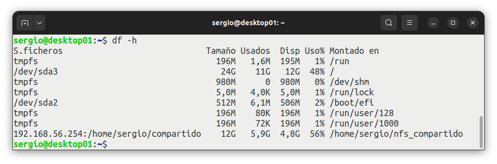
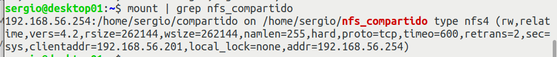
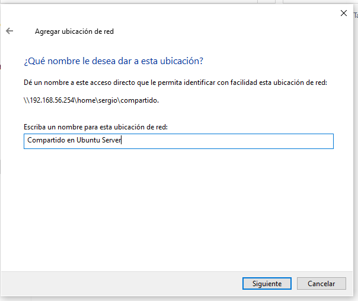

<h1>NFS. Network File System</h1>

<h3>Tabla de contenidos</h3>

- [1. Introducción](#1-introducción)
- [2. Instalación y configuración de NFS en un servidor Ubuntu](#2-instalación-y-configuración-de-nfs-en-un-servidor-ubuntu)
  - [2.1. Instalación de NFS](#21-instalación-de-nfs)
    - [2.1.1. Antes de la instalación](#211-antes-de-la-instalación)
    - [2.1.2. Instalar NFS](#212-instalar-nfs)
    - [2.1.3. Comprobar la instalación](#213-comprobar-la-instalación)
  - [2.2. Configuración de NFS](#22-configuración-de-nfs)
    - [2.2.1. Exportar contenido de las carpetas](#221-exportar-contenido-de-las-carpetas)
- [3. Instalación y configuración de un cliente Ubuntu](#3-instalación-y-configuración-de-un-cliente-ubuntu)
  - [3.1. Instalación.](#31-instalación)
  - [3.2. Configuración](#32-configuración)
    - [3.2.1. Crear punto de montaje](#321-crear-punto-de-montaje)
    - [3.2.2. Realizar el montaje de las carpetas compartidas](#322-realizar-el-montaje-de-las-carpetas-compartidas)
  - [3.3. Pruebas y demostraciones](#33-pruebas-y-demostraciones)
  - [3.4. Realizar el montaje de las carpetas compartidas en `/etc/fstab`](#34-realizar-el-montaje-de-las-carpetas-compartidas-en-etcfstab)
- [4. Instalación y configuración en un cliente Windows 10](#4-instalación-y-configuración-en-un-cliente-windows-10)
  - [4.1. Instalación](#41-instalación)
  - [4.2. Configuración y acceso](#42-configuración-y-acceso)
    - [4.2.1. Acceso puntual](#421-acceso-puntual)
    - [4.2.2. Montando unidades al inicio de Windows](#422-montando-unidades-al-inicio-de-windows)
      - [4.2.2.1. Creamos un acceso directo a la unidad compartida.](#4221-creamos-un-acceso-directo-a-la-unidad-compartida)
      - [4.2.2.2. Creamos unidad de red mediante un script en el inicio de sesión.](#4222-creamos-unidad-de-red-mediante-un-script-en-el-inicio-de-sesión)
- [5. Mejorando el uso compartido. Gestionando permisos.](#5-mejorando-el-uso-compartido-gestionando-permisos)
  - [5.1. Control de permisos desde servidor o desde cliente.](#51-control-de-permisos-desde-servidor-o-desde-cliente)
  - [5.2. Consideraciones a la hora de compartir](#52-consideraciones-a-la-hora-de-compartir)
  - [5.3. Problemas con los permisos en NFS](#53-problemas-con-los-permisos-en-nfs)
  - [5.4. Integración NFS con LDAP](#54-integración-nfs-con-ldap)
  - [5.5. Compartir con unos equipos en concreto](#55-compartir-con-unos-equipos-en-concreto)
- [6. Conclusiones](#6-conclusiones)


# 1. Introducción

**NFS**, del inglés ***Network File System***, es un protocolo que está presente en los sistemas operativos derivados de UNIX, incluidas casi todas las distribuciones de GNU/Linux. Su objetivo es facilitar el acceso, a través de la red local, a espacios de almacenamiento compartidos, como si se encontraran en el equipo desde el que se accede.

El protocolo **NFS** ofrece grandes ventajas en una instalación de red, como evitar la replicación de información en distintos puntos de la misma, simplificar el equipamiento de los equipos de trabajo, centralizar la copia de seguridad de los datos, etc. Incluso permite compartir dispositivos completos, como unidades ópticas, que ya comienzan a estar en desuso.

Se trata de un protocolo, implementado en 1984 por la empresa *Sun Microsystems*, que se utiliza en redes de área local para crear un sistema de archivos distribuido.

*Sun Microsystems* desarrolló **NFS** como un estándar abierto y lo incluyó en la publicación Request for Comments (RFC es una publicación de la *Internet Engineering Task Force* (IETF)) para que cualquiera pudiese implementarlo.

El objetivo de **NFS** es que varios usuarios (o programas) de una red local puedan acceder a archivos y directorios compartidos como si fuesen locales. De esta forma, se puede centralizar la capacidad de almacenamiento de la red, pudiendo ser más reducida en los clientes.

Para lograrlo, la instalación de **NFS** se divide en dos partes:
- Un equipo que actúa como servidor y que almacena los archivos compartidos.
- Uno o varios equipos que actúan como clientes y cuyos usuarios accederán a los archivos compartidos por el servidor como si fuesen locales.

Actualmente, el protocolo **NFS** está incluido en la mayoría de las distribuciones Linux, y en las diferentes versiones del sistema operativo *OSX de Apple*.

El protocolo **NFS** actúa en el nivel de aplicación del modelo ***OSI***.

En los sistemas *Microsoft*, a partir de la versión de Windows 8 ya se incluyó de fábrica, inicialmente sólo en la versión *Enterprise Edition*. Por su parte, hasta no hace mucho tiempo, para que Windows 10 permitiera trabajar de forma nativa con NFS, necesitabas la versión *Enterprise*. Sin embargo, esto ha cambiado y ya puedes usarlo desde la versión ***Pro***.

<div align="center">
    
</div>

Cuando implementamos **NFS** en una red local obtenemos las siguiente ventajas:
- Al facilitar el acceso centralizado a la información, se evita la duplicidad de la misma en diferentes puntos de la red.
- De forma predeterminada, obliga a que todas las operaciones de escritura relacionadas con una actualización concluyan antes de continuar (incluida la actualización de la estructura de directorios). Así se asegura la integridad de los datos.
- Permite almacenar todo el perfil de los usuarios en el servidor (su directorio */home*), de modo que cualquier usuario podrá acceder a sus datos desde cualquier lugar de la red.
- Permite compartir dispositivos de almacenamiento completos (como unidades ópticas, discos externos, memorias flash, etc), lo que facilita la reducción de costes en este tipo de dispositivos a la vez que mejora su aprovechamiento.
- Desde la versión 4, se incluyen características de seguridad Kerberos y Listas de Control de Acceso (ACL – Access Control List), entre otras.

Como hemos dicho más arriba, para que NFS funcione en una red, debemos instalar dos componentes: uno en el servidor, que se encargará de ofrecer los recursos compartidos y otro en cada cliente que pretenda utilizar estos recursos.

> NFS es un protocolo muy útil para compartir archivos entre diferentes hosts, pero también tiene algunos problemas de seguridad conocidos. Por ejemplo, **NFS no proporciona cifrado de datos**, lo que significa que los datos que se transmiten a través de NFS no están protegidos y pueden ser interceptados por un atacante. Además, **NFS no tiene autenticación incorporada**, lo que significa que cualquier persona que tenga acceso a la red puede acceder a los archivos compartidos. Por lo tanto, es importante asegurarse de que los sistemas NFS estén configurados correctamente y se implementen medidas de seguridad adicionales, como el cifrado de datos y la autenticación de usuarios

A continuación veremos cómo se instala **NFS** en un servidor Ubuntu 22.04 LTS. Después, veremos cómo se realiza la instalación en los equipos cliente, tanto en Ubuntu 22.04 LTS como en Windows 10. De esta forma, cuando terminemos la instalación, estaremos listos para comenzar a configurar nuestro sistema de archivos de red.

# 2. Instalación y configuración de NFS en un servidor Ubuntu

## 2.1. Instalación de NFS

La instalación, es muy sencilla ya que como se ha comentado NFS esta totalmente integrado en los sistemas GNU/Linux. 

Para instalar, comenzaremos revisando los pasos previos a la instalación, la propia instalación de los paquetes necesarios y la verificación de que se ha instalado todo de forma correcta. 

### 2.1.1. Antes de la instalación

Como es lógico, lo primero será disponer de un equipo con Ubuntu Server 22.04 LTS. Recuerda que te recomiendo asignarle al servidor una dirección IP estática (si aún no la tiene). 

Por último, antes de realizar la instalación, te recomiendo que tengas el sistema operativo completamente actualizado. Algo que puedes conseguir con el siguiente comando:

```bash
sudo apt update -y && sudo apt upgrade -y
```

### 2.1.2. Instalar NFS

El paquete que necesitamos se llama `nfs-kernel-server`. Además, su instalación provoca que se instalen, a modo de dependencias, dos paquetes más:

- `nfs-common`, que contiene los programas que nos permitirán usar *NFS*, tanto en el lado cliente como en el lado servidor. Entre ellos se encuentran los comandos `lockd`, `statd`, `showmount` y `nfsstat`.
- `rpcbind`, un servicio que convierte los identificadores de programa *RPC* (Remote Procedure Call) en direcciones universales

En cualquier caso, la instalación es tan sencilla como ejecutar el siguiente comando:

```bash
sudo apt install nfs-kernel-server
```

### 2.1.3. Comprobar la instalación

Al finalizar la instalación, se habrá añadido un nuevo servicio al sistema, llamado `nfs-server`. Además, se habrá activado de forma automática.

Por lo tanto, para asegurarnos de que todo ha funcionado como debe, el modo más sencillo es comprobar el estado del nuevo servicio. Algo que podemos conseguir fácilmente con el siguiente comando:

```bash
sudo systemctl status nfs-server
```

El resultado del comando debe informarnos de que el servicio se encuentra activo.

Por último, otra precaución que podemos tomar es comprobar que el núcleo del sistema contiene ahora soporte para NFS. Lo lograremos con la siguiente orden:

```bash
grep nfsd /proc/filesystems
```

<div align="center">
    
</div>

El archivo `/proc/filesystems` contiene los sistemas de archivos soportados por el núcleo de Ubuntu.

Como vemos en la imagen, el comando `grep` encuentra una línea del archivo donde aparece el texto `nfsd`.


## 2.2. Configuración de NFS

Para la configuración, en primer lugar necesitamos decidir qué carpetas compartir. 

Para comenzar vamos a crear una carpeta compartida en la propia carpeta `/home`, de nuestro usuario, aunque obviamente sabemos que no es la forma correcta de compartir, de hecho más tarde vamos a crear una carpeta en `/srv` y ahí será donde compartamos documentos, pero ahora, por simplificar vamos a utilizar nuestro home.

En nuestro caso vamos a crear un carpeta llamada compartido dentro de /`home/sergio` y ahí compartiremos todo: 

<div align="center">
    
</div>

De momento vamos a compartir sin mas, pero más adelante veremos que debemos tener en cuenta, los permisos, puesto que los usuarios con los que compartamos elementos, deben poder acceder a la ruta compartida.


### 2.2.1. Exportar contenido de las carpetas

Después de esto, debemos editar el archivo `/etc/exports`. Este es el archivo donde se indican a NFS las carpetas que vamos a compartir (*exportar, en la terminología NFS*).

Cada carpeta exportada debe estar en una línea diferente de este archivo, aunque una línea muy larga puede continuarse en la línea siguiente poniendo al final una barra invertida ”`\`".

Las líneas tienen el siguiente formato:

```
ruta cliente_1(opciones) cliente_2(opciones) …
```
No hay espacios en la definición de un cliente, sólo entre un cliente y otro, y entre el primero y la ruta de la carpeta.

Observa que cada cliente tiene dos partes:

1. La primera identifica al ordenador cliente (en el ejemplo lo hemos representado como cliente_1, cliente_2, …). Podemos usar cualquiera de las siguientes opciones:
   - Una dirección IP o un nombre DNS.
   - Caracteres comodín para representar todo el nombre del cliente o una parte. Podemos utilizar los comodines ‘`?`’(para representar un carácter cualquiera y ‘`*`’ (para representar cualquier conjunto de caracteres. No se recomienda utilizarlos con direcciones IP.
   - Intervalos de direcciones IP. Por ejemplo, 192.168.1.0/30, que permitirá acceder a las primeras 30 direcciones a partir de 192.168.1.0
   - `netgropus`. Cuando dispongamos de un servidor NIS en la red, podremos agrupar los usuarios en grupos. En este caso, podremos utilizar el grupo con el formato *@nombre_de_grupo*.
2. La segunda será una lista de opciones para compartir. Entre las opciones que podemos utilizar, se encuentran las siguientes:
   - `ro` (read-only): La carpeta compartida será de sólo lectura. Es la opción predeterminada.
   - `rw` (read-write): El usuario podrá realizar cambios en el contenido de la carpeta compartida.
   - `wdelay`: El servidor NFS no escribe en el disco si espera otra solicitud de forma inminente. Así se reducen los accesos a disco y mejora el rendimiento. Es la opción predeterminada, pero sólo funciona cuando usamos la opción sync.
   - `no_wdelay`: Deshabilita la característica anterior.
   - `root_squash`: Evita que los usuarios con privilegios administrativos los mantengan, sobre la carpeta compartida, cuando se conectan remotamente. En su lugar, se les trata como a un usuario remoto más. Es la opción predeterminada. 
   - `no_root_squash`: Deshabilita la característica anterior.
   - `sync`: Evita responder peticiones antes de escribir los cambios pendientes en disco. Es la opción predeterminada. 
   - `async`: Deshabilita la característica anterior. Mejora el rendimiento a cambio de que exista el riesgo de corrupción en los archivos o, incluso, en todo el sistema de archivos, si se produjese una interrupción del fluido eléctrico o un bloqueo del sistema.
   - `subtree_check`: Cuando el directorio compartido es un subdirectorio de un sistema de archivos mayor, NFS comprueba los directorios por encima de éste para verificar sus permisos y características. Es la opción predeterminada.
   - `no_subtree_check`: Deshabilita la característica anterior, lo que hace que el envío de la lista de archivos sea más rápido, pero puede reducir la seguridad.
   - `anonuid` y `anongid`: Estas opciones le permiten especificar el *uid* y el *gid* de la cuenta anónima. Esto es útil si tiene un volumen exportado para montajes públicos y queremos limitar accesos concretos.

En nuestro caso, incluiremos estas dos nuevas líneas en el archivo `/etc/exports`:

```bash
/home *(rw,sync,no_root_squash,no_subtree_check)
/srv/nfs *(rw,sync,no_subtree_check)
```

Y para lograrlo, recurriremos, como es habitual, al editor de textos nano: 

<div align="center">
    
</div>

Una vez modificado el fichero, debemos reiniciar el servicio para que tengan efectos los cambios:

```bash
sudo systemctl restart nfs-server.service 
```

Con estos pasos tan sencillos tenemos nuestro servidor configurado, ahora veamos cómo acceder desde equipos clientes. 

Aprovechamos para crear y compartir un fichero para después poder acceder desde los clientes: 

<div align="center">
    
</div>

# 3. Instalación y configuración de un cliente Ubuntu

## 3.1. Instalación.

Vamos ahora a instalar NFS en un equipo cliente, es decir, en uno de los ordenadores desde los que utilizaremos el espacio que comparta el servidor anterior. 

Como siempre, antes de realizar la instalación, es recomendable tener el sistema operativo completamente actualizado. Algo que puedes conseguir con el siguiente comando:

```bash
sudo apt update -y && sudo apt upgrade -y
```

Como habrás supuesto, los caracteres `&&` nos permiten unir dos comandos en una sola línea. En cuanto a los caracteres `-y` al final de cada comando hacen que éstos asuman Yes como respuesta a cualquier pregunta.

Cuando se haya completado la actualización, estaremos listos para instalar NFS en el cliente. Si la instalación en el servidor parece fácil, en los clientes no lo es menos. En el caso particular de un cliente con Ubuntu 22.04 LTS, sólo tendremos que instalar los paquetes `nfs-common` y `rpcbind`.

Para lograrlo, ejecutamos el siguiente comando, también desde la terminal:

```bash
sudo apt-get install nfs-common rpcbind
```

Y con este simple paso tenemos nfs instalado en nuestro equipo cliente, ahora solo falta su configuración.

## 3.2. Configuración

Configurar el acceso a un recurso compartido tienes varios pasos: 

- Crear el punto de montaje, en la estructura de directorios local, donde se montarán las carpetas compartidas.
- Realizar el montaje y comprobarlo.
- Crear algún archivo en las carpetas compartidas.
- Conseguir que las carpetas compartidas se monten automáticamente al arrancar el cliente.

Veamos

### 3.2.1. Crear punto de montaje

Lo primero que tendremos que decidir es en qué lugar del árbol de directorios del equipo cliente se montarán las carpetas compartidas por el servidor. Recuerda que en GNU/Linux sólo existe un árbol de directorios donde se van montando los diferentes volúmenes que necesitemos.

Para nuestro ejemplo, crearemos una subcarpeta, dentro de `/home/sergio` en nuestro cliente llamada `nfs_compartido`. En su interior, reproduciremos la ruta original de las carpetas compartidas. Y lo haremos con los siguientes comandos:

```bash
mkdir nfs_compartido
```

### 3.2.2. Realizar el montaje de las carpetas compartidas

La siguiente tarea que debemos completar, será montar las carpetas compartidas por el servidor, en el punto montaje que hemos creado en el apartado anterior. Para ello, como es natural, recurrimos al comando mount:

```bash
sudo mount 192.168.56.254:home/sergio/compartido /home/sergio/nfs_compartido
```

La ausencia de errores indica que el montaje se realiza con éxito.

## 3.3. Pruebas y demostraciones

Para comprobar que todo ha ido bien, utilizaremos dos comandos: `df` y `mount` (aunque con cualquiera de ellos sería suficiente).

El comando `df` nos ofrece información sobre el espacio en disco utilizado y el que tenemos disponible en los sistemas de archivos que tengamos montados en estos momentos (de todos, salvo que indiquemos lo contrario en sus parámetros). Así pues, escribiremos lo siguiente en la terminal:

```bash
df -h
```

La opción `-h` hace que la salida sea más fácilmente comprensible para las personas (`-h` ó `–human-readable`).

Al final de la salida del comando, podemos comprobar que aparecen las carpetas que acabamos de montar.

<div align="center">
    
</div>

Como hemos dicho antes, también podemos utilizar el comando `mount`, sin argumentos, para mostrar la lista de los volúmenes montados en este momento (en realidad, lo que muestra es el contenido del archivo `/etc/mtab`.

```bash
mount
```

<div align="center">
    
</div>

La ventaja de este último método es que disponemos de información complementaria, como los permisos o las direcciones IP tanto del cliente como del servidor).

Una última comprobación sería obtener el contenido de las carpetas compartidas:

El contenido de la carpeta ~/nfs_compartido.

<div align="center">
    
</div>

Como ves, aparece el archivo que creamos en el punto anterior y además le hemos añadido más texto sin ningún tipo de problemas. *Esto ha sido así porque el nombre del usuario es el mismo con el que hemos compartido en el servidor...*

También podemos comprobar desde el entorno gráfico que nuestra carpeta y fichero están ahí: 

<div align="center">
    
</div>


## 3.4. Realizar el montaje de las carpetas compartidas en `/etc/fstab`

Como sabemos, si montamos una unidad mediante el comando `mount`, al reiniciar el equipo, perderemos el punto de montaje y para poder acceder debemos ejecutar de nuevo el comando.

Además, si queremos montar una unidad para un usuario sin privilegios para ejecutar `sudo`, ocurrirá que com administradores del sistema deberemos acceder o conectarnos a su equipo y ejecutar el `mount` cada vez que inicie sesión. 

Para ello, como ya conocemos, el método que nos permite montar los datos compartidos de forma automática es mediante el fichero /etc/fstab. 

No dista mucho el montaje de una unidad en red de la de una partición, salvo en la peculiaridad de que debemos especificar el servidor y la ruta e indicar que se trata de un recurso nfs.

La línea de montaje debe incluir el nombre o ip del servidor NFS, el directorio que el servidor esta exporando y el servidor de nuestra máquina local donde queremos montar el sistema de fichero.

En nuestro ejemplo seria: 

```bash
192.168.56.254:/home/sergio/compartido  /home/sergio/nfs_compartido nfs auto,nofail,noatime,nolock,intr,tcp,actimeo=1800 0 0
```

Mas opciones en el [manual de ubuntu](https://manpages.ubuntu.com/manpages/noble/en/man5/nfs.5.html)

<div align="center">
    
</div>
 
Recordemos que una vez modificado el fichero `/etc/fstab`, o bien reiniciamos o ejecutamos: 

```bash
mount -a
```

En la siguiente captura, podemos ver como desmontamos la unidad previamente montada, comprobamos que ahora la carpeta esta vacía, porque ya no tiene montado nada (y esa carpeta estaba vacía antes de montar el recurso NFS), que modificamos el fichero `/etc/fstab` según lo visto anteriormente y para finalizar ejecutamos el comando para montar lo establecido en el fichero, con lo que de nuevo accedemos a nuestra carpeta compartida.


<div align="center">
    
</div>


# 4. Instalación y configuración en un cliente Windows 10

Uno de los aspectos esenciales de poder compartir recursos es poder acceder desde cualquier tipo de cliente, tanto desde sistemas GNU/Linux como desde sistemas Microsoft Windows.

En nuestro caso, vamos a ver cómo acceder desde un sistema Windows 10, por lo que necesitamos una máquina con Windows 10 Pro instalado y configurado según las especificaciones de los equipos anteriores, o sea con una conexión de red "*Solo anfitrión*"

## 4.1. Instalación

El cliente *Network File System* (NFS) no está instalado de forma predeterminada en las versiones de escritorio de *Windows Server 2022/2019/2016/2012R2* y *Windows 11/10*. 

Para instalarlo en un servidor abrimos  el *Administrador del servidor* y seleccionamos *Agregar funciones y características* -> *Cliente para NFS* .

En un equipo cliente los pasos serán los siguientes.
1. Abrimos el Panel de control
2. Accedemos a *Programas* y luego *Programas y Características*
3. Pulsamos sobre *Activar o desactivar las características de Windows*
4. Seleccionamos *Servicios para NFS*, o sea las características de *Cliente para NFS* y *Herramientas administrativas*

<div align="center">
    
</div>

Poco después el asistente nos informa de que la instalación se ha completado.

## 4.2. Configuración y acceso

Para ello, previamente debemos asegurarnos que ambos equipos se encuentran en la misma subred y que desde nuestro cliente windows podemos acceder a nuestro servidor Ubuntu, o sea que si hacemos un `ping` el resultado es satisfactorio.

<div align="center">
    
</div>

Ahora ya podemos acceder de dos formas: de forma puntual o montando las unidades al inicio de Windows.

### 4.2.1. Acceso puntual

Para acceder a los datos compartidos por el servidor NFS de un modo esporádico, abrimos una ventana del explorador de archivos y, en su barra de direcciones, escribimos la dirección IP del servidor precedida de dos barras inclinadas (\\). En nuestro caso, escribiremos lo siguiente:

```
\\192.168.56.254
```

Al momento, el contenido principal de la ventana, cambiará para mostrarnos las carpetas que tenemos compartidas en el servidor.

<div align="center">
    
</div>

Entramos en la carpeta compartida e incluso podemos abrir el fichero que tenemos compartido.

Desde este punto podemos incluso abrir el fichero e intentar modificar su contenido. Aparentemenente todo va a funcionar correctamente hasta que intentemos guardar los cambios, momento en el que tendremos un error; no tenemos permisos de escritura:

<div align="center">
    
</div>

**¿qué ha pasado?**

Hasta ahora hemos compartido una carpeta, hemos puesto un fichero, se ha accedido desde un sistema Linux sin problemas, ahora hemos accedido desde un sistema Windows, sin embargo desde el sistema Linux hemos modificado el fichero y desde Windows no, entonces *¿cuál es el problema?*. Respuesta : **Permisos**.

<div align="center">
    
</div>

Efectivamente, lo que ha sucedido es que cuando hemos accedido desde el sistema Ubuntu Desktop, el usuario era el mismo que el del servidor, y por lo tanto tenía permisos de lectura y escritura, y ahora al acceder desde un sistema Microsoft Windows, accedemos como *otros*, por lo que solo tenemos permisos de lectura. 

Abordaremos este problema más adelante, y veremos sus soluciones (obvias), pero antes continuaremos accediendo desde Windows a la carpeta compartida montando y preparando previamente la conexión a la carpeta compartida para tenerla en el inicio de Windows.

### 4.2.2. Montando unidades al inicio de Windows

A su vez, podemos montar al inicio de dos formas diferentes: creando un acceso directo o mediante un script que monte al inicio de la sesión: 

#### 4.2.2.1. Creamos un acceso directo a la unidad compartida.

La creación del acceso directo es muy sencilla, abrimos el Explorador de Archivos de Windows, seleccionamos *Este Equipo* y pulsando en la parte inferior derecha, fuera de todo icono, con el botón derecho del ratón accedemos a un menú que nos permite crear un acceso directo *Agregando una ubicación de red*:

<div align="center">
    
</div>

A partir de ahí se inicia el tipico asistente de Windows que permite configurar el acceso directo. Tan solo es necesario especificar la ruta directa de red al recurso compartido, en este caso `\\192.168.56.254\home\sergio\compartido`

Veamos el proceso: 

<div align="center">
    
    
</div>
Importante especificar correctamente la dirección de red. Nos podemos ayudar del propio explorador de archivos
<div align="center">
    
</div>
Y ahora damos nombre y finalizamos el asistente.
<div align="center">
    
    
</div>
Y ha tenemos acceso directo a la unidad compartida
<div align="center">
    
</div>

#### 4.2.2.2. Creamos unidad de red mediante un script en el inicio de sesión.

Otro método sería crear un script sencillo donde utilicemos el comando `mount` al inicio de nuestra sesión.

Esto se puede realizar de diferentes formas, una de ellas es la siguientes:

El sistema operativo Windows dispone de una carpeta especial, llamada *Inicio*, donde podemos incluir archivos para que se ejecuten durante el arranque del equipo.

Para abrirla, comenzaremos usando la combinación de teclas `Windows + R`, para obtener la ventana Ejecutar. En ella, escribiremos la siguiente orden: `shell:startup`

<div align="center">
    
</div>

Al hacerlo, se abrirá el Explorador de archivos, mostrando el contenido de la carpeta *Inicio*.

Como nos interesa que se muestren las extensiones de los archivos, comenzaremos haciendo clic sobre el menú Vista, desplegando las opciones *Mostrar y oculta*r, y asegurándonos de marcar la opción *Extensiones de nombre de archivo*.

<div align="center">
    
</div>

A continuación, haremos clic, con el botón derecho del ratón, sobre cualquier espacio libre de la ventana, para crear un nuevo archivo de texto, que llamaremos o renombraremos `nfs.bat`. Se trata de un script o archivo de proceso de lotes en windows que se ejecutará al inicio. 

> Queda claro que necesitamos ver la extensión del fichero, puesto que en otro caso podemos crear un fichero llamado `nfs.bat.txt` que obviamente no se ejecutará al inicio de windows por no tener la extensión adecuado, por eso en clase habrás oído eso de : *Si en el explorador de Windows no estas viendo las extensiones de tus fichero, eso quiere decir que no eres un informático* 

Editamos el fichero `nfs.bat` y dentro escribimos la orden de montaje: 

```bash
mount -o anon 192.168.56.254:/home/sergio/compartido N:
```

Como ves, la sintaxis es bastante intuitiva. Aún así, hagamos un repaso rápido:
- El argumento `-o anon` hará que la carpeta se monte usando un usuario anónimo.
- A continuación, se incluye la dirección IP del servidor y la ruta de la carpeta compartida.
- Por último, incluiremos la letra de unidad que usará Windows para referirse a la carpeta..

<div align="center">
    
</div>

Ahora solo queda **reiniciar** el equipo, y al volver a iniciar sesión tendremos nuestra nueva unidad compartida:

<div align="center">
    
</div>


# 5. Mejorando el uso compartido. Gestionando permisos.

Todo lo visto hasta ahora, ha servido para ilustrar lo sencillo que es compartir con NFS, pero no se trata de la mejor opción para compartir, básicamente por dos aspectos:
- Hemos compartido una carpeta dentro del **Home** de un usuario, que puede servir en un momento determinado, pero que no es muy coherente, para eso tenemos la carpeta `/srv` o incluso nos podemos crear cualquier otra carpeta, pero no dentro de `/home`
- No hemos tenido en cuenta el tema de los **permisos**, de hecho podríamos decir que todo lo que ha funcionado hasta ahora ha sido condicionado a utilizar el mismo usuario en *Ubuntu Server* y *Desktop* o porque teníamos permisos asignados para todos (de lectura), como hemos visto al acceder desde *Windows*.

Asi pues, revisemos nuestras carpetas compartidas y compartamos siendo conscientes de quién puede o no acceder.

Vamos a crear una carpeta en la ruta `/srv/nfs` y ahí vamos a compartir a partir de ahora.

> Antes de continuar, puesto que vamos a eliminar la carpeta compartida inicialmente, eliminamos los recursos compartidos en los clientes; 
> - Eliminamos el acceso directo en nuestro Windows 
> - Eliminamos o comentamos la línea del archivo `nfs.bat` (para comentar en dos, mediante el comando `rem` delante de la línea)
> - Comentamos o eliminamos la línea de `/etc/fstab` en nuestro *Ubuntu Desktop*
> - Comentamos o eliminamos la línea de exportación de la carpeta en el servidor `/etc/exports`, en caso contrario, si eliminamos la carpeta el servicio puede entrar en error y esto provocará que no podamos exportar nada mas:
<div align="center">
    
</div>

Vamos a ver dos formas diferentes de compartir, cuando lo hacemos para un acceso abierto a cualquier usuario o cuando restringimos a un grupo de usuarios (que como sabemos es la forma correcta de compartir información)

## 5.1. Control de permisos desde servidor o desde cliente.

El contenido del fichero `/etc/exports` nos permite especificar cómo se gestionan los permisos.

Tal y como hemos visto en la sección [2.2.1. Exportar contenido de las carpetas](#221-exportar-contenido-de-las-carpetas) a la hora de compartir tenemos varias secciones; comenzamos por la opciones:

- `ro` (read-only): La carpeta compartida será de sólo lectura. Es la opción predeterminada.
- `rw` (read-write): El usuario podrá realizar cambios en el contenido de la carpeta compartida.

Estas opciones son obvias, se explican por si solas, pero la complicación llega con las siguientes opciones, que permiten establecer variantes sobre el control de los permisos, mas allá de los especificados de `ro` o `rw`, así pues tenemos: 

- `root_squash`: Evita que los usuarios con privilegios administrativos los mantengan, sobre la carpeta compartida, cuando se conectan remotamente. En su lugar, se les trata como a un usuario remoto más. Es la opción predeterminada. 
- `no_root_squash`: Deshabilita la característica anterior.

Esto se traduce en que si especificamos `no_root_squash` entonces el control de los permisos recae en el equipo cliente, y si no lo especificamos o indicamos `root_squash` el control de los permisos recae en el equipo servidor.

Dicho de otra manera, `root_squash` previene a los usuarios *root* conectados remotamente de tener privilegios como *root* asignándole el userid de '`nobody`'. Esto reconvierte el poder del usuario *root* remoto al de usuario local más bajo, previniendo que los usuarios *root* remotos puedan convertirse en usuarios *root* en el sistema local. Alternativamente, la opción `no_root_squash` lo desactiva.  

Ejemplo: 

Tenemos un la carpeta `/srv/nfs` exportada como 

```bash
/srv/nfs *(rw,sync,no_root_squash,no_subtree_check)
```
<div align="center">
    
</div>

o sea, el control de permisos recae sobre el **cliente**, de esta forma que si en el servidor tenemos que no se puede escribir en esa carpeta y en el cliente se indica que si se puede escribir, entonces se escribe.

> recordad que al realizar cualquier cambio en el fichero `/etc/export` se debe reiniciar el servicio `nfs-server` para que tengan efecto.

En la siguiente captura podemos ver que montamos la carpeta exportada, inicialmente no tenemos permisos de escritura (somos *otros*) y no podemos escribir, y tras dar permisos de escritura ya somo capaces de escribir. Realmente lo que ha ocurrido es que al cambiar los permisos, los hemos cambiado directamente en la carpeta compartida desde el servidor:

<div align="center">
    
</div>

Pero si cambiamos el control desde el servidor:

<div align="center">
    
</div>

Y volvemos a cambiar los permisos para que no se pueda escribir:

<div align="center">
    
</div>

Ahora desde el cliente no se podrá escribir:

<div align="center">
    
</div>

Observar que esta última captura, tenemos la parte donde el control estaba desde el cliente en primer lugar donde se podía escribir, pero después se intenta reescribir de nuevo y ya no se puede, de hecho los permisos han cambiado, porque realmente se han cambiado desde el servidor.

De igual forma, en la captura anterior se observa como los permiso han cambiado solo, porque se han cambiado desde el cliente, y una vez cambiada la opción para control desde el servidor, se elimina el permiso de escritura y será cuando el cliente ya no pueda escribir 

> Nota: en la captura del servidor, en el último comando se elimina el fichero `fich.txt`, porque este fichero tiene permisos para el usuario `sergio` con el que se ejecuta todo, con lo si si hubiéramos intentado escribir sobre este fichero hubiera sido posible, pero al eliminarlo, necesitamos permisos en la carpeta, y ahí es cuando no tenemos y falla la escritura. 

Antes de acabar este punto debemos volver también sobre las opciones

- `subtree_check`: Cuando el directorio compartido es un subdirectorio de un sistema de archivos mayor, NFS comprueba los directorios por encima de éste para verificar sus permisos y características. Es la opción predeterminada.
- `no_subtree_check`: Deshabilita la característica anterior, lo que hace que el envío de la lista de archivos sea más rápido, pero puede reducir la seguridad.

Estas opciones indican que se tienen o no en cuenta los permisos de las carpetas *padres* o contenedoras de las carpetas compartidas, tanto en el cliente como en el servidor, o sea si en `/mnt` quitamos el permiso de entrar en la carpeta (`x`) y tenemos el control en el cliente, pues entonces tendremos un problema y no podremos acceder.

Por último, podemos especificar los ID de usuario y grupo para usar con usuarios remotos desde una máquina particular, use las opciones `anonuid` y `anongid`, respectivamente. De esta manera, puede crear una cuenta de usuario especial para usuarios NFS remotos para compartir y especificar (anonuid=<uid-value>,anongid=<gid-value>), donde <uid-value> es el número ID de usuario y <gid-value> es el número ID de grupo.

```bash
/srv/nfs *(rw,sync,root_squash,no_subtree_check,anonuid=1000,anongid=1000)
```

## 5.2. Consideraciones a la hora de compartir

En ocasiones, a la hora de compartir y evitar problemas se suelen utilizar los usuarios y grupos `nobody` y `nogroup`, que no habíamos visto hasta ahora.

Veamos un ejemplo:

```bash
sudo mkdir -p /srv/nfs
sudo chown nobody:nogroup /srv/nfs
sudo chmod 007 /srv/nfs
```

Donde podemos establecer las siguientes puntualizaciones: 
- En el comando `mkdir` se usa del argumento `-p` (también podemos escribir `–parents`). Su cometido es doble: por un lado evitar que se produzca un error si alguna de las carpetas ya existiese (aunque este no es el caso); por el otro, crea automáticamente la parte de la estructura del árbol que sea necesaria. Es decir, en la primera orden, se crea la carpeta `nfs` (que aún no existía). 
- El usuario `nobody` y el grupo `nogroup` son dos conceptos importantes en el sistema operativo Linux. El usuario `nobody` está destinado a representar al usuario con ***los permisos más bajos*** en el sistema. En el mejor de los casos, este usuario y su grupo no están asignados a ningún archivo o directorio (como propietario). El grupo `nogroup` se utiliza para restringir el acceso a archivos y directorios a usuarios no autorizados. 
- Finalmente, solo tienen sentido los permisos que asignamos a otros, con lo que establecemos todo tipo de permisos a *otros* pero no a los propietarios del grupo. 

O sea, en ocasiones utilizamos el usuario `nobody` y el grupo `nogroup` para enfatizar que nadie va a tener acceso a nivel de usuario y grupo, y que toda la gestión se realiza a través del **otros**

> Personalmente no soy muy partidario de este tipo de configuraciones; en mi caso prefiero dejar en manos de `root` el control del recurso compartida, para evitar posibles errores futuros al intentar gestionar carpetas y ficheros de usuarios como `nobody` y `nogroup`


## 5.3. Problemas con los permisos en NFS

Uno de los problemas que plantea el uso de *NFS* es que no permite validar a los usuarios que tratan de acceder a una carpeta compartida. En realidad, el servidor *NFS* envía al cliente los permisos de cada archivo y subcarpeta que encuentre dentro de la carpeta compartida. Además, también se envía el ***UID*** del usuario propietario y el ***GID*** de su grupo principal.

El problema es que, cuando existan usuarios y/o grupos en los equipos cliente que tengan asignado el mismo ***UID*** o dispongan del mismo ***GID*** para su grupo principal, estos usuarios locales asumirán los permisos que tenían los usuarios del equipo servidor sobre el contenido de las carpetas compartidas.

Dicho así, parece un poco lioso, pero vamos a tratar de explicarlo usando el siguiente ejemplo:

<div align="center">
    
</div>

Este ejemplo ilustra varias posibles situaciones:
- Los usuarios root y usuario existen tanto en el servidor como en los clientes y tienen los mismos valores ***UID*** y ***GID***, por lo que podrán utilizar los elementos compartidos sin ningún problema.
- El usuario *jlopez* existe tanto en el servidor como en los clientes, sin embargo, como no coinciden ni sus ***UID*** ni sus ***GID***, el usuario de un equipo cliente no podrá usar los datos compartidos que pertenezcan a la misma cuenta del equipo servidor.
- Sin embargo, sí que podrá beneficiarse de los permisos heredados del grupo cuyo ***GID*** es 1030, aunque se trate de grupos diferentes (en el servidor corresponde con el grupo *Direccion* y en los clientes con el grupo *Almacen*).
- Igual de curioso resulta el caso del usuario *fgil*, que podrá acceder desde un equipo cliente a los datos compartidos que pertenezcan a la cuenta *aperez* del servidor, ya que, aunque el nombre de las cuentas es diferente, sus valores ***UID*** y ***GID*** son los mismos.

Afortunadamente, si estamos usando la opción `root_squash` en las definiciones de las carpetas compartidas que incluimos en el archivo `/etc/exports`, el superusuario del equipo cliente no tendrá plenos poderes sobre los archivos compartidos por el servidor. Lógicamente, sí que mantendrá los privilegios sobre sus propios archivos.

La opción `root_squash` es el valor predeterminado, por lo que no es necesario incluirlo de forma explícita

Como vemos, el tratamiento que hace NFS de las cuentas de usuarios y grupos se aleja bastante de lo deseable. Sin embargo, ***los problemas que hemos ilustrado más arriba desaparecen cuando combinamos el uso de NFS con la autenticación centralizada de LDAP***. 

## 5.4. Integración NFS con LDAP

Tal y como se ha planteado, la gestión más adecuada es implantar un sistema LDAP y después compartir a partir teniendo en cuenta lo usuarios y sobretodo los ***grupos creados en LDAP***.

Esto se implementa de forma sencilla, simplemente asignado el grupo el recurso compartido:

```bash
sudo chown root:10000 /srv/nfs
sudo chmod g+rwx,o-rwx /srv/nfs
```

Con estos comandos, si tenemos el control desde el servidor mediante `root_squash`, asignamos al grupo 10000 de nuestro ldap, que en nuestro caso era la *Unidad Organizativa Asix*. Posteriormente, asignamos permisos adecuados y ya lo tenemos.

Veamos cómo se aplica de forma práctica: 

Primero configuramos el servidor como siempre, para que todos tengan acceso desde ***otros***

<div align="center">
    
</div>

y podemos escribir desde todo tipo de usuarios en este recurso compartido

<div align="center">
    
</div>

Pero si ajustamos el servidor para que ***otros*** no pueda escribir y hacemos que la carpeta sea del grupo 10000 que era el grupo de *asix* en *LDAP*, 

<div align="center">
    
</div>

entonces veremos que yo no se tiene acceso desde un usuario que no pertenezca al grupo que hemos asignado.

<div align="center">
    
</div>

Como vemos, se trata de nuevo de gestión de permisos, pero ahora a partir de un recurso exportado por NFS. La única salvedad es que el comando `chwon` no es capaz de leer LDAP y por lo tanto no podemos asignar directamente propiedad al grupo *asix* o *iso* o *aso*, pero si lo podemos hacer indicando directamente el ***gid*** del grupo


## 5.5. Compartir con unos equipos en concreto

Podemos también restringir el acceso a los recursos compartidos a una ip o conjunto de ips. Esto se soluciona de forma muy sencilla:

Para compartir con una ip específica:
```bash
/srv/nfs 192.168.56.201(rw,no_root_squash,async)
```

Para compartir con una subred: 
```bash
/srv/nfs 192.168.56.0/24(rw,no_root_squash,async)
```


# 6. Conclusiones

NFS es una herramienta muy útil, pero debe tener en cuenta sus limitaciones especialmente en cuestiones de seguridad: 
- todos los datos pasan a través de la red sin cifrar (un sniffer puede interceptarlos); 
- el servidor fuerza restricciones de acceso basado en la dirección IP del cliente (que puede ser falsificada); 
- y, finalmente, cuando se provee acceso a una máquina cliente a un espacio NFS compartido mal configurado, el usuario ***root*** del cliente puede acceder a todos los archivos en el espacio compartido (aún aquellos que pertenezcan a otros usuarios) ya que el servidor confía en el nombre de usuario que recibe del cliente (esta es una limitación histórica del protocolo). 

Por ello, es un sistema aconsejable en entorno Linux controlados, pero cuando estos sistemas son susceptibles de ataques o se involucran sistemas Windows, debe utilizar `Samba` en su lugar.


**Fuentes**: 
- [Wikipedia: Network File System](https://es.wikipedia.org/wiki/Network_File_System)
- [somebooks.es. Instalar y configurar NFS en Ubuntu](http://somebooks.es/capitulo-10-instalar-y-configurar-nfs-en-ubuntu-14-04-lts/)
- [Tutorial montar particiones NFS en una red GNU/Linux](https://fortinux.gitbooks.io/humble_tips/content/administrar_gnulinux/tutorial_montar_particiones_nfs_en_una_red_gnulinux.html)
- [DigitalOcena: Cómo configurar NFS Mount en Ubuntu 20.04](https://www.digitalocean.com/community/tutorials/how-to-set-up-an-nfs-mount-on-ubuntu-20-04-es#requisitos-previos)
- [Pasos para instalar el cliente de NFS en Windows 10](https://imperioweb.net/pasos-instalar-cliente-nfs-windows)
- [RedesZone: Qué es el protocolo NFS y cómo se puede usar](https://www.redeszone.net/tutoriales/internet/protocolo-archivos-nfs/)
- [Ubuntu man pages. exports - Sistemas de ficheros NFS a exportar](https://manpages.ubuntu.com/manpages/focal/es/man5/exports.5.html)
- [El Rincón De Juanjo. Cuentas Centralizadas con LDAP y NFS](https://juanjoselo.wordpress.com/2017/11/01/cuentas-centralizadas-con-ldap-y-nfs/)