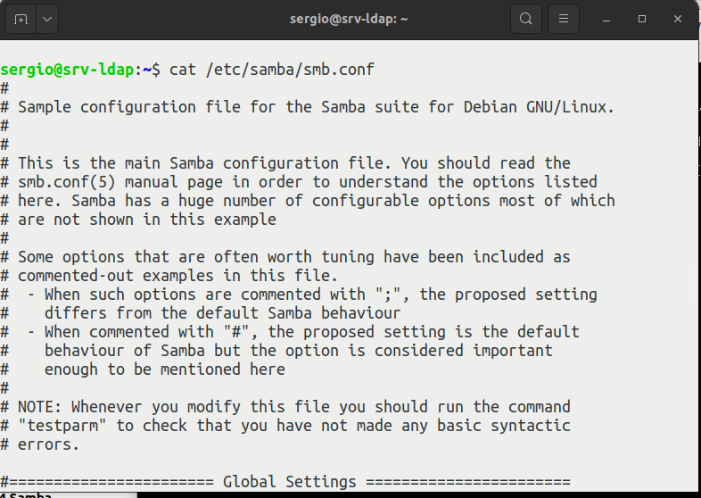
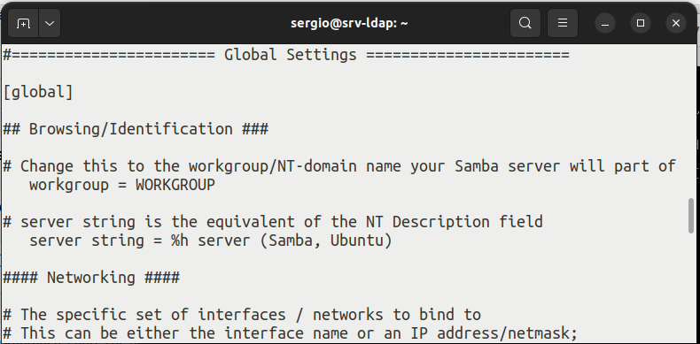
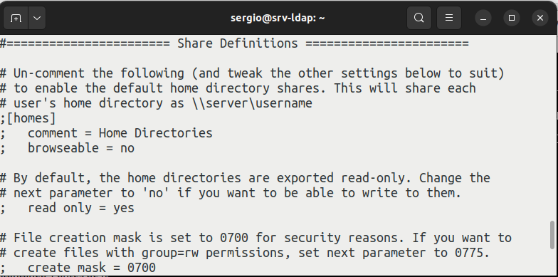
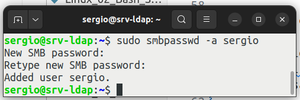
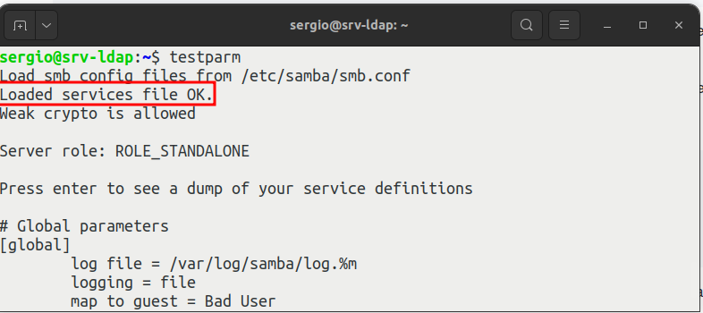

<h1>Samba</h1>

<h3>Tabla de contenidos</h3>

- [1. Introducción a Samba](#1-introducción-a-samba)
- [2. Instalación y configuración básica](#2-instalación-y-configuración-básica)
- [3. El fichero `/etc/samba/smb.conf`](#3-el-fichero-etcsambasmbconf)
  - [3.1. Sección `[global]`](#31-sección-global)
  - [3.2. Resto de secciones](#32-resto-de-secciones)
  - [3.3. variables SAMBA](#33-variables-samba)
- [4. Crear, editar o eliminar usuarios en Samba](#4-crear-editar-o-eliminar-usuarios-en-samba)
- [5. Verificando la configuración: `testparm`](#5-verificando-la-configuración-testparm)
- [6. puntos](#6-puntos)


# 1. Introducción a Samba

`Samba` es una implementación libre del protocolo de archivos compartidos de *Microsoft Windows* (antiguamente llamado ***SMB***, renombrado posteriormente a ***CIFS***) para sistemas de tipo *UNIX*. De esta forma, es posible que computadoras con *GNU/Linux*, *Mac OS X* o *Unix* en general se vean como servidores o actúen como clientes en redes de Windows. En otras palabras, `Samba` permite compartir archivos y recursos entre sistemas operativos diferentes, como *Windows* y *Linux*, en una red local

Algunos de los usos comunes de `Samba` en *GNU/Linux* son:

- **Compartir archivos**: Samba permite compartir archivos y directorios entre sistemas operativos diferentes, lo que facilita la transferencia de archivos entre ellos.
- **Compartir impresoras**: Samba también puede utilizarse para compartir impresoras en una red local.
- **Autenticación de usuarios**: Samba puede utilizarse para autenticar usuarios en una red local.
- **Controlador de dominio**: Samba puede actuar como un controlador de dominio en una red local1.

# 2. Instalación y configuración básica

La instalación de `Samba` es muy sencilla, y como siempre consta de la instalación de un paquete, en este caso llamado `samba` y posteriormente la configuración se realiza en el fichero `/etc/samba/smb.conf`. 

Para más información de instalación y configuración básica de `Samba`, aquí tienes el siguiente enlace: [Ubuntu.com: Install and Configure Samba](https://ubuntu.com/tutorials/install-and-configure-samba#1-overview).

En siguiente enlace puedes ver la configuración básica de dos carpetas compartidas, una accesible por todos los usuarios con permisos de lectura y otra crea una carpeta por usuario conectado, solo accesible por el propio usuario. [Instalar y configurar un servidor SAMBA en Debian y Ubuntu](https://medium.com/marcsanchezg/instalar-y-configurar-un-servidor-samba-en-debian-y-ubuntu-d05bb23644a1)


# 3. El fichero `/etc/samba/smb.conf`

La configuración de SAMBA, tanto servidor como cliente, se realiza en el fichero `/etc/samba/smb.conf`. Este fichero establece las características de SAMBA y los recursos que se compartirán en la red. Aunque este fichero posee un gran número de opciones, la configuración del mismo suele ser sencilla, dado que el valor por defecto es apropiado para casi todas las opciones y casos posibles.

Como punto importante, resaltar que se consideran comentarios todas las líneas que comienzan por `#` y por `;` (punto y coma), utilizándose generalmente el símbolo `#` para los comentarios formales y el punto y coma para comentar opciones de configuración. Además, el símbolo `\` indica que la línea continúa en la línea siguiente,
por lo que debe ignorarse el retorno de carro insertado a continuación.

De forma general, podemos considerar el fichero de configuración dividido en diferentes secciones. El comienzo de cada sección se indica mediante la etiqueta ***[nombre de sección]***, siendo el final de una sección el comienzo de la siguiente. 

Por defecto, el fichero se puede dividir en dos partes, una con la sección `[global]` y otra para el resto de recursos compartidos.

<div align="center">
    
</div>

Antes de nada, recordad que antes de manipular este tipo de ficheros, es aconsejable realizar una copia:

```bash
cp /etc/samba/smb.conf /etc/samba/smb_copia.conf
``` 

## 3.1. Sección `[global]`

La sección `[global]` define los parámetros de SAMBA del nivel global, así como los valores por defecto para el resto de parámetros en otras secciones si no se especifican en las mismas.

<div align="center">
    
</div>

Las principales opciones de configuración de la sección global de SAMBA son:

| Opción | Descripción | Valor por defecto | 
| --- | --- | --- |  
| workgroup | Nombre del grupo de trabajo o dominio de SAMBA. | Ninguno.  | 
| server string | Descripción del equipo en el dominio o grupo de trabajo. | Ninguno. | 
| netbios name | Nombre del ordenador SAMBA. | Nombre DNS. | 
| interfaces | Interfaces que utilizará SAMBA. Puede ser un interface (eth0), una dirección IP, una  dirección IP/mascara o una dirección broadcast/mascara. | Todos los interfaces excepto el de loopback. | 
| security | Nivel de seguridad. | user | 
| passdb backend | Modo de almacenamiento de las contraseñas. | tdbsam
| smb passwd file | Fichero con las contraseñas almacenadas. | En el ejecutable. | 
| encrypt passwords |  Utilizar contraseñas cifradas de Windows. | yes | 
| password server | Servidores Windows para la autentificación. | Ninguno.
| null password | Permitir el acceso de usuarios con contraseña nula. | no
| map to guest | Indica cuando un acceso debe considerarse como invitado. | Never | 
| hosts allow | Permite restringir los ordenadores y/o redes que pueden acceder al servidor. | Permiso a todos los ordenadores. | 
| log file | Fichero de log | /var/log/samba/log.%m | 
| max log file | Tamaño máximo del fichero de log | 50 kBytes | 

Un sencillo ejemplo de sección [global] es el siguiente:

```
[global]
workgroup = ROBLIS
server string = SAMBA %v en %L
netbios name = glup
security = user
passdb backend = tdbsam
smb passwd file = /var/lib/samba/private/passdb.tdb
encrypt passwords = yes
map to guest = Never
hosts allow = 147.156.222. 147.156.223.
```

Donde `%v` se sustituye por la versión de SAMBA y `%L` por el nombre del ordenador SAMBA. Mas adelante tenemos una tabla de equivalencia de estas variables.

## 3.2. Resto de secciones 

En el resto de secciones podemos diferenciar en tres tipos: 

Por una parte, la sección `[homes]` define un recurso de red para cada usuario conocido por SAMBA y lo asocia al directorio raíz de cada usuario del ordenador servidor de SAMBA. Esta sección funciona como opción por defecto, pues un servidor SAMBA intenta primero comprobar si existe un servicio con ese nombre. Si no se
encuentra, la solicitud se trata como un nombre de usuario y se busca en el fichero local de contraseñas. Si el nombre existe y la clave es correcta, se crea un servicio, cuyo nombre se cambia de [homes] al nombre local del usuario y, si no se especifica otro valor, se utiliza el directorio raíz del usuario.

Por otra parte, la sección `[printers]` define un recurso compartido para cada nombre de impresora conocida por SAMBA, que suelen ser las impresoras especificadas en el fichero `/etc/printcap` del ordenador. Su funcionamiento es similar al de la sección [homes].

Por último, cualquier otro recurso (directorio o impresora) que se quiera compartir, debe especificarse creando una sección adicional en el fichero de configuración, donde el nombre de la sección se corresponderá con el nombre con el que el recurso será conocido en la red. **Aqui es donde nosotros trabajaremos habitualmente**

<div align="center">
    
</div>

Las principales opciones de configuración de estas secciones son:

| Opción | Descripción | Valor por defecto |
| --- | --- | --- |  
| read only | Exportación del recurso en solo lectura. | yes |  
| writeable | Exportación del recurso en modo escritura | no |
| browseable | Define si se permitirá mostrar este recurso en las listas de recursos compartidos de Windows | yes |
| path | Ruta absoluta al recurso | Ninguno. |
| comment | Descripción del servicio. | Ninguno. |
| guest ok | Define si se permitirá el acceso como usuario invitado. El valor puede ser Yes o No. | no |
| guest account | Usuario que identifica el acceso como invitado. | nobody |
| guest only | Todos los accesos se realizan como invitado | no |
| public | Es un equivalente de guest ok, es decir define si se permitirá el acceso como usuario invitado. El valor puede ser Yes o No. | no |
| force user | Fuerza a que el acceso al recurso se realice como el usuario especificado. | Ninguno |
| force group | Fuerza a que el acceso al recurso se realice como el grupo especificado. | Ninguno. |
| hosts allow | Lista de ordenadores desde el que se permite el acceso | Lista vacía (todos los ordenadores). |
| hosts deny | Lista de ordenadores a los que se les deniega el acceso. | Lista vacía (ningún ordenador). |
| printable | Indica si un dispositivo compartido es una impresora. | no |
| valid users | Define los usuarios o grupos, que podrán acceder al recurso compartido. Los valores pueden ser nombres de usuarios separados por comas o bien nombres de grupo antecedidos por una @. Ejemplo: fulano, mengano, @administradores | Lista vacía (todos los usuarios). |
| write list | Define los usuarios o grupos, que podrán acceder con permiso de escritura. Los valores pueden ser nombres de usuarios separados por comas o bien nombres de grupo antecedidos por una @. Ejemplo: fulano, mengano, @administradores | Lista vacía (todos los usuarios). |
| admin users | Define los usuarios o grupos, que podrán acceder con permisos administrativos para el recurso. Es decir, podrán acceder hacia el recurso realizando todas las operaciones como super-usuarios. | Lista vacía (ningún usuario). |
| directory mask | Es lo mismo que directory mode. Define qué permiso en el sistema tendrán los subdirectorios creados dentro del recurso. Ejemplos: 1777 | Definido por sistema | 
| create mask | Define que permiso en el sistema tendrán los nuevos archivos creados dentro del recurso. Ejemplo: 0644 | Definido por sistema | 
| follow symlinks | Permite el seguimiento de enlaces simbólicos | Yes |

`read only` y `writeable` se refieren al modo de exportación del recurso, solo que de forma inversa, así el
equivalente de `read only = yes` es `writeable = no`.

En el siguiente ejemplo, en el cual se exportan los directorios raíz de los usuarios:
```
[homes]
comment = Directorios raiz de los usuarios
browseable = yes
writeable = yes
```

O en este otro ejemplo, en el que se exportan las impresoras conectadas al servidor de SAMBA:

```
[printers]
comment = Impresoras
path = /var/spool/samba
browseable = no
guest ok = no
writeable = no
printable = yes
```

Otro ejemplo, en el que se exporta un directorio temporal para que los usuarios puedan escribir en el mismo, es el siguiente:

```
[tmp]
comment = Espacio temporal de disco
path = /tmp
browseable = yes
read only = no
guest ok = yes
```

Otro ejemplo de carpeta compartida en el que se permite acceso total a todo el mundo.

```
[compartido]
comment = Archivos Compartidos
path = /home/compartido
guest ok = yes
browseable = yes
writeable = yes
create mask = 0777
directory mask = 0777
```

## 3.3. variables SAMBA

Comentar que SAMBA posee una serie de variables, que comienzan por el símbolo `%`, y que permiten especificar de forma variable distintos valores, como pueden ser un conjunto de directorios, etc. Las principales variables son:

| Variable | Definición |
| --- | --- |
| `%a` | Arquitectura del cliente (SAMBA, WinNT, UNKNOWN, etc.) |
| `%I` | Dirección IP del cliente. |
| `%m` | Nombre NetBIOS del cliente. |
| `%M` | Nombre DNS del cliente. |
| `%g` | Grupo primario del usuario en Linux. |
| `%G` | Grupo primario del usuario que requiere el acceso. |
| `%H` | Directorio raíz del usuario en Linux. | 
| `%u` | Usuario en Linux. | 
| `%U` | Usuario que requiere el acceso. | 
| `%p` | Directorio donde montar el recurso compartido. | 
| `%P` | Directorio raíz compartido. | 
| `%S` | Nombre del recurso compartido. | 
| `%d` | Identificador del proceso. | 
| `%h` | Nombre DNS del servidor | 
| `%L` | Nombre NetBIOS del servidor. | 
| `%N` | Directorio raíz del servidor. | 
| `%v` | Versión de SAMBA. | 
| `%R` | Versión del protocolo SMB. | 
| `%T` | Día y hora actual del servidor. | 


# 4. Crear, editar o eliminar usuarios en Samba

Los usuarios que queremos que tengan acceso al servidor Samba deben estar creados como usuarios en nuestro servidor linux, podemos crear un grupo samba y agregar a ese grupo todos los usuarios que tendrán acceso al servidor samba:

Supongamos que tenemos un usuarios ya creado llamado *sergio* y que lo queremos agregar a los usuarios de Samba, para esto ejecutamos el siguiente comando:

```bash
sudo smbpasswd -a sergio
```
Nos aparecerá algo como:

<div align="center">
    
</div>


Además : 

```bash
smbpasswd -a nombre_usuario     # Para editar un usuario ejecutamos
smbpasswd -x nombre_usuario     # Para borrar un usuario ejecutamos:
```
Si queremos realizar una correspondencia entre usuarios de un sistema Microsoft Windows y usuarios de Linux para el uso de recurso compartidos por *samba*, creamos un nuevo archivo donde estarán todos los usuarios autorizados para conectarse al Servidor de Samba, para esto ejecutamos:

```bash
sudo nano /etc/samba/smbusers
```

En el nuevo archivo copiamos la siguiente línea:

```bash
nombre_en_linux = "Nombre en Windows"
```

Donde `nombre_en_linux` es el nombre del usuario que tenemos en linux en este caso *sergio* y `Nombre en Windows` es el nombre del usuario de red en Windows. Tenemos que agregar una nueva línea por cada usuario que creemos para Samba.

Ahora que ya tenemos a los usuarios creados procedamos a ver como se comparten archivos y directorios.

Para aplicar el uso de estos usuarios en SAMBA, volvemos de nuevo a modificar el archivo `/etc/samba/smb.conf`

Busca la línea que dice:

```
; security = user
```

Y la modificamos por:

```
security = user
username map = /etc/samba/smbusers
```

Con esto lo que estamos haciendo es diciéndole a Samba que vamos a autenticar por usuario y donde está la lista de los usuarios permitidos que fue la que creamos anteriormente.

Para darle acceso a los usuario a sus respectivos directorios home o personales, hacemos lo siguiente:

Buscamos las línea donde dice

```
;[homes]
; comment = Home Directories;
;browseable = no
;valid users = %S
;writable = no
```

Y le quitamos el `;` para descomentarlos, y en `writable` le cambiamos *no* por *yes* para que el usuario pueda escribir en el directorio.

# 5. Verificando la configuración: `testparm`

Siempre que cambiemos la configuración del archivo smb.conf debemos ejecutar el siguiente comando:

```
testparm
```

lo que hace este parámetro es verificar que los parámetros del archivo `smb.conf` estén correctos. 

<div align="center">
    
</div>

Una vez sepamos que nuestro fichero de configuración esta correcto, podemos aplicar cambios mediante el reinicio del servicio: 

```bash
sudo systemctl restart smbd.service 
```


# 6. puntos

Hacer tarea que contenga los siguientes puntos

- Compartir anónimo
- Compartir usuarios
- Crear usuarios para compartir
- Compartir por otros usuarios **no** `root`
- Instalación webadmin y creación de nuevo recurso


**Fuentes:**

- [Samba. Página oficial](https://www.samba.org/samba/docs/)
- [Install and Configure Samba](https://ubuntu.com/tutorials/install-and-configure-samba#1-overview)
- [Instalar y configurar Samba Share en Ubuntu 22.04, 20.04 y 18.04](https://es.linux-console.net/?p=21480)
- [Teycen: Configurar Samba en Ubuntu para compartir archivos e impresoras en redes Windows](http://www.teycen.com/pages/linux/linux_samba.php)
- [Guía Ubuntu: Samba](https://www.guia-ubuntu.com/index.php/Samba#Para_compartir_una_carpeta)
- [YouTube: Uso de Samba para compartir carpetas con equipos Windows](https://www.youtube.com/watch?v=2fF1etV7iYY)

- [DigitalOcean: How To Install Webmin on Ubuntu 22.04](https://www.digitalocean.com/community/tutorials/how-to-install-webmin-on-ubuntu-22-04)
- [HowtoForge; Cómo instalar Webmin con el certificado SSL gratuito Let’s Encrypt en Ubuntu 22.04](https://howtoforge.es/como-instalar-webmin-con-el-certificado-ssl-gratuito-let-s-encrypt-en-ubuntu-22-04/)